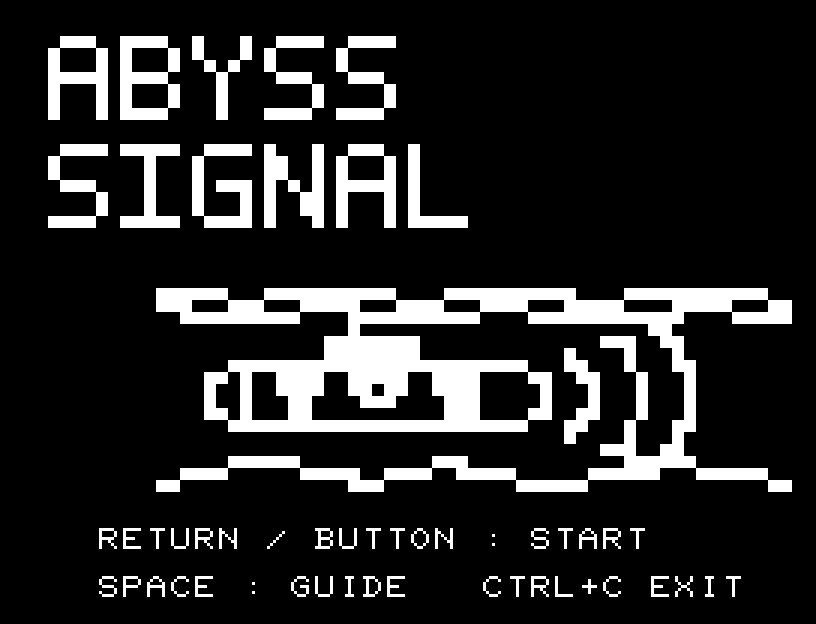
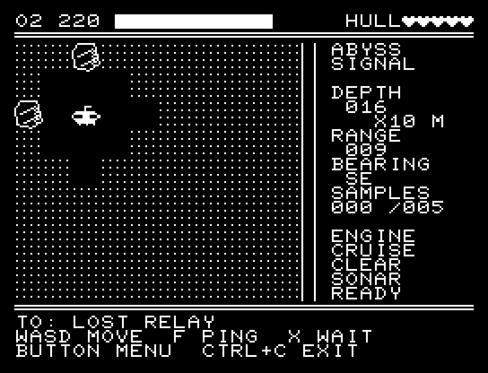
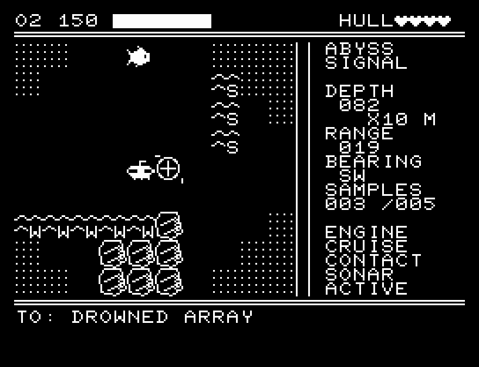
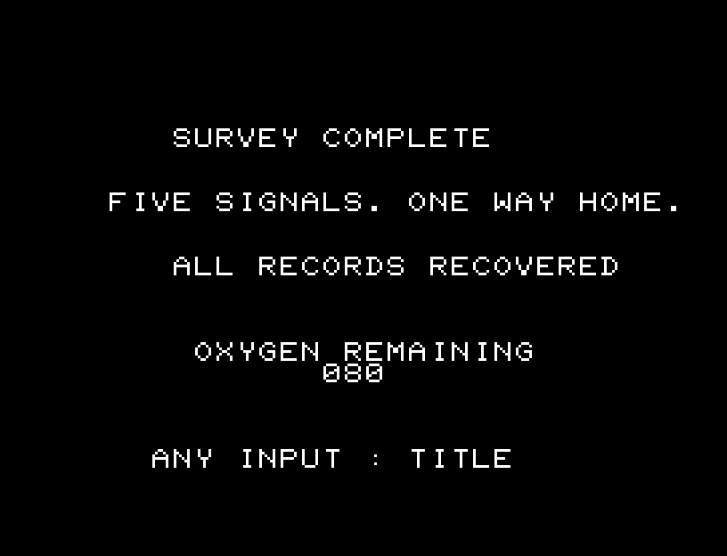
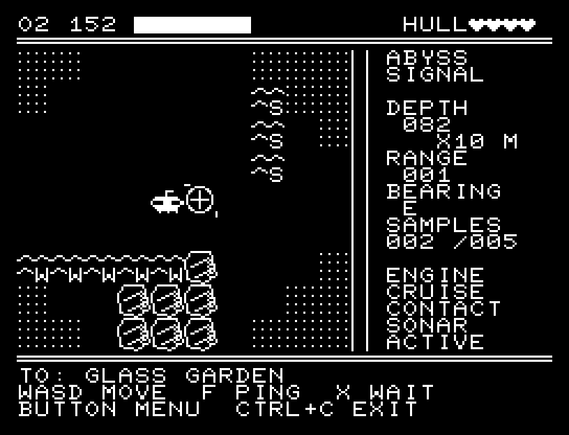
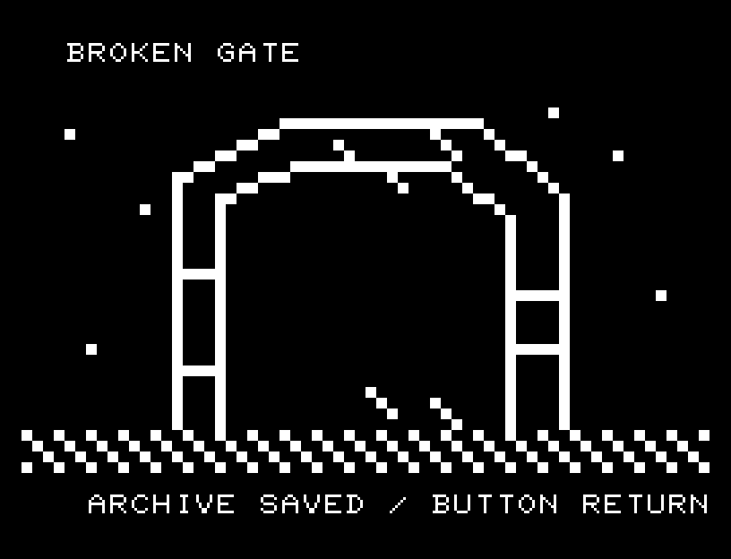
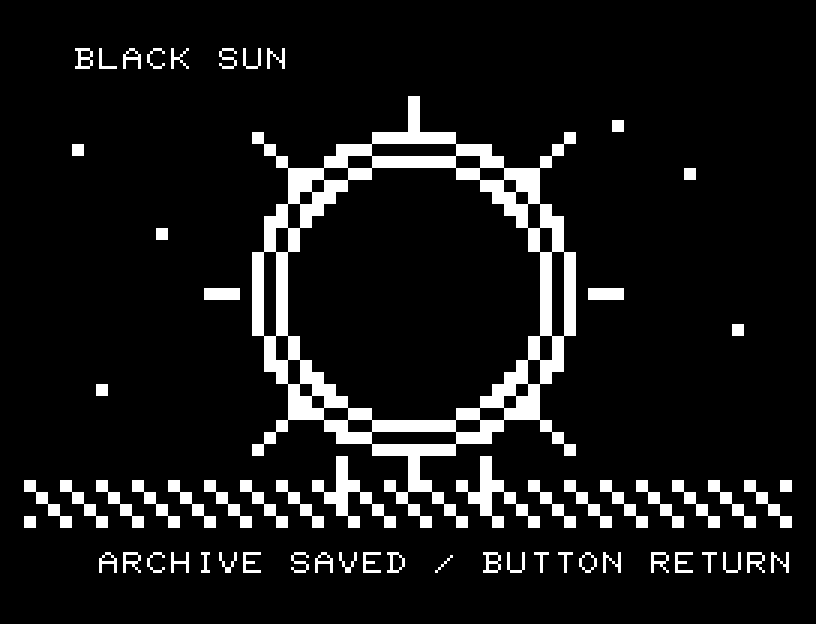

# ABYSS SIGNAL

標準RAM 16KBのJR-100向け海底探索ゲーム。32×32セルの海域で5つの観測地点を記録し、基地へ帰還します。ソナーで視界を広げながら、海流、岩礁、音を追う生物を避けてください。発見した遺構には、それぞれ専用の観測画面があります。



## 紹介画像とプレイ動画







**[音付きプレイ動画を見る（約102秒）](https://zabaglione.github.io/pyjr100emu/gameplay.html?game=abyss-signal)**

5つの記録を回収し、基地へ帰還するまでを収録。

## タイトルのデザイン

横に広いABYSSと深い海底のシルエットで、潜水艇の小ささと探索の不安を表します。

## 画面の奥行き

岩の側面と潜水艇の下側に陰影を加え、発見画面の海底には奥へ収束する線を敷きました。航行中のソナーは正確な位置が読める平面表示を保っています。 潜水艇はマスの中間を通って移動します。ソナーを使うと、観測範囲を横切る走査線と音で探査を示します。

## ゲーム専用フォント

今回は通常フォントを維持しています。絵柄やアニメーションに使うPCGを残すと、一式の数字・英字を揃える枠が足りないためです。一部の文字だけ書体が変わる置き換えは行いません。

## 動きとクリア演出

潜水艇はマスの中間を通って移動します。ソナーを使うと、観測範囲を横切る走査線と音で探査を示します。被弾や結果を確認する間は、追加入力で表示を飛ばせません。

クリア時は完成した盤面・結果を残し、約1.6秒のジングルと余韻を挟みます。失敗時も原因を表示し、ジングルの後に短い間を置きます。その後、キーを押し直して次の操作に進みます。直前から押し続けたキーや、演出中に押したキーで結果を飛ばすことはありません。


## 操作

| 操作 | キーボード | 1ボタンパッド |
| --- | --- | --- |
| 移動 | W/A/S/D | 上下左右 |
| 操作パネル／決定 | RETURN | ボタン |
| パネル選択 | W/S | 上下 |
| パネルを閉じる | SPACE | 項目を実行 |
| ソナー／待機 | F／X | パネルから選択 |
| BASICへ戻る | CTRL+C | キーボードを使用 |

パネルにはソナー、記録、静音切替、待機、やり直し、タイトルがあります。記録は未記録地点と同じセルか上下左右の隣から行います。5地点の順序は自由です。全記録後、出発地点へ戻ると成功です。

通常の移動・待機で酸素1、静音中は2、ソナーと記録で2を使います。海流による追加移動はさらに1を使います。岩礁への衝突は船体を1損傷します。酸素または船体が0になると失敗。パネル操作、写真の閲覧、何も入力していない間は時間も酸素も進みません。

ソナーは6行動の間、マンハッタン距離6以内を表示します。通常の視界は距離2。ソナーの音は追跡者を引き寄せます。追跡者は通常2行動ごと、静音中は4行動ごとに移動します。距離1以内で接触し、被弾後は4行動の猶予があります。

HUDは酸素と残量バー、船体、深度、次の未記録地点への距離・方位、記録数、機関、接近警報、ソナー状態を表示します。海流内の E/S/W/N は押される向きです。酸素30以下の `!!!` と接近警報は画面と効果音で知らせます。





やり直し／プレイ中のタイトル移動は実行前に確認します。NOが初期選択です。A/Dで選びRETURNで確定、SPACEで取り消します。

## ソースコード

ゲーム本体は [`src/`](src/) のアセンブリと定数定義です。

描画・データ生成などの補助ソース: [`assets.py`](assets.py)。

ビルド設定は [`game.json`](game.json) と [`Makefile`](Makefile) です。共有コードと生成物の関係は[全ゲームのソース一覧](../SOURCES.md)を参照してください。

## ビルドと検証

リポジトリの開発環境を用意して `make -C games/abyss_signal` を実行します。出力は `build/abyss-signal.prg`、開始番地は `$0300`。ゲーム本体と定数は10,910 bytes、画面・状態・保存領域・512 bytesのスタックを含めて標準16KB内です。PCGは場面ごとに32文字を使います。

`make -C games/abyss_signal test` は独立したPythonのルールモデルとC++エミュレーターの結果を照合し、岩礁・海流4方向・酸素枯渇・被弾・ソナー・静音・記録・帰還を検査します。入力だけで全5地点を観測して帰還する試験は117行動、酸素80・船体4を残して成功しました。キーボードとパッドの両方を確認しています。

所有するBASIC ROMを使う起動と画面取得は次のとおりです。ROMはリポジトリに含めません。

```sh
.venv/bin/python games/abyss_signal/replay.py --rom /path/to/owned-rom.prg --capture
```

掲載画像は実BASICからPRGを起動したエミュレーターの実フレームです。実機での動作・音声は未確認です。タイトルに独自の短い単音曲、探索中は効果音のみを使います。

ソース・画像・曲は[MIT License](../LICENSE)。`art/`にはPCG Workbenchで開ける画面データもあります。
