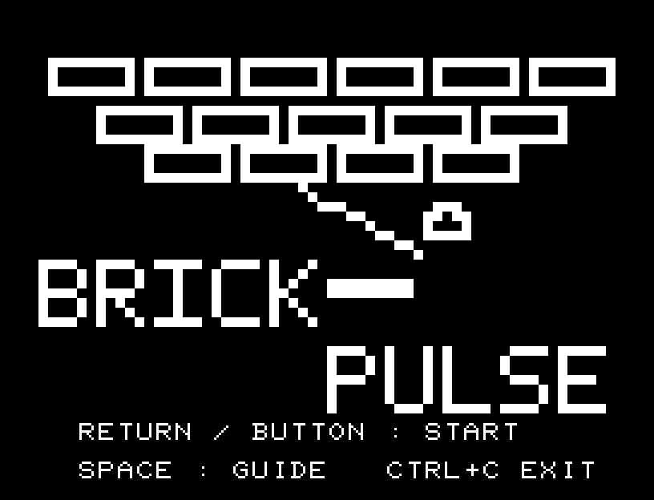
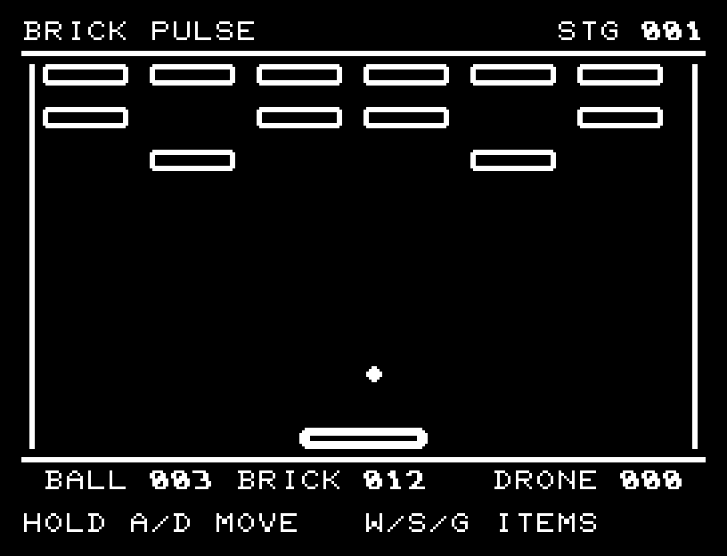
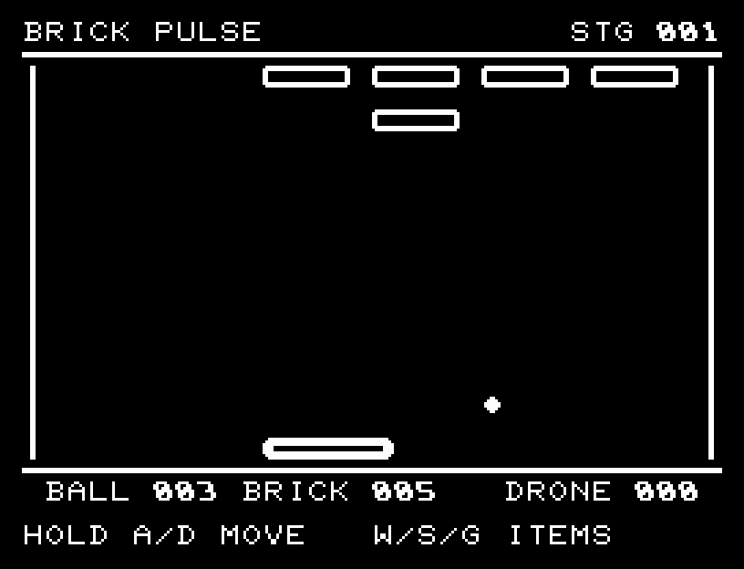
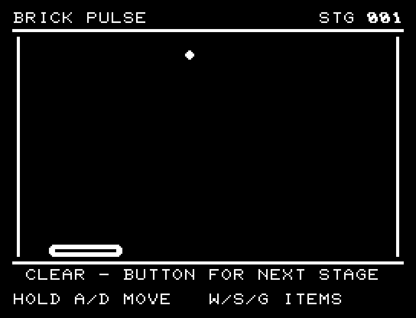
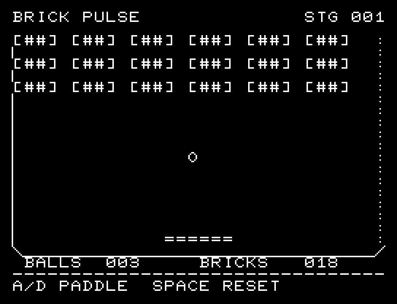
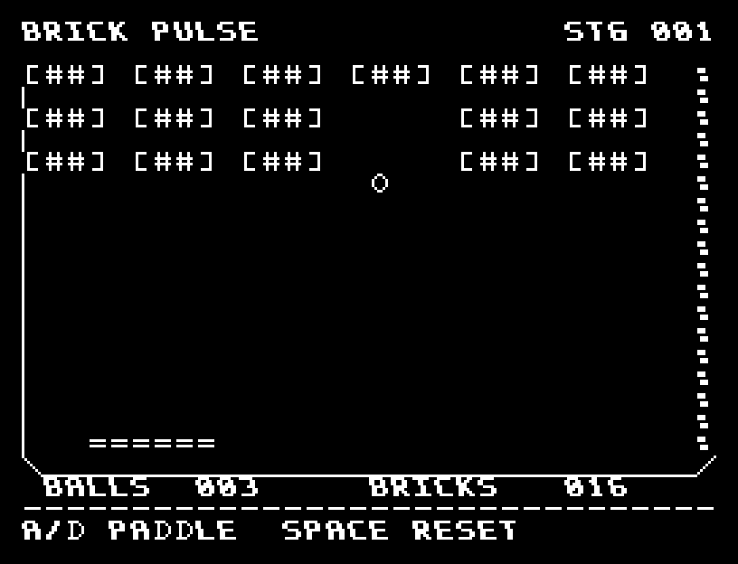
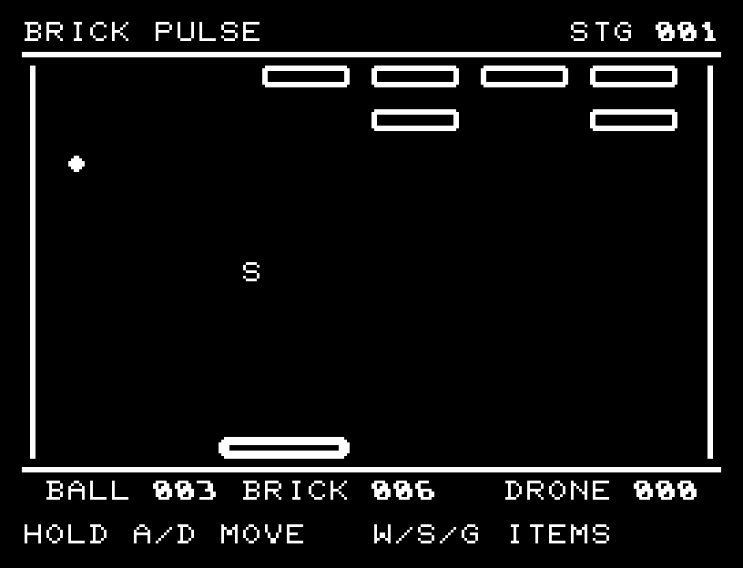
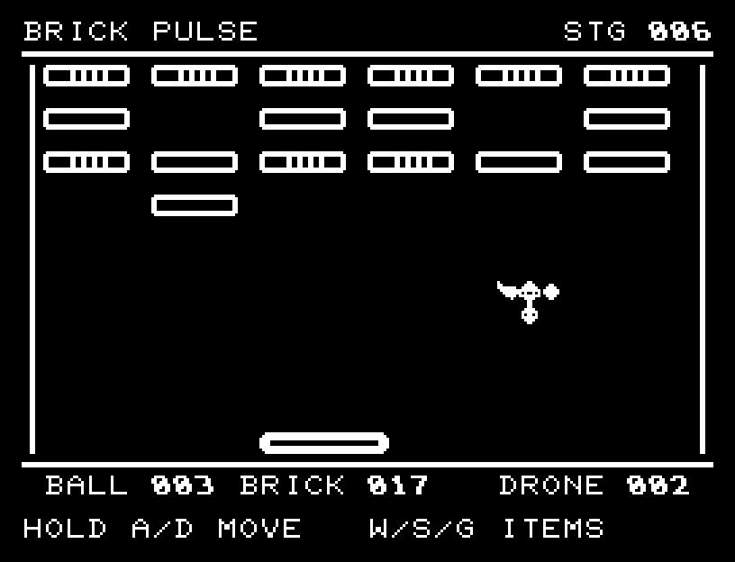
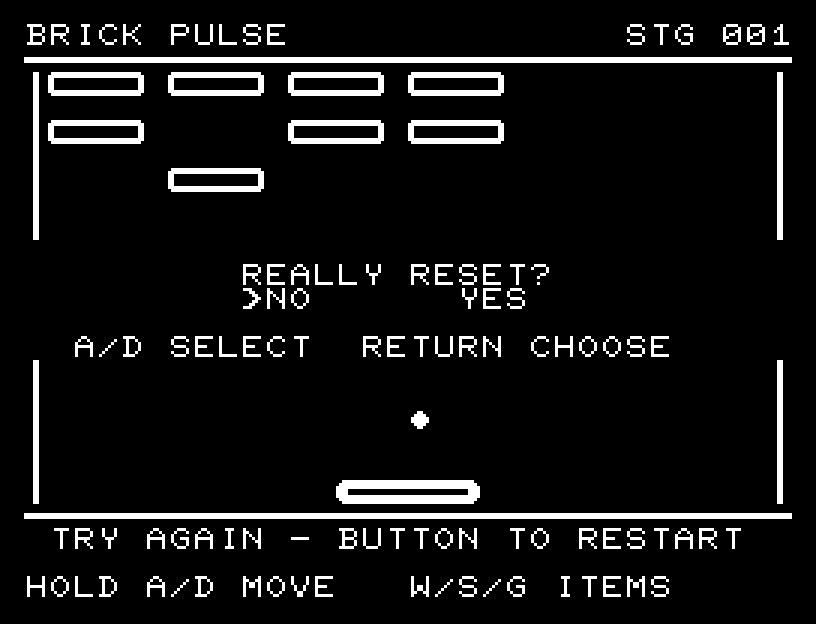

# BRICK PULSE

[Wiki](https://github.com/zabaglione/jr100dev/wiki/BRICK-PULSE) · [プレイ](https://zabaglione.github.io/pyjr100emu/?game=brick-pulse)

12面のブロック崩しです。各面のブロックとドローンをすべて壊すとクリア。各面は3球で開始し、3球を落とすと同じ面から再挑戦できます。序盤は隙間の多い配置、後半は2〜3回の打撃が必要な装甲ブロックが増えます。3面目からドローン、6面目からその落下爆弾が登場します。



## 紹介画像とプレイ動画

**[音付きプレイ動画を見る（約30秒）](https://zabaglione.github.io/pyjr100emu/gameplay.html?game=brick-pulse)**

1ステージのクリアまでを収録。長い途中経過を省略したダイジェストです。省略箇所にはLATERを表示し、動作と音の速度は変えていません。画面を確認する間を入れた自動キー入力によるプレイです。



[](https://zabaglione.github.io/pyjr100emu/gameplay.html?game=brick-pulse)



## タイトルのデザイン

上のブロック帯、弾む球と軌跡、下のパドルを一枚にまとめ、斜体ロゴに網点の側面を付けています。

## 画面の奥行き

無理な遠近表現や離れた影を使わず、太い輪郭を揃えた平面のアーケード画面にしています。ブロックの耐久は内部の模様、アイテムはW/S/Gで区別し、同じ形の枠とパドルで統一しています。

## ゲーム専用フォント

ゲーム中の**数字0〜9の10文字をスピードフォント**（右へ傾く太線）で揃えています。部分的な英字の置き換えは行いません。タイトルの操作案内・説明・パスワード入力は通常フォントに統一しています。既存のロゴと絵柄を保ち、空きPCG枠だけを使用します。

## 動きとクリア演出

装甲やドローンに命中すると点滅します。破壊時は発光して破片が散り、命中と撃破の違いを音と画面で確認できます。演出中の追加入力は受け付けません。

クリア時は完成した盤面・結果を残し、約1.6秒のジングルと余韻を挟みます。失敗時も原因を表示し、ジングルの後に短い間を置きます。その後、キーを押し直して次の操作に進みます。直前から押し続けたキーや、演出中に押したキーで結果を飛ばすことはありません。

## 操作と遊び方

A/Dまたはパッドの左右を押し続けると連続移動し、短押しでは2文字分ずつ動き、離すと止まります。中央で受けると急な角度、端で受けると浅い角度になります。ブロックを3個壊すごとにW・S・Gのいずれかが落下します。Wは一定時間パドル拡大、Sは一定時間ボール減速、Gは落球または爆弾を1回防ぎます。ドローン撃破でもGが落ちます。同時に出るアイテムは1個です。爆弾を受けるとパドルが一定時間短くなります。Wを取ると解除できます。

方向キーはキーボードまたはパッド、RETURNはパッドのボタンでも操作できます。プレイ中のSPACEは無効です。やり直し確認はNOが初期選択です。A/Dで選び、RETURNで確定、SPACEで取り消します。確認中は進行を止めます。CTRL+CでBASICへ戻ります。

装甲やドローンに命中すると点滅します。破壊時は発光して破片が散り、命中と撃破の違いを音と画面で確認できます。演出が終わってから次のキーを押してください。

下部のBALLは残球、BRICKは残ブロック数、DRONEは敵の残耐久です。WIDE・SLOW・GUARDは有効な効果、JAMは爆弾による縮小を示します。ブロックの模様は残る耐久を表します。クリア後のRETURNは次の面、失敗後のRETURNは確認付きの再挑戦です。











## ビルドと検証

バージョン 2.3.0。開始番地 `$0300`、ゲーム本体と定数は 9,842 bytes。画面・作業領域・復帰用の保存領域・512 bytesのスタックを含めて標準RAM 16KB内で動作します。PCGは32文字を場面ごとに切り替えます。

```sh
make -C games/brick_pulse
make -C games/brick_pulse test
```

出力はゲームの `build/` ディレクトリに作られます。`rules.py` はビルド時にMB8861Hの機械語へ変換されます。JR-100上でPythonを実行する方式ではありません。

キー入力による全ステージのクリア、失敗を含む入力試験、画面範囲、RAM配置、スタック、PCM出力をエミュレーターで検査しています。掲載画像は所有するBASIC ROMからPRGを起動した実フレームです。実機での動作・音声は未確認です。

```sh
.venv/bin/python games/native/replay.py brick_pulse --rom /path/to/owned-rom.prg --capture --keyboard
```

タイトルには長めの単音曲、プレイ中には効果音を付けています。ソース・画像・曲は[MIT License](https://github.com/zabaglione/jr100dev/blob/main/games/LICENSE)。`art/`にはPCG Workbench用の画面データもあります。
