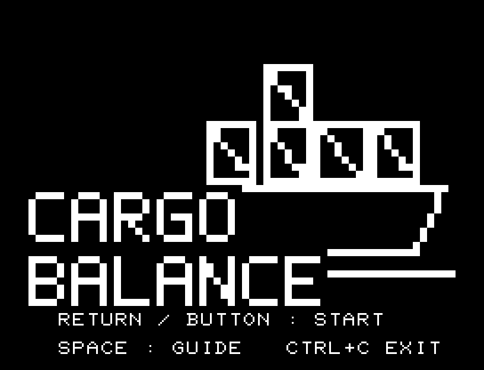
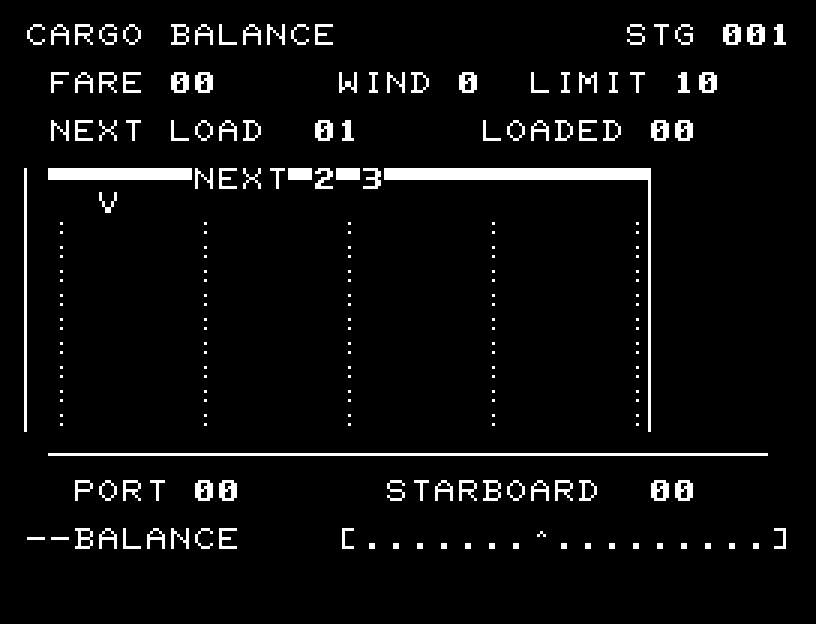
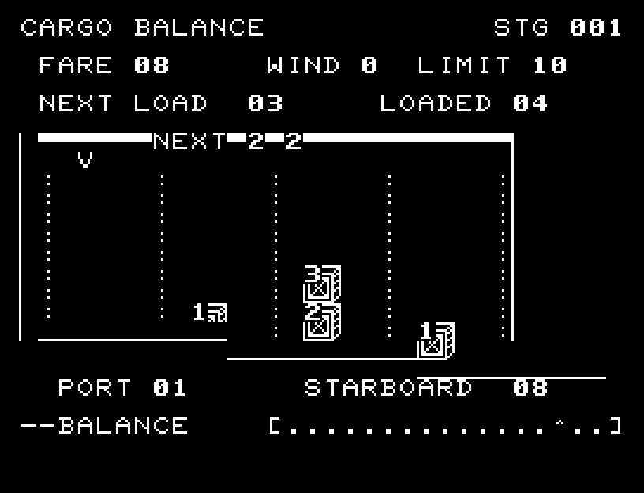
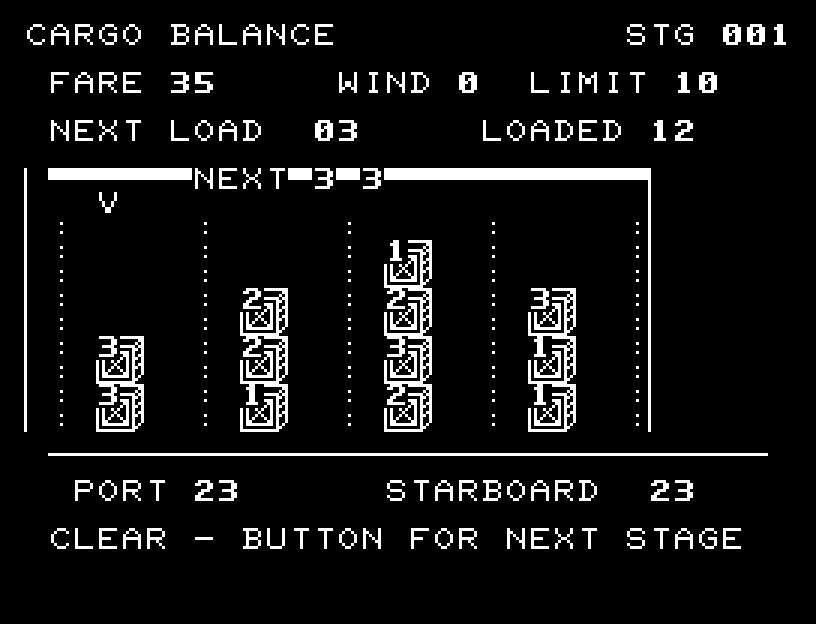
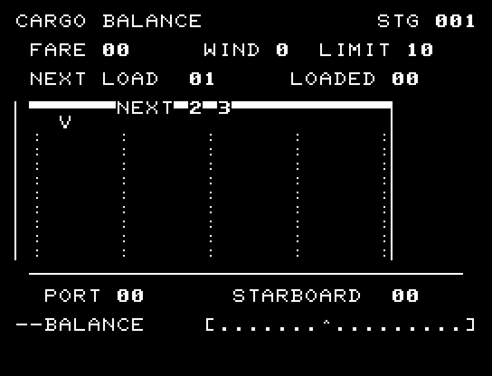
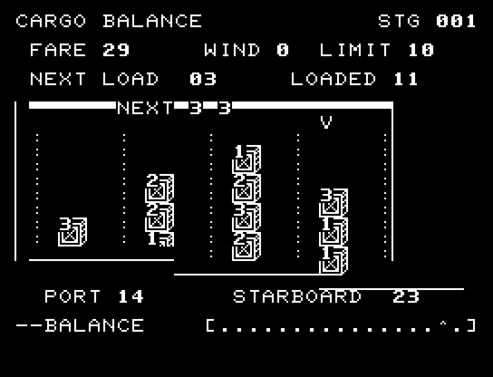

# CARGO BALANCE

[Wiki](https://github.com/zabaglione/jr100dev/wiki/CARGO-BALANCE) · [プレイ](https://zabaglione.github.io/pyjr100emu/?game=cargo-balance)

12個の荷物を4つの船倉へ積む全6航海。外側は運賃が2倍になる一方、船を傾ける力は内側の3倍です。次の2個の重さを読み、風と許容差に備えます。



## 紹介画像とプレイ動画







**[音付きプレイ動画を見る（約42秒）](https://zabaglione.github.io/pyjr100emu/gameplay.html?game=cargo-balance)**

1ステージのクリアまでを収録。

## タイトルのデザイン

高さの違う荷物を積んだ船を描き、横長CARGOで船幅、BALANCEで積載の課題を表します。

## 画面の奥行き

クレーンから荷物が落下し、船体と積み荷が一緒に傾いて揺れます。積載音、転覆の原因表示、出航ジングルで結果を確認できます。

## ゲーム専用フォント

ゲーム中の**数字0〜9の10文字を計器盤フォント**（角張った太線）で揃えています。部分的な英字の置き換えは行いません。タイトルの操作案内・説明・パスワード入力は通常フォントに統一しています。既存のロゴと絵柄を保ち、空きPCG枠だけを使用します。

## 動きとクリア演出

クレーンから荷物が落下し、船体と積み荷が一緒に傾いて揺れます。積載音、転覆の原因表示、出航ジングルで結果を確認できます。被弾や結果を確認する間は、追加入力で表示を飛ばせません。

クリア時は完成した盤面・結果を残し、約1.6秒のジングルと余韻を挟みます。失敗時も原因を表示し、ジングルの後に短い間を置きます。その後、キーを押し直して次の操作に進みます。直前から押し続けたキーや、演出中に押したキーで結果を飛ばすことはありません。

## 操作と遊び方

A/Dで船倉を選び、RETURNで積みます。各船倉は4個まで。左右の力の差に風の分を加え、LIMITを超えると転覆します。全12個を積めば出航です。

方向キーはキーボードまたはパッド、RETURNはパッドのボタンでも操作できます。SPACEでこの面のやり直し確認を開きます。やり直し確認はNOが初期選択です。A/Dで選び、RETURNで確定、SPACEで取り消します。確認中は進行を止めます。CTRL+CでBASICへ戻ります。

クレーンから荷物が落下し、船体と積み荷が一緒に傾いて揺れます。積載音、転覆の原因表示、出航ジングルで結果を確認できます。演出が終わってから次のキーを押してください。

NEXT LOADは今の荷物、NEXTは続く2個、LOADEDは積載数。PORTとSTARBOARDは左右に掛かる力、WINDは左へ掛かる追加の力、FAREは運賃です。後半は許容差が10から8へ狭まります。





## ビルドと検証

バージョン 2.0.0。開始番地 `$0300`、ゲーム本体と定数は 8,226 bytes。画面・作業領域・復帰用の保存領域・512 bytesのスタックを含めて標準RAM 16KB内で動作します。PCGは32文字を場面ごとに切り替えます。

```sh
make -C games/cargo_balance
make -C games/cargo_balance test
```

出力はゲームの `build/` ディレクトリに作られます。`rules.py` はビルド時にMB8861Hの機械語へ変換されます。JR-100上でPythonを実行する方式ではありません。

キー入力による全ステージのクリア、失敗を含む入力試験、画面範囲、RAM配置、スタック、PCM出力をエミュレーターで検査しています。掲載画像は所有するBASIC ROMからPRGを起動した実フレームです。実機での動作・音声は未確認です。

```sh
.venv/bin/python games/native/replay.py cargo_balance --rom /path/to/owned-rom.prg --capture --keyboard
```

タイトルには長めの単音曲、プレイ中には効果音を付けています。ソース・画像・曲は[MIT License](https://github.com/zabaglione/jr100dev/blob/main/games/LICENSE)。`art/`にはPCG Workbench用の画面データもあります。
