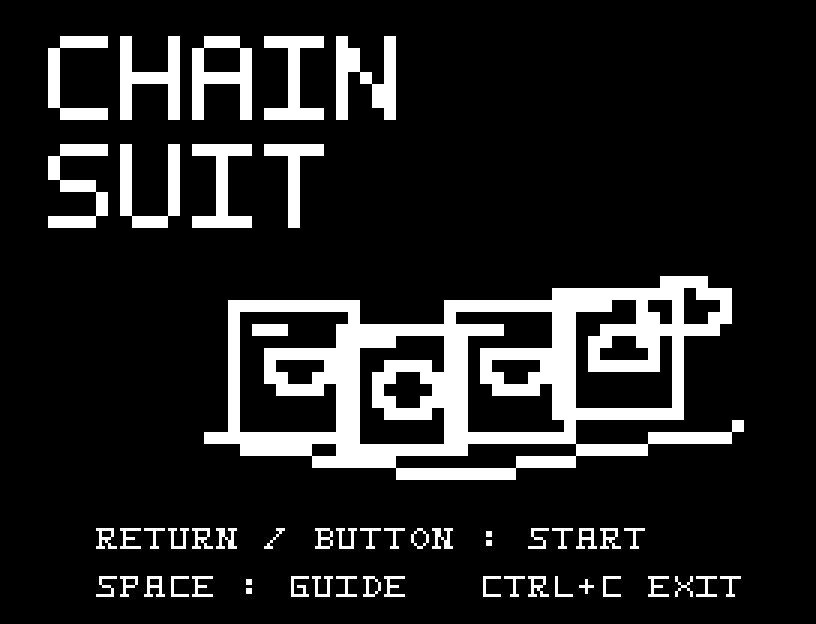
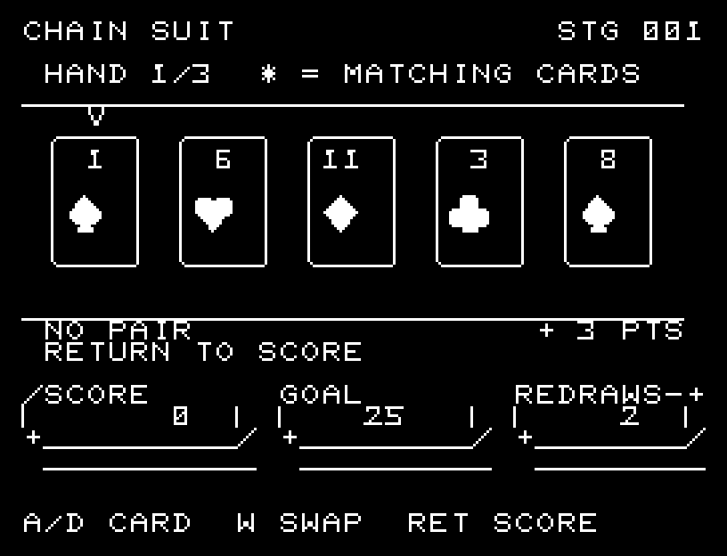
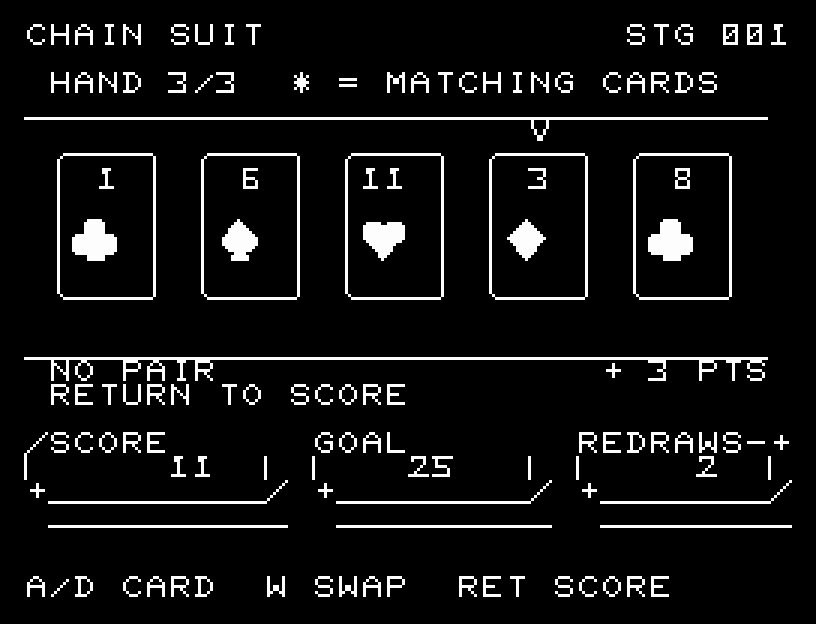
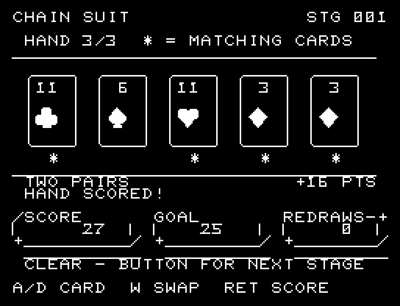
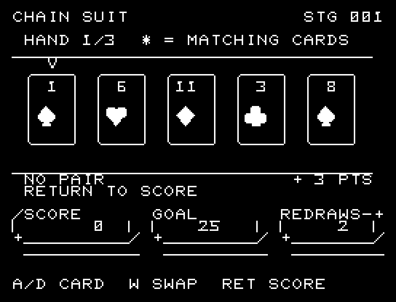
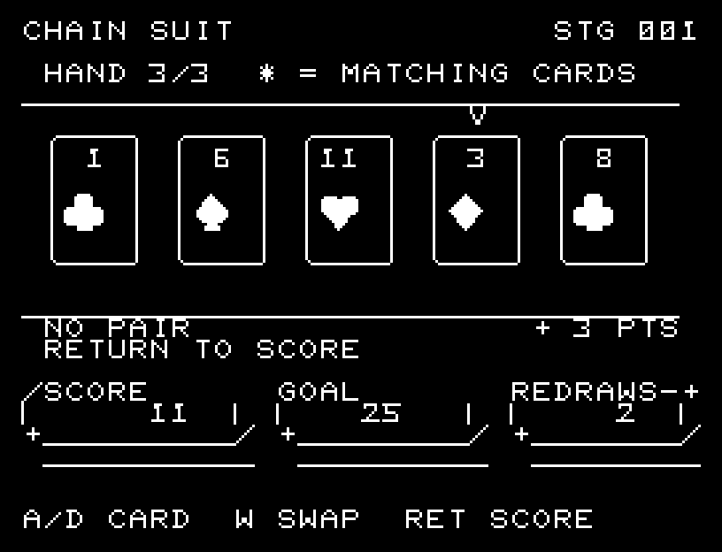

# CHAIN SUIT

[Wiki](https://github.com/zabaglione/jr100dev/wiki/CHAIN-SUIT) · [プレイ](https://zabaglione.github.io/pyjr100emu/?game=chain-suit)

5枚の手札を交換し、3回の採点で合計25点を目指します。役なし3点、1組のペア8点、複数のペア16点、同一スート5枚25点です。



## 紹介画像とプレイ動画







**[音付きプレイ動画を見る（約31秒）](https://zabaglione.github.io/pyjr100emu/gameplay.html?game=chain-suit)**

1ステージのクリアまでを収録。

## タイトルのデザイン

三枚のカードを高さを変えて鎖でつなぎ、上のCHAINと右下のSUITで連鎖を囲みます。

## 画面の奥行き

5枚の札を一枚ずつ大きな枠で囲み、最大2桁の数字と16×16ドットのスート記号を枠内にまとめました。成立する役と点数を手札の直下に表示し、該当する札に * 印を付けます。得点・目標・交換残数は下段の別々の台座で読めます。

## ゲーム専用フォント

ゲーム中の**数字0〜9の10文字を活字フォント**（読みやすいセリフ体）で揃えています。部分的な英字の置き換えは行いません。タイトルの操作案内・説明・パスワード入力は通常フォントに統一しています。既存のロゴと絵柄を保ち、空きPCG枠だけを使用します。

## 動きとクリア演出

交換する札は細くなって側面を見せ、新しい札として開きます。採点時は役を作る札の印が点滅し、役名・今回の点数・合計点を残して効果音と約2秒の間を挟んでから、次の手札へ進みます。演出中の追加入力は受け付けません。

クリア時は完成した盤面・結果を残し、約1.6秒のジングルと余韻を挟みます。失敗時も原因を表示し、ジングルの後に短い間を置きます。その後、キーを押し直して次の操作に進みます。直前から押し続けたキーや、演出中に押したキーで結果を飛ばすことはありません。

## 操作と遊び方

A/Dで札の上の矢印を動かし、Wでその札を交換します。交換は各手札につき2回まで。RETURNで採点して次の手札へ進みます。

方向キーはキーボードまたはパッド、RETURNはパッドのボタンでも操作できます。SPACEでこの面のやり直し確認を開きます。やり直し確認はNOが初期選択です。A/Dで選び、RETURNで確定、SPACEで取り消します。確認中は進行を止めます。CTRL+CでBASICへ戻ります。

交換する札は細くなって側面を見せ、新しい札として開きます。採点時は役を作る札の印が点滅し、役名・今回の点数・合計点を残して効果音と約2秒の間を挟んでから、次の手札へ進みます。演出が終わってから次のキーを押してください。

各札の枠内に1〜13の数字と、スペード・ハート・ダイヤ・クラブのスート記号を表示します。数字は最大2桁で、先頭の0は付けません。役に含まれる札の下には * 印が付き、盤面の下に現在の役名と点数が出ます。NO PAIRは役なし、ONE PAIRは1組、TWO PAIRSは2組、THREE / FOUR / FIVE OF A KINDは同じ数字3〜5枚、FULL HOUSEは3枚と2枚の組、FLUSHは同一スート5枚です。同じ数字の組が複数できる役はすべて16点で、同一スートが揃う場合は25点を優先します。下段のSCOREは合計点、GOALは目標点、REDRAWSは交換残数です。





## ビルドと検証

バージョン 1.6.0。開始番地 `$0300`、ゲーム本体と定数は 7,835 bytes。画面・作業領域・復帰用の保存領域・512 bytesのスタックを含めて標準RAM 16KB内で動作します。PCGは32文字を場面ごとに切り替えます。

```sh
make -C games/chain_suit
make -C games/chain_suit test
```

出力はゲームの `build/` ディレクトリに作られます。`rules.py` はビルド時にMB8861Hの機械語へ変換されます。JR-100上でPythonを実行する方式ではありません。

キー入力による全ステージのクリア、失敗を含む入力試験、画面範囲、RAM配置、スタック、PCM出力をエミュレーターで検査しています。掲載画像は所有するBASIC ROMからPRGを起動した実フレームです。実機での動作・音声は未確認です。

```sh
.venv/bin/python games/native/replay.py chain_suit --rom /path/to/owned-rom.prg --capture --keyboard
```

タイトルには長めの単音曲、プレイ中には効果音を付けています。ソース・画像・曲は[MIT License](https://github.com/zabaglione/jr100dev/blob/main/games/LICENSE)。`art/`にはPCG Workbench用の画面データもあります。
