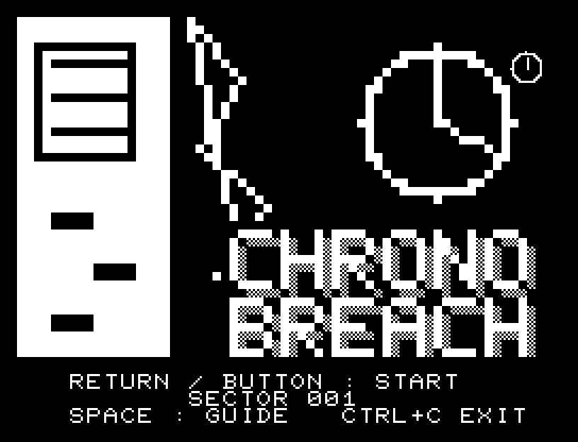
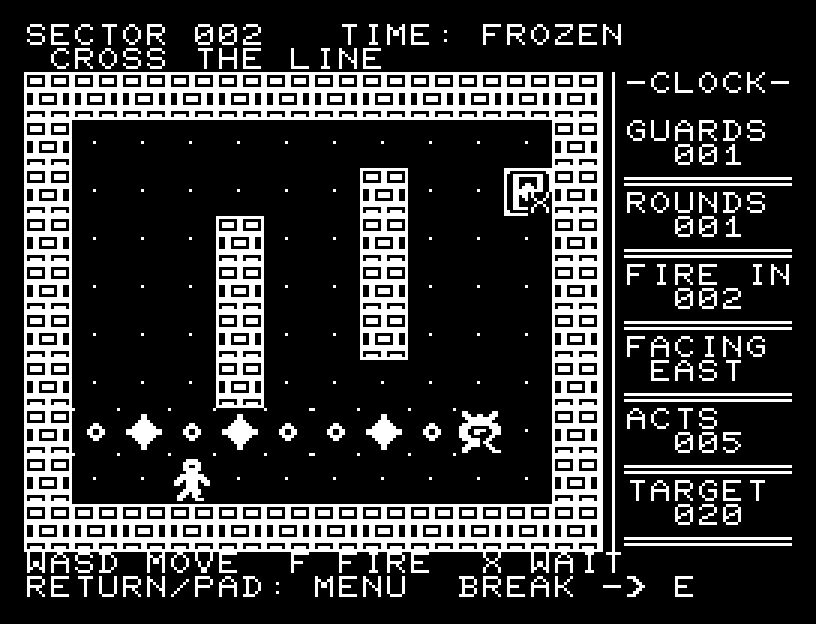
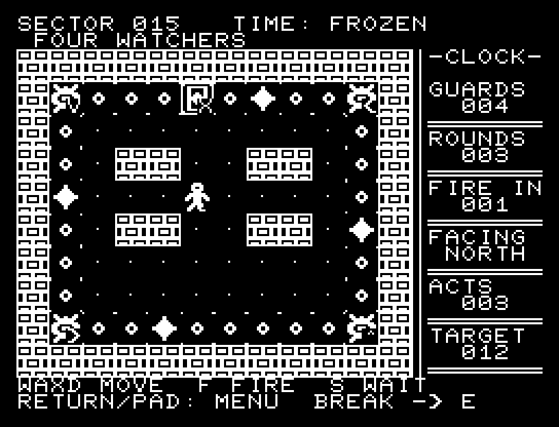
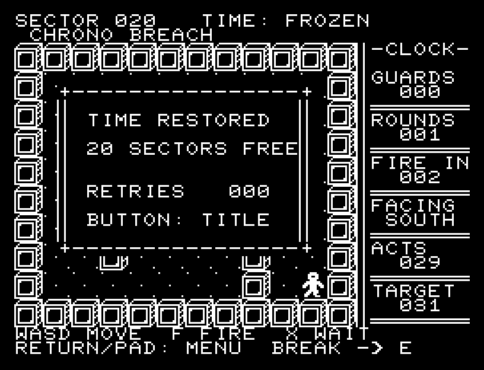

# CHRONO BREACH

**動けば、時間が動く。止まれば、弾も止まる。**

警備ドローンの射線を読み、接近攻撃と4マス射撃で突破する20面の戦術パズルです。各面の敵を全滅させ、出口へ到達してください。標準RAM 16KB、MB8861H用の機械語で動きます。



## 操作

| 操作 | キーボード | 方向＋1ボタンパッド |
| --- | --- | --- |
| 上／下／左／右へ1マス移動 | W / X / A / D | 各方向を押す |
| 戦術メニュー／決定 | RETURN | ボタン |
| 射撃 | F | メニューのFIREを選ぶ |
| 待機 | S | メニューのWAITを選ぶ |
| 戻る／メニュー | SPACE | メニューのBACKを選ぶ |
| 照準変更 | メニュー中A / D | メニュー中左右 |
| BASICへ戻る | CTRL+C | キーボードを使用 |

方向は1回押すごとに1マス進みます。押しっぱなしで連続移動はしません。メニューは上下で項目を選びます。左・右でNORTH / SOUTH / WEST / EASTの照準を切り替えます。照準変更やメニューを開く操作では時間は進みません。

## ルールとHUD

- 移動・射撃・待機の1操作につき、弾が1マス進みます。敵は3操作ごとに固定方向へ発砲します。
- 小さな輪郭の列は敵の射線です。大きな白い弾に触れないよう、通過のタイミングを選びます。
- 敵のいるマスへ移動すると接近攻撃で倒せます。射撃は現在の照準方向へ4マス。壁または最初の敵で止まり、1発を消費します。
- 敵の弾は別の敵にも当たります。発射した敵を倒しても、既に発射された弾は残ります。
- 壁への移動や残弾0の射撃では時間を消費しません。弾のあるマスへ入ると、その弾が動く前に被弾します。
- 全敵撃破後に出口の`E`へ入るとクリアです。敵が残っている間は出口に`X`を表示します。
- `GUARDS`は残り敵数、`ROUNDS`は残弾、`FIRE IN`は次の一斉発砲までの操作数、`ACTS`は操作数、`TARGET`はACE評価の目標です。
- `TARGET`以内ならACE、超えてもCLEARです。解禁した面はタイトルで左右を押して選べます。電源断をまたぐ保存はありません。
- 死亡後は決定ですぐ再挑戦できます。20面クリア後は再挑戦回数を表示します。



射線から外れて弾をやり過ごす場面。白い弾の位置と、次の発砲までの操作数を見比べます。



複数の敵の射線が交差する区画。敵同士の誤射も突破に利用できます。



20面を突破した結果画面。掲載画像は配布PRGを所有ROMで動かしたエミュレーターの実フレームです。

## ビルド・起動

リポジトリのルートで`pip install -e .`を済ませてから実行します。

```sh
make -C games/chrono_breach
```

生成物は`build/chrono-breach.prg`。エミュレーターで読み込むと`A=USR($0300)`が自動入力されます。手動起動の場合の入口も`$0300`です。ROMとゲームのロード経路を持つエミュレーターを使ってください。

タイトルには動く時計と独自ロゴ、ゲームにはPCGの人物・ドローン・金属壁・予告線を使っています。タイトル曲、移動・メニュー・発砲・撃破・被弾・クリア・空撃ちの効果音を収録しています。ブラウザーの音声は最初のキー入力または画面クリックで有効になります。

## 検証と制作データ

```sh
# 合成ROM、MB8861Hエミュレーター、パッド入力による全20面のリプレイ
JR100EMU_ROOT=/path/to/pyjr100emu make -C games/chrono_breach test
# キーボードによる同じ全20面のリプレイ
JR100EMU_ROOT=/path/to/pyjr100emu python3 games/chrono_breach/replay.py --keyboard
# 所有ROMのBASICから起動し、実画面を取得（Pillowが必要）
JR100EMU_ROOT=/path/to/pyjr100emu python3 games/chrono_breach/replay.py \
  --rom /path/to/owned-rom.prg --captures games/chrono_breach/build/screens
```

1.0.0は標準16KBで、独立したルールモデルと実機械語の状態を323行動分照合しました。キーボードとパッドの両リプレイ、死亡・再挑戦・弾切れ・メニュー・入力保持を確認しました。実BASIC経由の起動、ブラウザーでのプレイ、Web AudioのPCM出力も確認しています。**実機未確認**です。

コード・データは8,221 bytes。画面バッファは`$3000-$32FF`、状態領域は`$3300-$37FF`、表示復帰用の保存領域は`$3900-$3DFF`の一部、スタックは`$3E00-$3FFF`。全20面リプレイでの最小SPは`$3FF5`でした。PCGはタイトル・プレイそれぞれ32スロット以内です。

`assets.py`が自作の字形・曲・画像配置を生成し、`levels.json`が20面の配置を保持します。`solve.py`は独立ルールモデルから解法を探索し、`solutions.json`を作ります。`art/`のJSONはPCG / CRT Workbenchに読み込める実画面の編集用資料です。ROM字形は含まず、読み込み時にWorkbenchの近似字形を使います。

ゲーム・共通基盤・オリジナルの画像と曲は[MIT License](../LICENSE)です。
