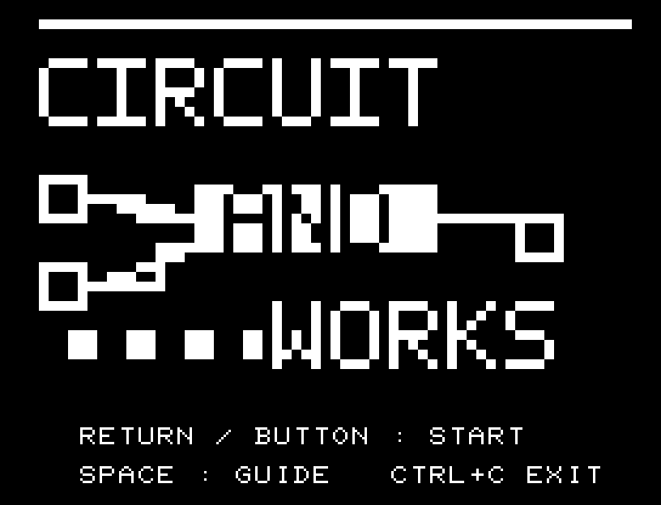
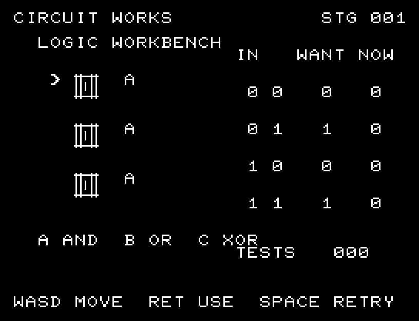
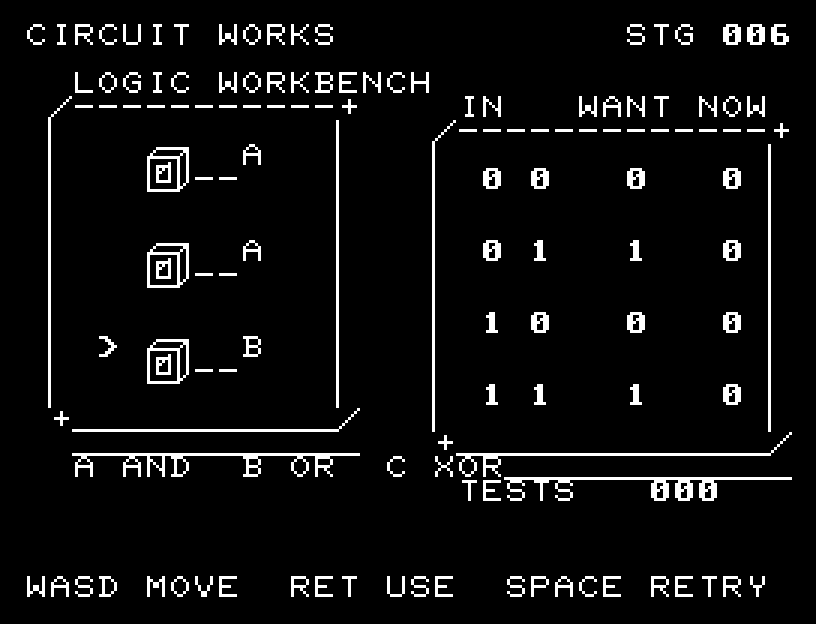

# CIRCUIT WORKS

[Wiki](https://github.com/zabaglione/jr100dev/wiki/CIRCUIT-WORKS) · [プレイ](https://zabaglione.github.io/pyjr100emu/?game=circuit-works)

3段の論理ゲートを組み替え、4通りの入力に対する出力を目標の表へ一致させます。G1は入力AとB、G2はG1とA、G3はG2とBを計算します。



## タイトルのデザイン

二つの入力がANDゲートへ合流する配線図を主役にし、CIRCUITとWORKSを回路の上下に置きます。

## 画面の奥行き

論理ゲートを厚みのあるスイッチ箱にし、接続線と真理値表を別の操作盤に収めました。配線と0・1の表示は傾けません。

## ゲーム専用フォント

ゲーム中の**数字0〜9の10文字を計器盤フォント**（角張った太線）で揃えています。部分的な英字の置き換えは行いません。タイトルの操作案内・説明・パスワード入力は通常フォントに統一しています。既存のロゴと絵柄を保ち、空きPCG枠だけを使用します。

## 動きとクリア演出

クリア時は完成した盤面・結果を残し、約1.6秒のジングルと余韻を挟みます。その後、キーを押し直して次の操作に進みます。クリア直前から押し続けたキーや、演出中に押したキーで結果を飛ばすことはありません。

## 操作と遊び方

W/Sでゲートを選択、A/DでAND・OR・XORを変更し、RETURNで試験します。画面のゲート記号A/B/Cは、それぞれAND/OR/XORです。

方向キーはキーボードまたはパッド、RETURNはパッドのボタンでも操作できます。SPACEでこの面のやり直し確認を開きます。やり直し確認はNOが初期選択です。A/Dで選び、RETURNで確定、SPACEで取り消します。確認中は進行を止めます。CTRL+CでBASICへ戻ります。

左側に3段の回路、右側に入力・目標・実際の出力を並べます。





## ビルドと検証

バージョン 1.4.0。開始番地 `$0300`、ゲーム本体と定数は 6,810 bytes。画面・作業領域・復帰用の保存領域・512 bytesのスタックを含めて標準RAM 16KB内で動作します。PCGは32文字を場面ごとに切り替えます。

```sh
make -C games/circuit_works
make -C games/circuit_works test
```

出力はゲームの `build/` ディレクトリに作られます。`rules.py` はビルド時にMB8861Hの機械語へ変換されます。JR-100上でPythonを実行する方式ではありません。

キー入力による全ステージのクリア、失敗を含む入力試験、画面範囲、RAM配置、スタック、PCM出力をエミュレーターで検査しています。掲載画像は所有するBASIC ROMからPRGを起動した実フレームです。実機での動作・音声は未確認です。

```sh
.venv/bin/python games/native/replay.py circuit_works --rom /path/to/owned-rom.prg --capture --keyboard
```

タイトルには長めの単音曲、プレイ中には効果音を付けています。ソース・画像・曲は[MIT License](https://github.com/zabaglione/jr100dev/blob/main/games/LICENSE)。`art/`にはPCG Workbench用の画面データもあります。
