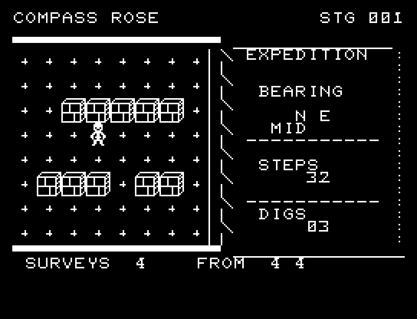
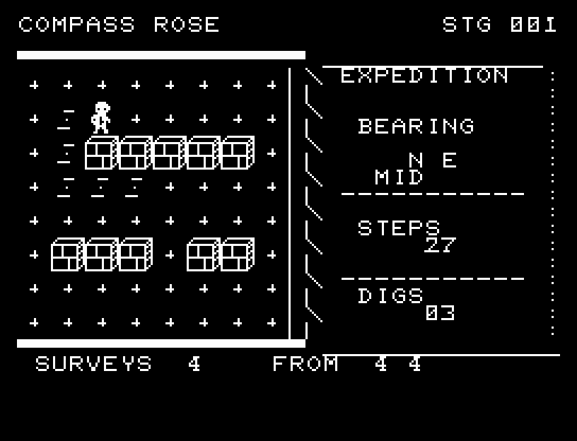
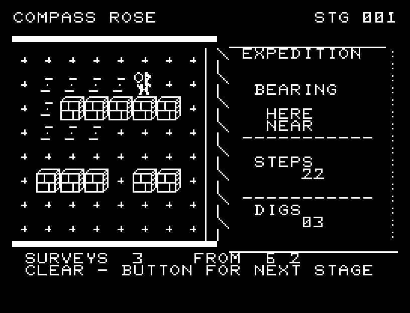

# COMPASS ROSE

[Wiki](https://github.com/zabaglione/jr100dev/wiki/COMPASS-ROSE) · [プレイ](https://zabaglione.github.io/pyjr100emu/?game=compass-rose)

最後に測った方角と距離帯から、埋まった遺物を探す全10地点。位置が変わっても測定結果は自動では変わりません。測る場所を選び、候補を絞ります。


## 紹介画像とプレイ動画







**[音付きプレイ動画を見る（約30秒）](https://zabaglione.github.io/pyjr100emu/gameplay.html?game=compass-rose)**

1ステージのクリアまでを収録。

## タイトルのデザイン

左の大きな羅針盤から右の目標へ点線を伸ばし、航路を挟んでタイトルを分けています。

## 画面の奥行き

測定では輪が3段階に広がり、歩行は途中の位置を通ります。掘る動きと穴、発見時の光と音を表示し、過去の測定地点を残します。

## ゲーム専用フォント

ゲーム中の**数字0〜9の10文字を活字フォント**（読みやすいセリフ体）で揃えています。部分的な英字の置き換えは行いません。タイトルの操作案内・説明・パスワード入力は通常フォントに統一しています。既存のロゴと絵柄を保ち、空きPCG枠だけを使用します。

## 動きとクリア演出

測定では輪が3段階に広がり、歩行は途中の位置を通ります。掘る動きと穴、発見時の光と音を表示し、過去の測定地点を残します。被弾や結果を確認する間は、追加入力で表示を飛ばせません。

クリア時は完成した盤面・結果を残し、約1.6秒のジングルと余韻を挟みます。失敗時も原因を表示し、ジングルの後に短い間を置きます。その後、キーを押し直して次の操作に進みます。直前から押し続けたキーや、演出中に押したキーで結果を飛ばすことはありません。

## 操作と遊び方

WASDで移動、Xで測定、RETURNで掘ります。移動は補給1、測定は2。開始時の測定は無料で、追加は4回までです。掘り外せるのは2回で、3回目の空振りで失敗します。

方向キーはキーボードまたはパッド、RETURNはパッドのボタンでも操作できます。SPACEでこの面のやり直し確認を開きます。やり直し確認はNOが初期選択です。A/Dで選び、RETURNで確定、SPACEで取り消します。確認中は進行を止めます。CTRL+CでBASICへ戻ります。

測定では輪が3段階に広がり、歩行は途中の位置を通ります。掘る動きと穴、発見時の光と音を表示し、過去の測定地点を残します。演出が終わってから次のキーを押してください。

BEARINGはN/S/W/Eの方角、NEARは距離0〜2、MIDは3〜5、FARは6以上。距離は上下左右の合計です。FROMは測定地点の列・行、SURVEYSは残り測定、STEPSは補給、DIGSは掘れる回数です。


## ビルドと検証

バージョン 3.0.0。開始番地 `$0300`、ゲーム本体と定数は 8,543 bytes。画面・作業領域・復帰用の保存領域・512 bytesのスタックを含めて標準RAM 16KB内で動作します。PCGは32文字を場面ごとに切り替えます。

```sh
make -C games/compass_rose
make -C games/compass_rose test
```

出力はゲームの `build/` ディレクトリに作られます。`rules.py` はビルド時にMB8861Hの機械語へ変換されます。JR-100上でPythonを実行する方式ではありません。

キー入力による全ステージのクリア、失敗を含む入力試験、画面範囲、RAM配置、スタック、PCM出力をエミュレーターで検査しています。掲載画像は所有するBASIC ROMからPRGを起動した実フレームです。実機での動作・音声は未確認です。

```sh
.venv/bin/python games/native/replay.py compass_rose --rom /path/to/owned-rom.prg --capture --keyboard
```

タイトルには長めの単音曲、プレイ中には効果音を付けています。ソース・画像・曲は[MIT License](https://github.com/zabaglione/jr100dev/blob/main/games/LICENSE)。`art/`にはPCG Workbench用の画面データもあります。
