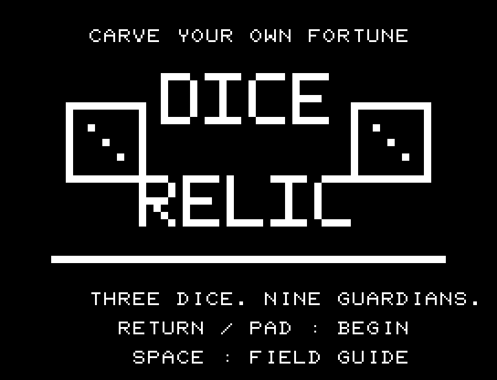
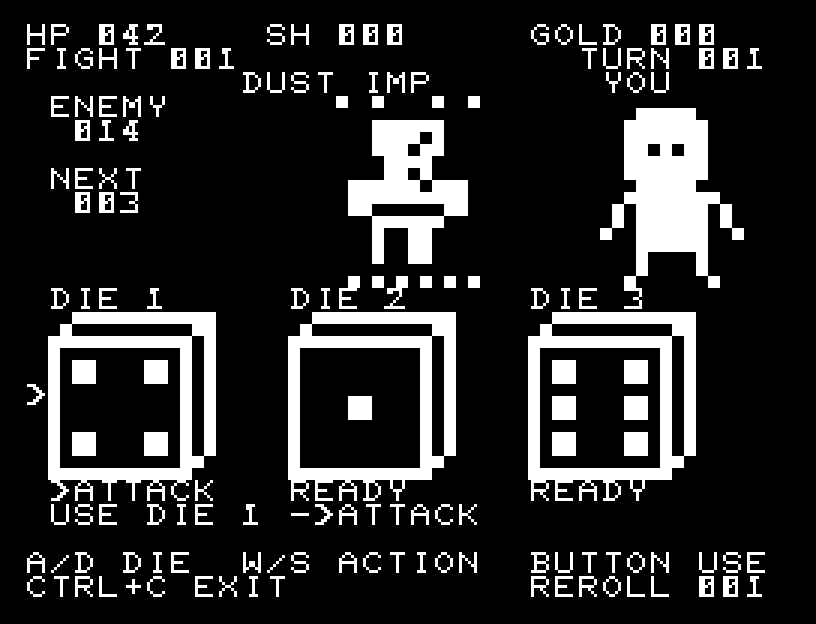
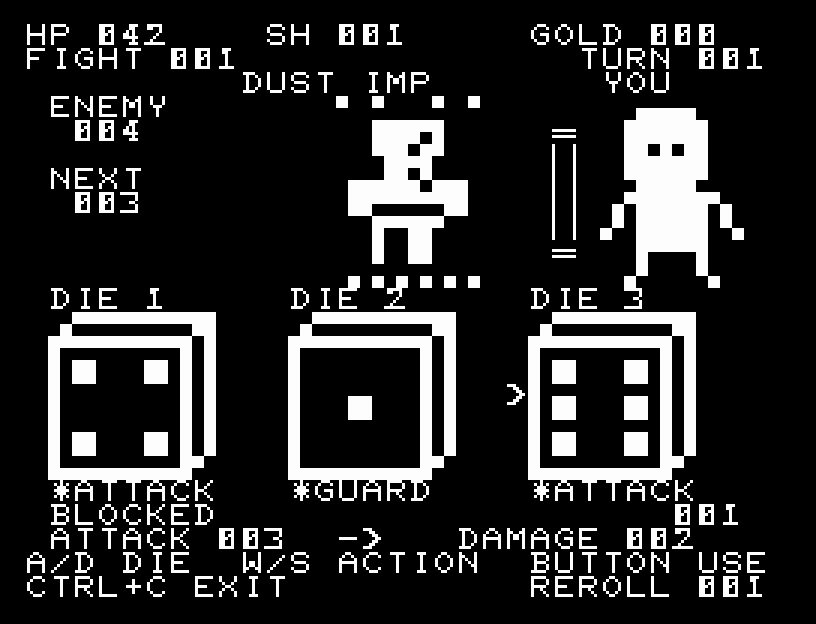
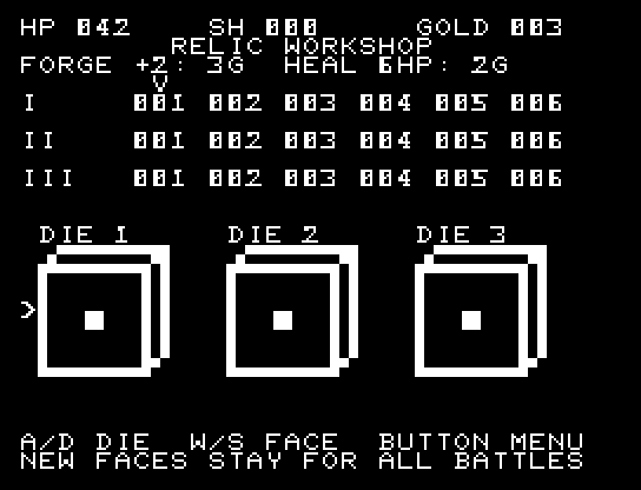
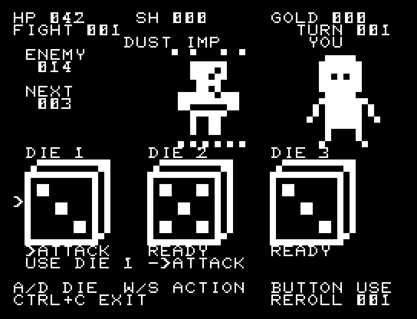
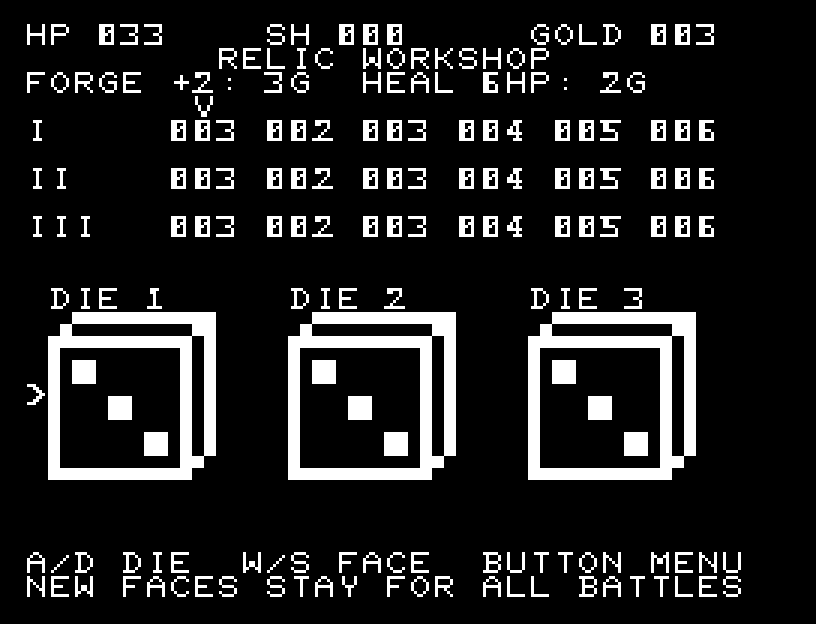
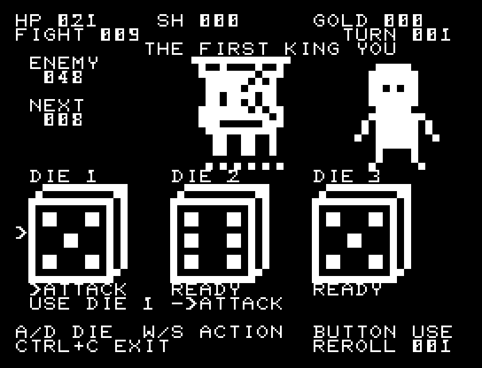

# DICE RELIC

3個のダイスを振り、その出目を攻撃・防御・回復へ割り当てる、JR-100・標準RAM 16KB向けゲームです。8体の守護者と最後の王を倒し、勝利報酬でダイスの面を作り替えます。



## 紹介画像とプレイ動画







**[音付きプレイ動画を見る（約34秒）](https://zabaglione.github.io/pyjr100emu/gameplay.html?game=dice-relic)**

最初の戦闘に勝利するまでを収録。

## タイトルのデザイン

大きなダイスと遺物の紋章を並べ、上のDICEと右下のRELICが両者を結びます。

## 画面の奥行き

ダイスに斜めの上面と側面を付け、1〜9の目を前面に配置しました。守護者の右に主人公を置き、攻撃の向きと被弾する対象を描き分けます。各ダイスのすぐ下に割当先を残し、下段の行動名と数値の変化で一手の結果を確認できます。

## ゲーム専用フォント

ゲーム中の**数字0〜9の10文字を石碑フォント**（上下の飾りを持つ刻印）で揃えています。部分的な英字の置き換えは行いません。タイトルの操作案内・説明・パスワード入力は通常フォントに統一しています。既存のロゴと絵柄を保ち、空きPCG枠だけを使用します。

## 動きとクリア演出

攻撃では主人公が踏み込んで光弾を飛ばし、命中した敵が点滅します。防御では盾が広がり、敵の攻撃から防いだ量と残るダメージを表示します。被弾すると主人公が点滅して後ずさりし、回復では光が上昇します。HPや防御値の変化を確認する間を挟み、敵の消滅と勝利報酬まで順番に表示します。演出中の追加入力は受け付けません。

クリア時は完成した盤面・結果を残し、約1.6秒のジングルと余韻を挟みます。失敗時も原因を表示し、ジングルの後に短い間を置きます。その後、キーを押し直して次の操作に進みます。直前から押し続けたキーや、演出中に押したキーで結果を飛ばすことはありません。


## 操作

| 操作 | キーボード | 1ボタンパッド |
| --- | --- | --- |
| ダイスを選択 | A/D | 左右 |
| 割当先を選択 | W/S | 上下 |
| 使用／決定 | RETURN | ボタン |
| 工房で面を選択 | W/S | 上下 |
| 工房のサービスを選択 | A/D | 左右 |
| BASICへ戻る | CTRL+C | キーボードを使用 |

ATTACKは出目の値だけ攻撃、GUARDは同じ値の防御、HEALは同じ値のHP回復です。選択中のダイスの下には「>ATTACK」のように割当先の候補を表示し、RETURNで使うと「*ATTACK」「*GUARD」「*HEAL」に変わります。使用後も出目と割当先を残すので、どのダイスを何に使ったか確認できます。各ダイスは1ターンに1回だけ使えます。REROLLは未使用のダイスを1ターンに1回だけ振り直します。

画面右のYOUが主人公です。攻撃では踏み込みと光弾、命中では敵の点滅、防御では盾の展開、被弾では主人公の点滅と後ずさり、回復では上昇する光が入ります。下段のBEFORE → AFTERはHPまたは防御値の変化です。BLOCKEDでは、防いだ量とATTACK → DAMAGE（敵の攻撃値から実際に受けるダメージへの変化）を表示します。3個目の使用、防御、被弾、次のダイスの順に進みます。演出が終わってから次のキーを押してください。

3個すべてを使うと敵が攻撃します。防御で軽減した残りがHPへ入り、防御は消えます。敵は4ターンごとに攻撃が2増えます。NEXTには今回の攻撃値を表示します。HP上限は42。敵を倒せばそのターンの反撃を受けません。



勝利でHPが2回復し、金貨を3枚得ます。工房では、左右でダイス、上下で6面のどれを作り替えるかを選び、ボタンでサービスメニューを開きます。

- FORGE：金貨3枚で選んだ面の値を2増加。上限9。
- HEAL：金貨2枚でHPを6回復。満タンなら購入しません。
- NEXT：次の戦闘へ。
- BACK：面の選択へ戻る。

作り替えた面は以後の戦闘でも使われます。工房の表に全18面、下の大きなダイスに選択中の面の値を表示します。




## ビルドと検証

開発環境を用意して `make -C games/dice_relic` を実行します。出力は `build/dice-relic.prg`、開始番地 `$0300`。本体・定数は9,699 bytes。画面・状態・保存領域・512 bytesのスタックを含め標準16KB内、PCGは32文字です。

`make -C games/dice_relic test` は攻防、回復上限、使用済みダイス、振り直し上限、強攻撃、購入価格、面の上限と次戦への持越しを独立モデルと照合します。入力だけで9戦を完走し、8回の面変更を確認しました。パッドとキーボードの両方を検証しています。

```sh
.venv/bin/python games/dice_relic/replay.py --rom /path/to/owned-rom.prg --capture
```

画像は実BASICから起動したエミュレーターの実画面です。実機は未確認。振り直し時のアニメーション、効果音、32小節の独自タイトル曲・戦闘曲を収録。ソース・画像・曲は[MIT License](../LICENSE)。ROMは含みません。
