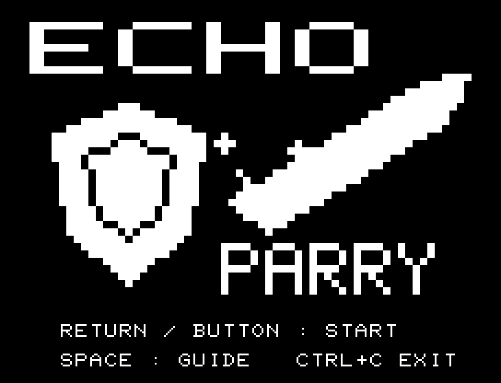
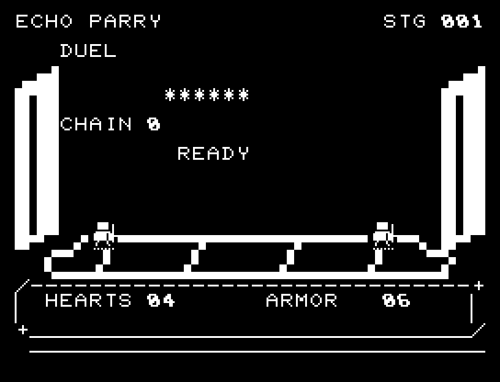
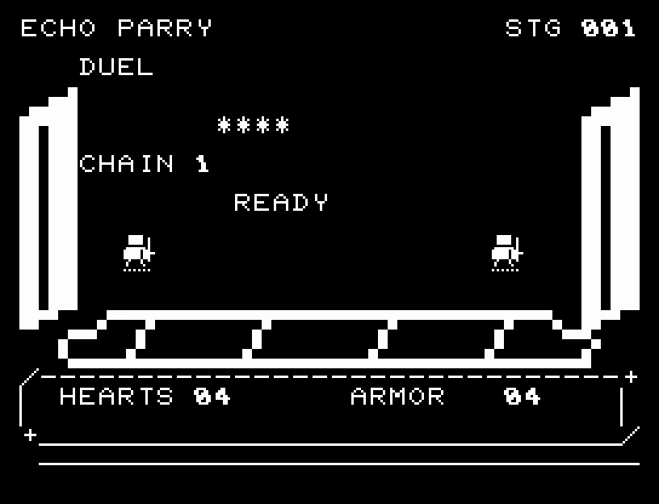
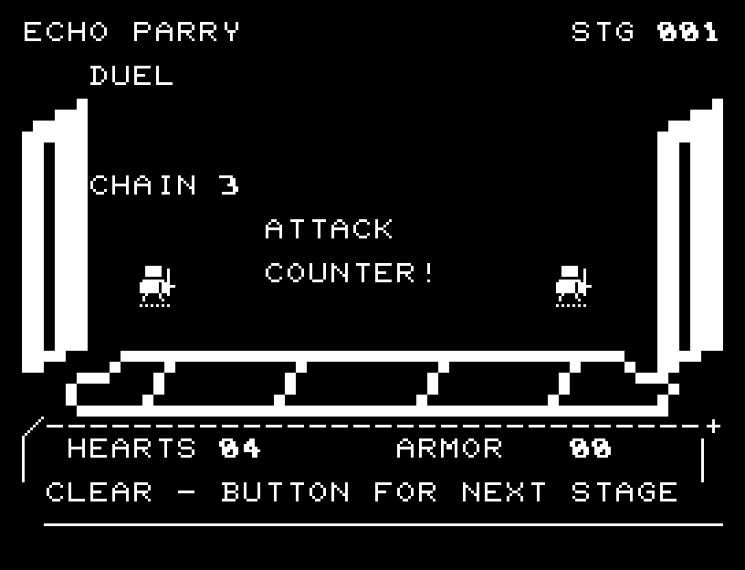
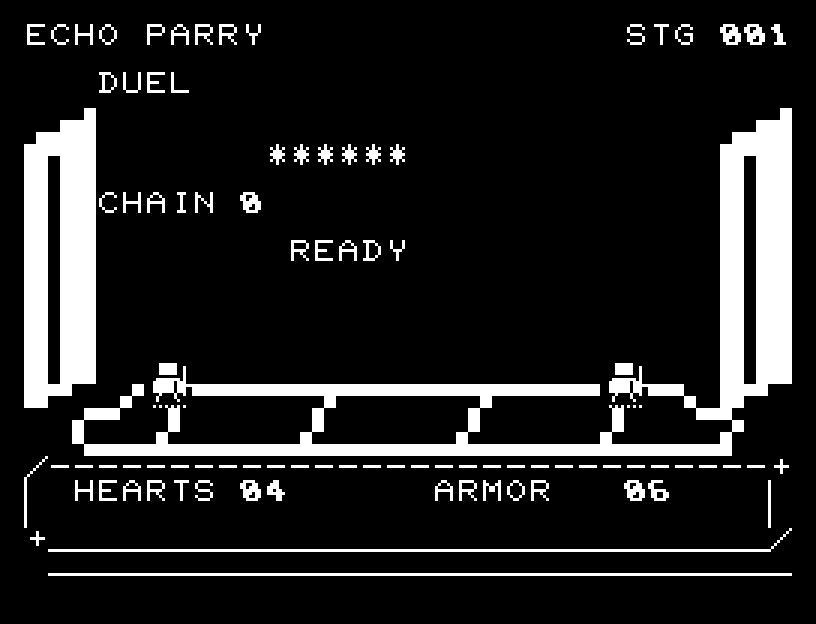
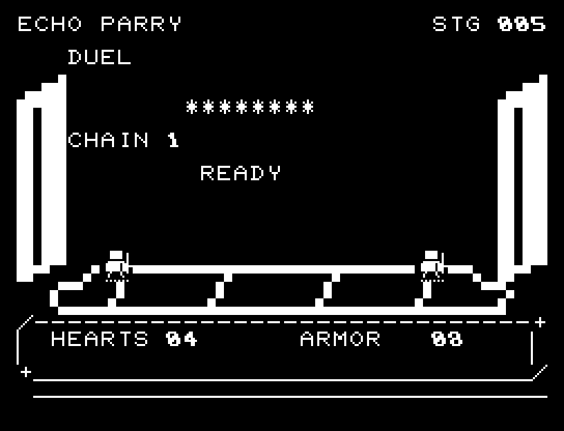

# ECHO PARRY

[Wiki](https://github.com/zabaglione/jr100dev/wiki/ECHO-PARRY) · [プレイ](https://zabaglione.github.io/pyjr100emu/?game=echo-parry)

上段・下段の攻撃を見て受け流す全6戦。相手の体力は6から11へ増え、3戦目からは構えを途中で変えるフェイントが加わります。



## 紹介画像とプレイ動画







**[音付きプレイ動画を見る（約30秒）](https://zabaglione.github.io/pyjr100emu/gameplay.html?game=echo-parry)**

1ステージのクリアまでを収録。

## タイトルのデザイン

大きな盾と斜めの剣を対置し、横長ECHOと下のPARRYで受け止める瞬間を表します。

## 画面の奥行き

立体的な決闘場を描き、攻撃の飛来、後退、反撃、装甲の点滅、撃破の破片を表示します。予告・フェイント・攻撃・反撃・回復時間を音と姿勢で追えます。

## ゲーム専用フォント

ゲーム中の**数字0〜9の10文字をスピードフォント**（右へ傾く太線）で揃えています。部分的な英字の置き換えは行いません。タイトルの操作案内・説明・パスワード入力は通常フォントに統一しています。既存のロゴと絵柄を保ち、空きPCG枠だけを使用します。

## 動きとクリア演出

立体的な決闘場を描き、攻撃の飛来、後退、反撃、装甲の点滅、撃破の破片を表示します。予告・フェイント・攻撃・反撃・回復時間を音と姿勢で追えます。被弾や結果を確認する間は、追加入力で表示を飛ばせません。

クリア時は完成した盤面・結果を残し、約1.6秒のジングルと余韻を挟みます。失敗時も原因を表示し、ジングルの後に短い間を置きます。その後、キーを押し直して次の操作に進みます。直前から押し続けたキーや、演出中に押したキーで結果を飛ばすことはありません。

## 操作と遊び方

W/Sで構えを選び、ATTACK中にRETURNで受け流します。攻撃の後半、COUNTER!の表示中なら2ダメージ。3連続の受け流しも2ダメージです。Aで後退すると、反撃を捨ててその攻撃を安全に避けられます。

方向キーはキーボードまたはパッド、RETURNはパッドのボタンでも操作できます。SPACEでこの面のやり直し確認を開きます。やり直し確認はNOが初期選択です。A/Dで選び、RETURNで確定、SPACEで取り消します。確認中は進行を止めます。CTRL+CでBASICへ戻ります。

立体的な決闘場を描き、攻撃の飛来、後退、反撃、装甲の点滅、撃破の破片を表示します。予告・フェイント・攻撃・反撃・回復時間を音と姿勢で追えます。演出が終わってから次のキーを押してください。

HEARTSは自分の体力、ARMORは相手の残り体力、CHAINは連続成功です。READY中や違う高さで受け流すと被弾。フェイントの後も攻撃の高さを見直します。





## ビルドと検証

バージョン 2.0.0。開始番地 `$0300`、ゲーム本体と定数は 7,997 bytes。画面・作業領域・復帰用の保存領域・512 bytesのスタックを含めて標準RAM 16KB内で動作します。PCGは32文字を場面ごとに切り替えます。

```sh
make -C games/echo_parry
make -C games/echo_parry test
```

出力はゲームの `build/` ディレクトリに作られます。`rules.py` はビルド時にMB8861Hの機械語へ変換されます。JR-100上でPythonを実行する方式ではありません。

キー入力による全ステージのクリア、失敗を含む入力試験、画面範囲、RAM配置、スタック、PCM出力をエミュレーターで検査しています。掲載画像は所有するBASIC ROMからPRGを起動した実フレームです。実機での動作・音声は未確認です。

```sh
.venv/bin/python games/native/replay.py echo_parry --rom /path/to/owned-rom.prg --capture --keyboard
```

タイトルには長めの単音曲、プレイ中には効果音を付けています。ソース・画像・曲は[MIT License](https://github.com/zabaglione/jr100dev/blob/main/games/LICENSE)。`art/`にはPCG Workbench用の画面データもあります。
