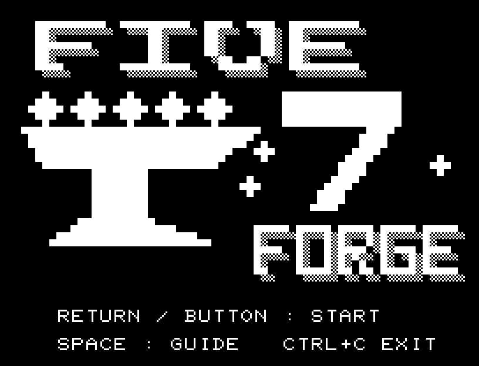
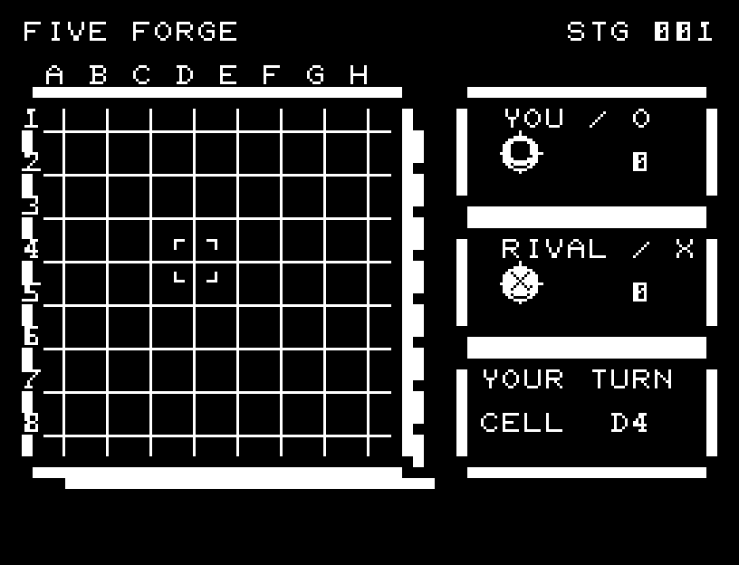
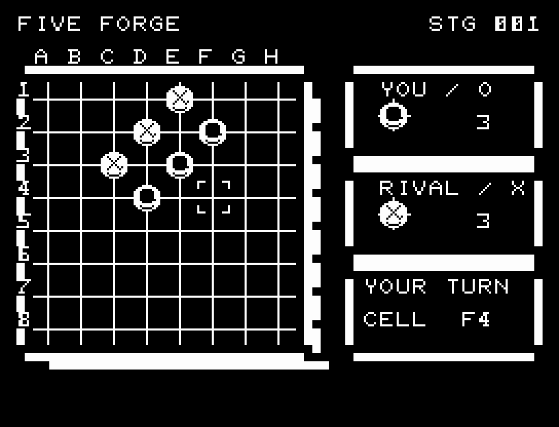
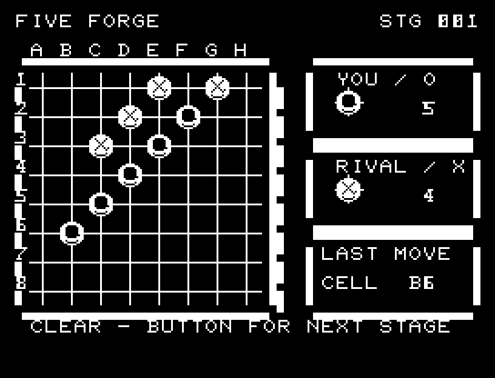
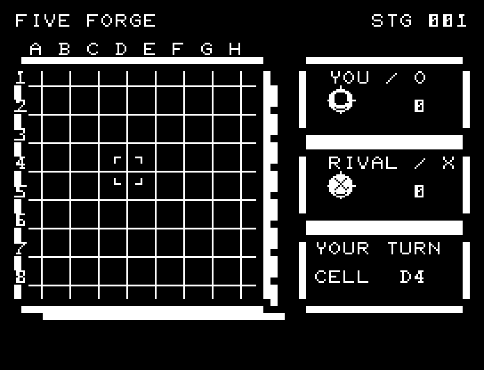
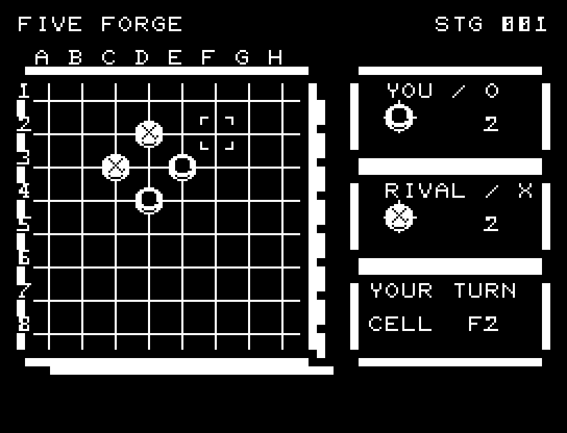

# FIVE FORGE

[Wiki](https://github.com/zabaglione/jr100dev/wiki/FIVE-FORGE) · [プレイ](https://zabaglione.github.io/pyjr100emu/?game=five-forge)

8×8の盤で相手より先に縦・横・斜めのいずれかに5個の石を並べます。相手は自分の連続を伸ばし、目前の勝ち筋を阻止します。



## 紹介画像とプレイ動画







**[音付きプレイ動画を見る（約34秒）](https://zabaglione.github.io/pyjr100emu/gameplay.html?game=five-forge)**

1ステージのクリアまでを収録。

## タイトルのデザイン

金床に並ぶ五つの駒と振り下ろすハンマーを描き、石の刻印風のロゴで鍛冶場を表します。

## 画面の奥行き

連続した格子と厚みのある盤枠、石数を示す二つのパネルで鍛冶場の対戦盤を表現します。自分は輪の刻印、相手は交差の刻印が入った立体的な石です。選択位置は四隅の括弧とCELLの座標で示します。

## ゲーム専用フォント

ゲーム中の**数字0〜9の10文字を石碑フォント**（上下の飾りを持つ刻印）で揃えています。部分的な英字の置き換えは行いません。タイトルの操作案内・説明・パスワード入力は通常フォントに統一しています。既存のロゴと絵柄を保ち、空きPCG枠だけを使用します。

## 動きとクリア演出

石が落下し、着地してつぶれ、元の形に戻る四段階の動きとSEを付けました。自分と相手の着手を一手ずつ表示し、五連の石だけを3回点滅させてから結果を表示します。被弾や結果を確認する間は、追加入力で表示を飛ばせません。

クリア時は完成した盤面・結果を残し、約1.6秒のジングルと余韻を挟みます。失敗時も原因を表示し、ジングルの後に短い間を置きます。その後、キーを押し直して次の操作に進みます。直前から押し続けたキーや、演出中に押したキーで結果を飛ばすことはありません。

## 操作と遊び方

WASDで位置を選び、RETURNで石を置きます。自分はO、相手はXです。満杯まで勝てなければ失敗です。

方向キーはキーボードまたはパッド、RETURNはパッドのボタンでも操作できます。SPACEでこの面のやり直し確認を開きます。やり直し確認はNOが初期選択です。A/Dで選び、RETURNで確定、SPACEで取り消します。確認中は進行を止めます。CTRL+CでBASICへ戻ります。

石が落下し、着地してつぶれ、元の形に戻る四段階の動きとSEを付けました。自分と相手の着手を一手ずつ表示し、五連の石だけを3回点滅させてから結果を表示します。演出が終わってから次のキーを押してください。

右側に自分と相手の石数を表示します。CELLは現在選んでいる位置で、着手中は石を置いている位置に変わります。五連ができると該当する石だけが3回点滅し、その後で結果メッセージとジングルが流れます。





## ビルドと検証

バージョン 1.6.1。開始番地 `$0300`、ゲーム本体と定数は 8,545 bytes。画面・作業領域・復帰用の保存領域・512 bytesのスタックを含めて標準RAM 16KB内で動作します。PCGは32文字を場面ごとに切り替えます。

```sh
make -C games/five_forge
make -C games/five_forge test
```

出力はゲームの `build/` ディレクトリに作られます。`rules.py` はビルド時にMB8861Hの機械語へ変換されます。JR-100上でPythonを実行する方式ではありません。

キー入力による全ステージのクリア、失敗を含む入力試験、画面範囲、RAM配置、スタック、PCM出力をエミュレーターで検査しています。掲載画像は所有するBASIC ROMからPRGを起動した実フレームです。実機での動作・音声は未確認です。

```sh
.venv/bin/python games/native/replay.py five_forge --rom /path/to/owned-rom.prg --capture --keyboard
```

タイトルには長めの単音曲、プレイ中には効果音を付けています。ソース・画像・曲は[MIT License](https://github.com/zabaglione/jr100dev/blob/main/games/LICENSE)。`art/`にはPCG Workbench用の画面データもあります。
