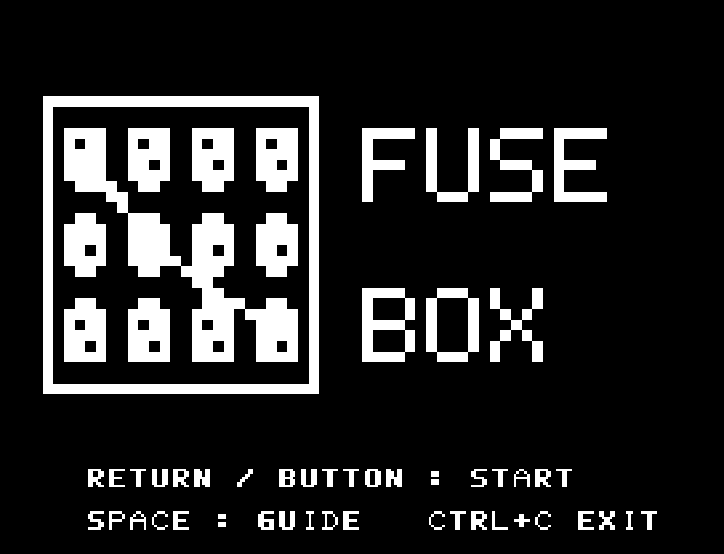
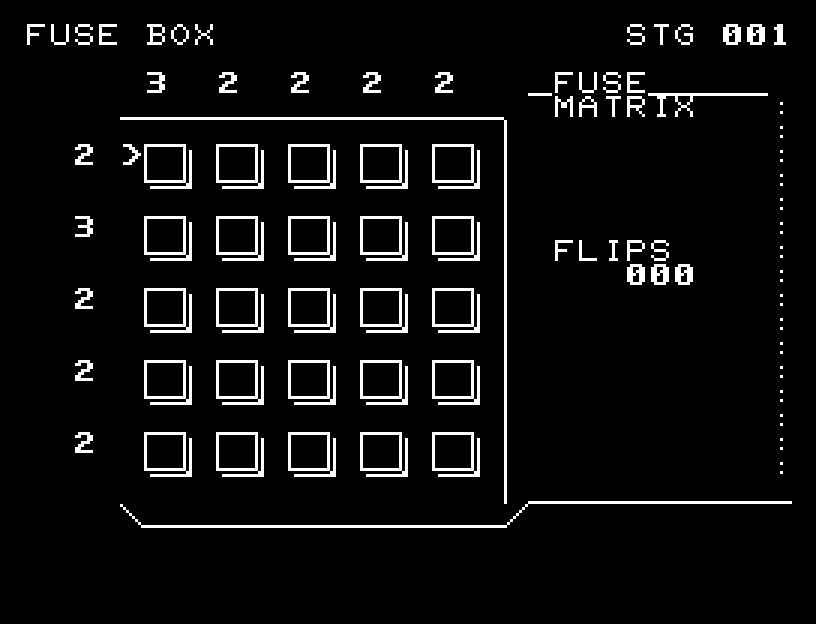
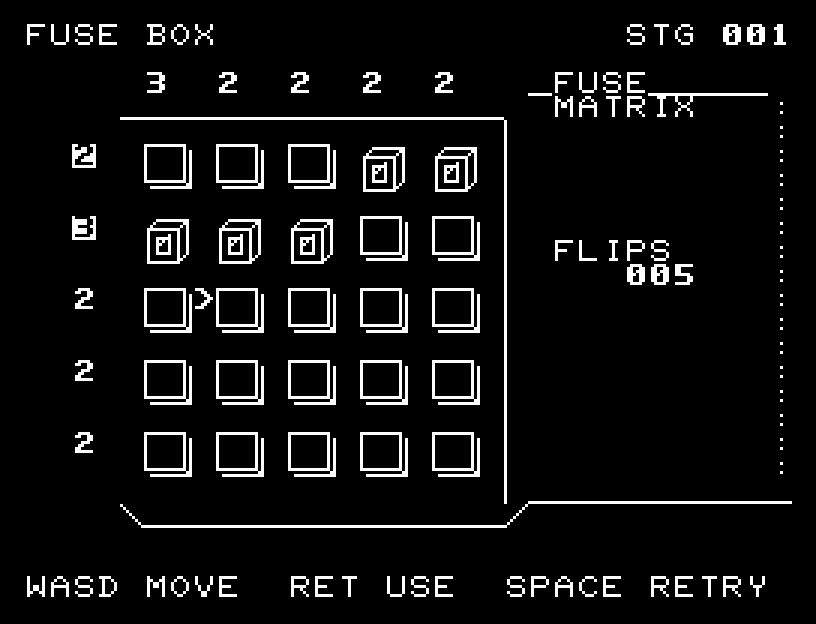
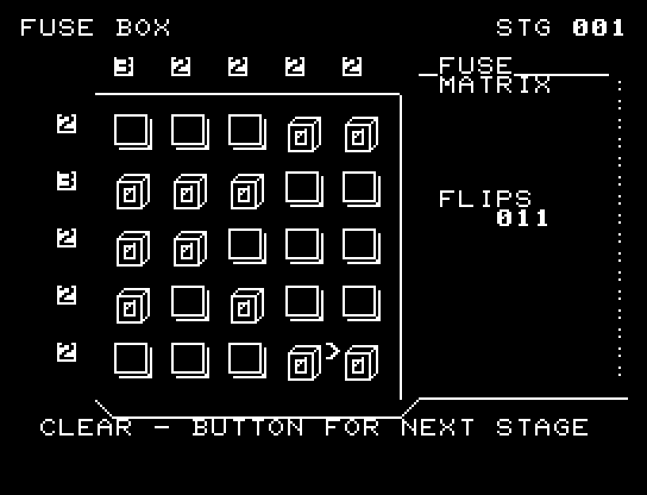
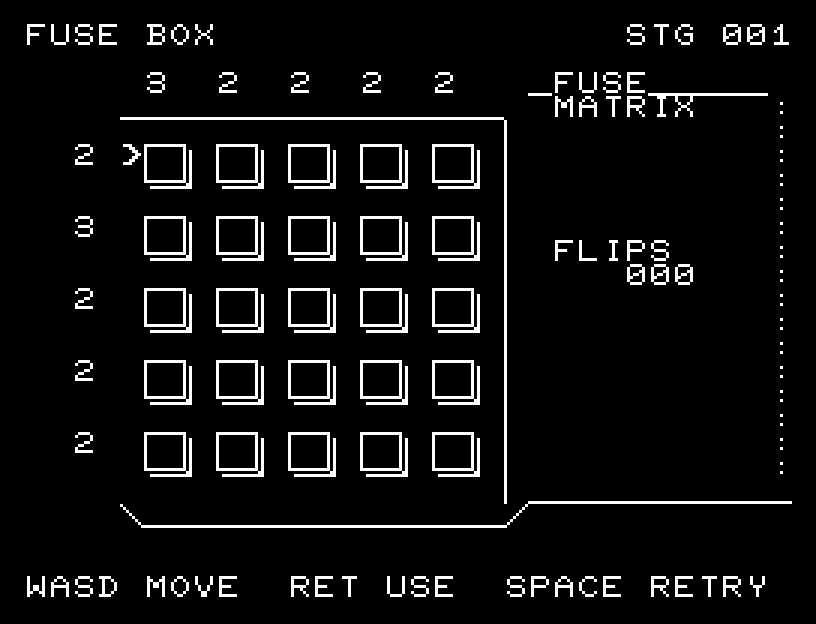
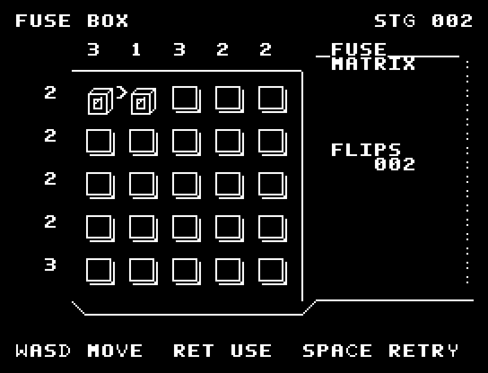

# FUSE BOX

[Wiki](https://github.com/zabaglione/jr100dev/wiki/FUSE-BOX) · [プレイ](https://zabaglione.github.io/pyjr100emu/?game=fuse-box)

行と列に指定された個数だけスイッチを入れます。すべての個数が一致すれば、どの配置でも正解です。



## 紹介画像とプレイ動画







**[音付きプレイ動画を見る（約32秒）](https://zabaglione.github.io/pyjr100emu/gameplay.html?game=fuse-box)**

1ステージのクリアまでを収録。

## タイトルのデザイン

大きな白い配電盤から右へ配線を引き、横長FUSEと下のBOXで機械の形を囲みます。

## 画面の奥行き

配線済みのマスを盛り上がったスイッチ、空きマスを枠として描きました。行列の個数は盤外に残し、盤の側面と区別できます。

## ゲーム専用フォント

ゲーム中の**数字0〜9の10文字を計器盤フォント**（角張った太線）で揃えています。部分的な英字の置き換えは行いません。タイトルの操作案内・説明・パスワード入力は通常フォントに統一しています。既存のロゴと絵柄を保ち、空きPCG枠だけを使用します。

## 動きとクリア演出

マスは面が細くなり、側面を見せてから反対の面が開く順に切り替わります。入／切の両方向に途中の形と効果音があります。被弾や結果を確認する間は、追加入力で表示を飛ばせません。

クリア時は完成した盤面・結果を残し、約1.6秒のジングルと余韻を挟みます。失敗時も原因を表示し、ジングルの後に短い間を置きます。その後、キーを押し直して次の操作に進みます。直前から押し続けたキーや、演出中に押したキーで結果を飛ばすことはありません。

## 操作と遊び方

WASDでスイッチを選び、RETURNで入／切を反転します。

方向キーはキーボードまたはパッド、RETURNはパッドのボタンでも操作できます。SPACEでこの面のやり直し確認を開きます。やり直し確認はNOが初期選択です。A/Dで選び、RETURNで確定、SPACEで取り消します。確認中は進行を止めます。CTRL+CでBASICへ戻ります。

マスは面が細くなり、側面を見せてから反対の面が開く順に切り替わります。入／切の両方向に途中の形と効果音があります。演出が終わってから次のキーを押してください。

上の数字は列、左の数字は行の目標個数です。スイッチの入っている数が目標と一致すると、その数字が白黒反転します。入れ過ぎたりスイッチを切ったりして一致しなくなると通常表示に戻ります。連続したマス数ではなく、行・列それぞれの合計を合わせます。

攻略では、必要数の多い行から埋めます。上の数字から、その列にすでに入れた数を引き、「あと何個必要か」を数えてください。残り個数の多い列を優先し、同じ個数なら近いマスを選びます。行の数字が反転したら次の行へ移り、列の残り個数を数え直します。反転した行・列には、それ以上入れません。

1面の動画では、左の「3」がある上から2行目と、上の「3」がある左端の列の交点から始めます。そこから同じ行にあと2個を入れて「3」を反転させ、残り個数を見ながらほかの行を埋めていきます。中央から始める必要はなく、すべての行・列の個数が合えば別の配置でもクリアできます。





## ビルドと検証

バージョン 1.6.0。開始番地 `$0300`、ゲーム本体と定数は 7,049 bytes。画面・作業領域・復帰用の保存領域・512 bytesのスタックを含めて標準RAM 16KB内で動作します。PCGは32文字を場面ごとに切り替えます。

```sh
make -C games/fuse_box
make -C games/fuse_box test
```

出力はゲームの `build/` ディレクトリに作られます。`rules.py` はビルド時にMB8861Hの機械語へ変換されます。JR-100上でPythonを実行する方式ではありません。

キー入力による全ステージのクリア、失敗を含む入力試験、画面範囲、RAM配置、スタック、PCM出力をエミュレーターで検査しています。掲載画像は所有するBASIC ROMからPRGを起動した実フレームです。実機での動作・音声は未確認です。

```sh
.venv/bin/python games/native/replay.py fuse_box --rom /path/to/owned-rom.prg --capture --keyboard
```

タイトルには長めの単音曲、プレイ中には効果音を付けています。ソース・画像・曲は[MIT License](https://github.com/zabaglione/jr100dev/blob/main/games/LICENSE)。`art/`にはPCG Workbench用の画面データもあります。
