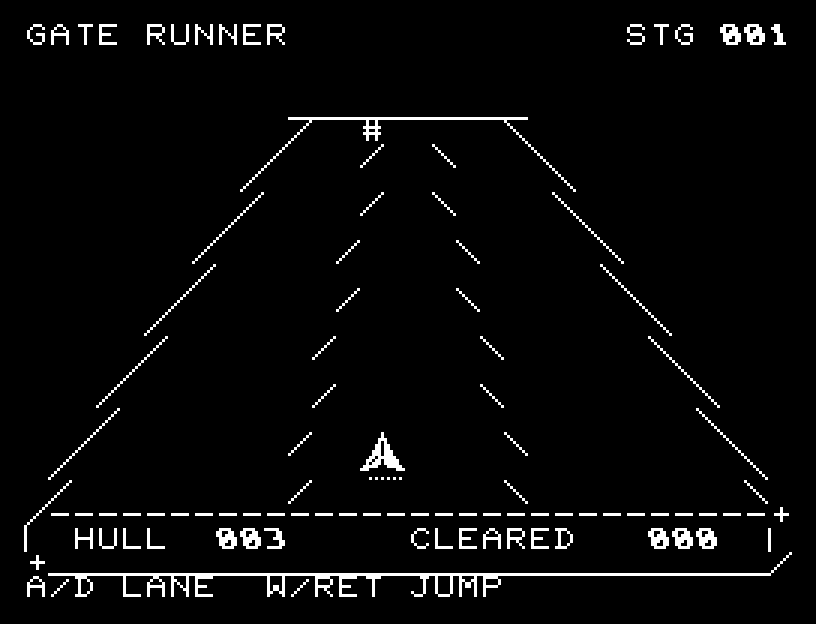
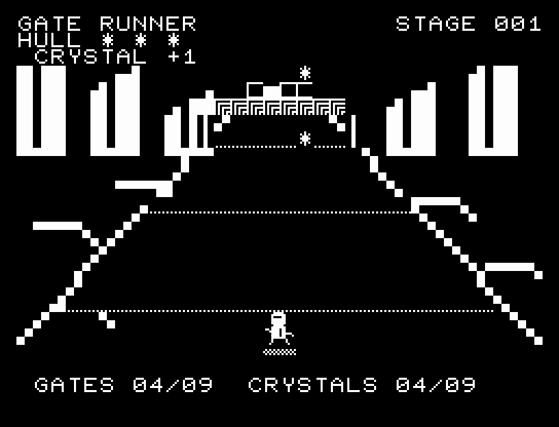
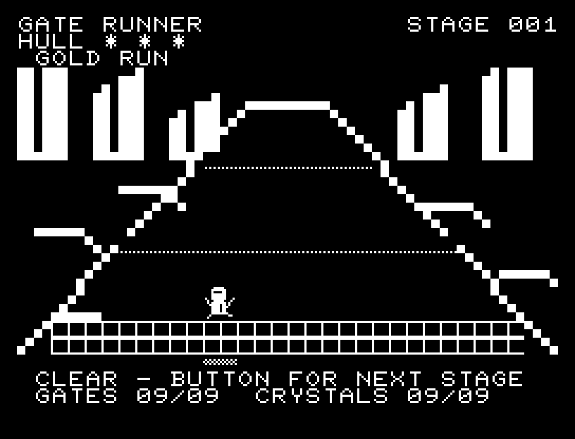

# GATE RUNNER

[Wiki](https://github.com/zabaglione/jr100dev/wiki/GATE-RUNNER) · [プレイ](https://zabaglione.github.io/pyjr100emu/?game=gate-runner)

奥から迫る障害物を越える、6コースのランニングゲームです。最初のコースは9組、以降は12組の障害物に挑みます。横位置を1文字ずつ細かく調整して走ります。壁は横へ避け、穴は跳び越え、低い梁は地上を通ります。各コースには道幅いっぱいの穴が3か所あり、ジャンプを使わないと突破できません。


## 紹介画像とプレイ動画







**[音付きプレイ動画を見る（約37秒）](https://zabaglione.github.io/pyjr100emu/gameplay.html?game=gate-runner)**

1ステージのクリアまでを収録。

## タイトルのデザイン

奥に収束する走路と迫るゲートを描き、横長GATEと傾いたRUNNERに網点の側面を付けています。

## 画面の奥行き

タイトルと同じ角張った遠景と奥へ収束する道をセミグラフィックスで描きます。道路の模様が手前へ流れ、障害物は接近に合わせて横幅と高さが増えます。壁には白い天面・模様のある正面・暗い側面を付け、穴と低い梁を描き分けます。

## ゲーム専用フォント

遠景はROMのセミグラフィックス、壁・穴・梁はPCGの陰影で描きます。主人公は4文字のPCGを走行とジャンプの形に書き換えます。説明と数値は通常フォントに揃え、描画の速さを優先しています。

## 動きとクリア演出

3車線を廃止し、横27段階を1文字ずつ移動する6コースへ作り直しました。タイトルと同じセミグラフィックスの遠景に、拡大して迫る壁・穴・低い梁を描きます。各コース3か所の全幅の穴はジャンプ必須です。危険な位置の結晶を集めると評価が上がり、走行・跳躍・被弾に動きとSEがあります。被弾や結果を確認する間は、追加入力で表示を飛ばせません。

クリア時は完成した盤面・結果を残し、約1.6秒のジングルと余韻を挟みます。失敗時も原因を表示し、ジングルの後に短い間を置きます。その後、キーを押し直して次の操作に進みます。直前から押し続けたキーや、演出中に押したキーで結果を飛ばすことはありません。

## 操作と遊び方

A/Dで左右へ1文字ずつ移動します。押し続けると連続して走り、空中でも左右へ動けます。WまたはRETURNでジャンプし、着地してから次のジャンプができます。

障害物は奥では小さく、手前へ来るほど大きくなります。次の障害も遠景に見えるため、今の障害を越えた後の横移動を考えておきます。壁はジャンプしても越えられません。低い梁では地上を通り、全幅の穴では踏み切るタイミングを合わせてください。

方向キーはキーボードまたはパッド、RETURNはパッドのボタンでも操作できます。SPACEでこの面のやり直し確認を開きます。やり直し確認はNOが初期選択です。A/Dで選び、RETURNで確定、SPACEで取り消します。確認中は進行を止めます。CTRL+CでBASICへ戻ります。

3車線を廃止し、横27段階を1文字ずつ移動する6コースへ作り直しました。タイトルと同じセミグラフィックスの遠景に、拡大して迫る壁・穴・低い梁を描きます。各コース3か所の全幅の穴はジャンプ必須です。危険な位置の結晶を集めると評価が上がり、走行・跳躍・被弾に動きとSEがあります。演出が終わってから次のキーを押してください。

HULLは残りの耐久力、GATESは越えた障害の数、CRYSTALSは回収した結晶の数です。3回ぶつかると失敗し、壁・穴・低い梁のどれで失敗したか表示します。

結晶は狭い通路や穴の上にも出現します。安全な経路で完走するか、危険な位置へ寄って結晶を取るかを選べます。最初のコースは5個でSILVER、7個でGOLD。以降は6個でSILVER、10個でGOLDです。コースが進むと障害の順番と左右の配置が変わり、3〜4コース、5〜6コースでは接近速度も上がります。


## ビルドと検証

バージョン 3.0.0。開始番地 `$0300`、ゲーム本体と定数は 9,387 bytes。画面・作業領域・復帰用の保存領域・512 bytesのスタックを含めて標準RAM 16KB内で動作します。PCGは32文字を場面ごとに切り替えます。

```sh
make -C games/gate_runner
make -C games/gate_runner test
```

出力はゲームの `build/` ディレクトリに作られます。`rules.py` はビルド時にMB8861Hの機械語へ変換されます。JR-100上でPythonを実行する方式ではありません。

キー入力による全ステージのクリア、失敗を含む入力試験、画面範囲、RAM配置、スタック、PCM出力をエミュレーターで検査しています。掲載画像は所有するBASIC ROMからPRGを起動した実フレームです。実機での動作・音声は未確認です。

```sh
.venv/bin/python games/native/replay.py gate_runner --rom /path/to/owned-rom.prg --capture --keyboard
```

タイトルには長めの単音曲、プレイ中には効果音を付けています。ソース・画像・曲は[MIT License](https://github.com/zabaglione/jr100dev/blob/main/games/LICENSE)。`art/`にはPCG Workbench用の画面データもあります。
