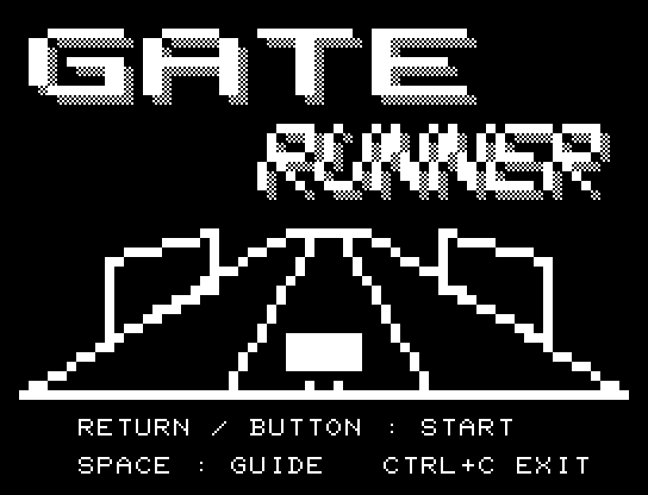
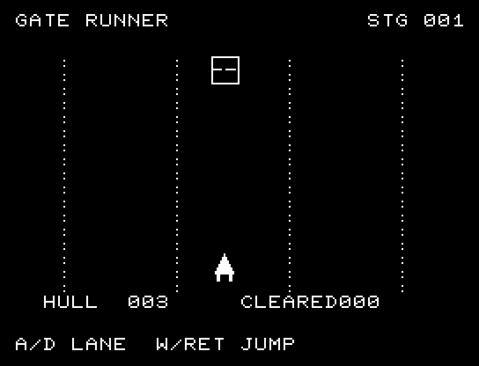
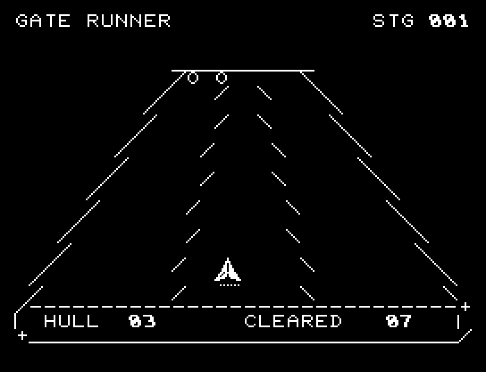

# GATE RUNNER

[Wiki](https://github.com/zabaglione/jr100dev/wiki/GATE-RUNNER) · [プレイ](https://zabaglione.github.io/pyjr100emu/?game=gate-runner)

3本の走路で18個の障害物を突破します。壁は別の走路へ避け、穴は避けるか跳び越えます。衝突3回で終了します。



## タイトルのデザイン

奥に収束する走路と迫るゲートを描き、横長GATEと傾いたRUNNERに網点の側面を付けています。

## 画面の奥行き

3本の走路が奥へ収束する遠近表示にしました。障害物は遠くでは小さく、接近すると大きくなり、手前では自機と同じレーン位置に揃います。衝突判定とジャンプのタイミングは変更していません。

## ゲーム専用フォント

ゲーム中の**数字0〜9の10文字をスピードフォント**（右へ傾く太線）で揃えています。部分的な英字の置き換えは行いません。タイトルの操作案内・説明・パスワード入力は通常フォントに統一しています。既存のロゴと絵柄を保ち、空きPCG枠だけを使用します。

## 動きとクリア演出

クリア時は完成した盤面・結果を残し、約1.6秒のジングルと余韻を挟みます。失敗時も原因を表示し、ジングルの後に短い間を置きます。その後、キーを押し直して次の操作に進みます。直前から押し続けたキーや、演出中に押したキーで結果を飛ばすことはありません。

## 操作と遊び方

A/Dで走路を変更、WまたはRETURNでジャンプします。

方向キーはキーボードまたはパッド、RETURNはパッドのボタンでも操作できます。SPACEでこの面のやり直し確認を開きます。やり直し確認はNOが初期選択です。A/Dで選び、RETURNで確定、SPACEで取り消します。確認中は進行を止めます。CTRL+CでBASICへ戻ります。

迫る障害物、ジャンプ状態、残りの耐久力、突破数を表示します。





## ビルドと検証

バージョン 1.5.0。開始番地 `$0300`、ゲーム本体と定数は 6,094 bytes。画面・作業領域・復帰用の保存領域・512 bytesのスタックを含めて標準RAM 16KB内で動作します。PCGは32文字を場面ごとに切り替えます。

```sh
make -C games/gate_runner
make -C games/gate_runner test
```

出力はゲームの `build/` ディレクトリに作られます。`rules.py` はビルド時にMB8861Hの機械語へ変換されます。JR-100上でPythonを実行する方式ではありません。

キー入力による全ステージのクリア、失敗を含む入力試験、画面範囲、RAM配置、スタック、PCM出力をエミュレーターで検査しています。掲載画像は所有するBASIC ROMからPRGを起動した実フレームです。実機での動作・音声は未確認です。

```sh
.venv/bin/python games/native/replay.py gate_runner --rom /path/to/owned-rom.prg --capture --keyboard
```

タイトルには長めの単音曲、プレイ中には効果音を付けています。ソース・画像・曲は[MIT License](https://github.com/zabaglione/jr100dev/blob/main/games/LICENSE)。`art/`にはPCG Workbench用の画面データもあります。
