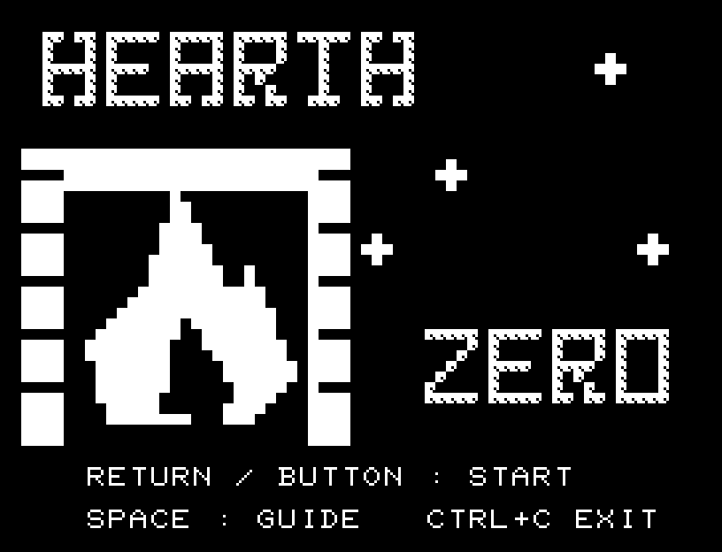
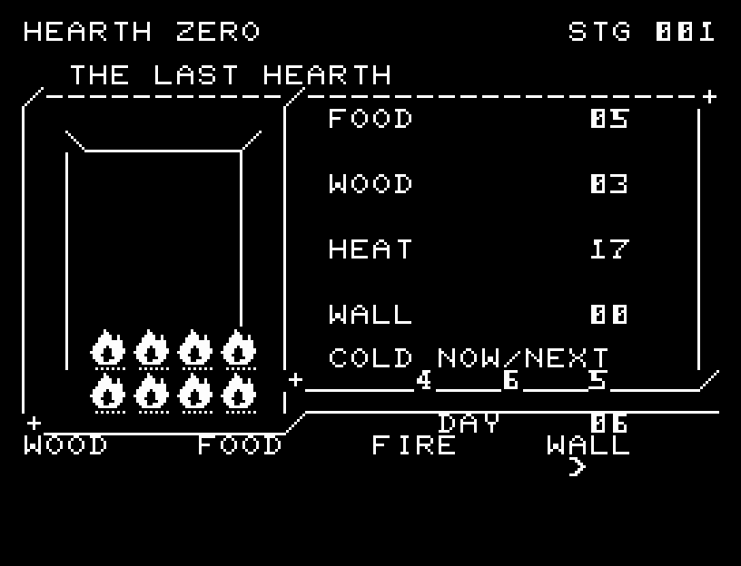
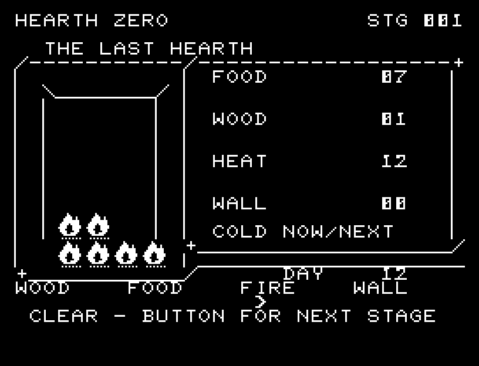
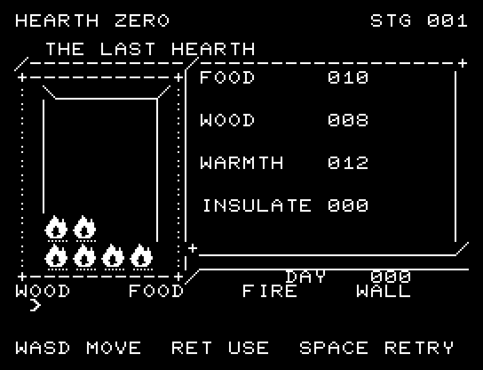
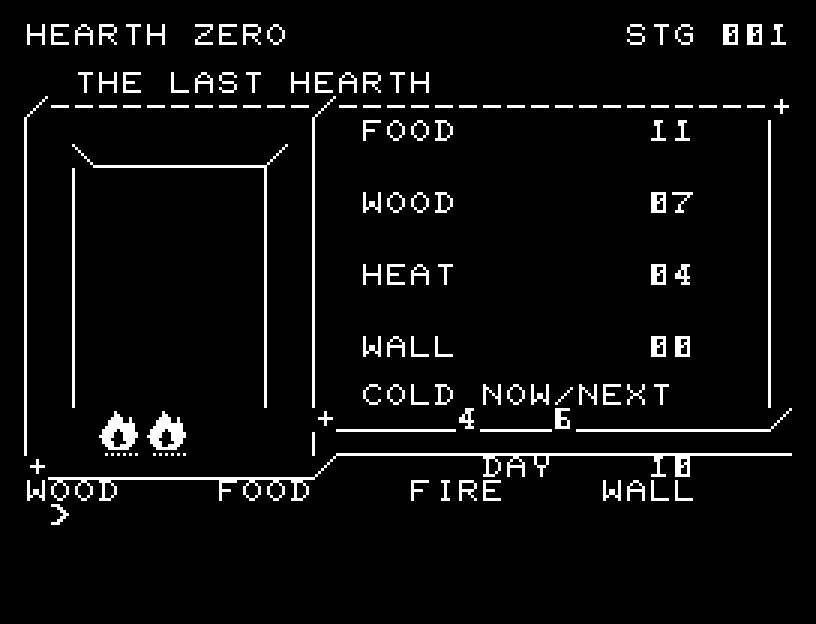

# HEARTH ZERO

[Wiki](https://github.com/zabaglione/jr100dev/wiki/HEARTH-ZERO) · [プレイ](https://zabaglione.github.io/pyjr100emu/?game=hearth-zero)

食料・薪・暖かさを管理し、3種類の寒波をそれぞれ12日間生き延びます。今夜から3夜の予報を読み、採集と暖房の備えを選びます。



## 紹介画像とプレイ動画






**[音付きプレイ動画を見る（約51秒）](https://zabaglione.github.io/pyjr100emu/gameplay.html?game=hearth-zero)**

1ステージのクリアまでを収録。

## タイトルのデザイン

左の大きな暖炉と右の雪を対置します。白い正面と網点の側面を持つロゴで、熱源を守る世界を表します。

## 画面の奥行き

採集物・薪・火・壁に別の絵を使い、選んだ仕事の品が暖炉へ移ります。火の揺れと雪を加え、作業、食事、熱の消費をSEと短い停止で順番に示します。

## ゲーム専用フォント

ゲーム中の**数字0〜9の10文字を石碑フォント**（上下の飾りを持つ刻印）で揃えています。部分的な英字の置き換えは行いません。タイトルの操作案内・説明・パスワード入力は通常フォントに統一しています。既存のロゴと絵柄を保ち、空きPCG枠だけを使用します。

## 動きとクリア演出

採集物・薪・火・壁に別の絵を使い、選んだ仕事の品が暖炉へ移ります。火の揺れと雪を加え、作業、食事、熱の消費をSEと短い停止で順番に示します。被弾や結果を確認する間は、追加入力で表示を飛ばせません。

クリア時は完成した盤面・結果を残し、約1.6秒のジングルと余韻を挟みます。失敗時も原因を表示し、ジングルの後に短い間を置きます。その後、キーを押し直して次の操作に進みます。直前から押し続けたキーや、演出中に押したキーで結果を飛ばすことはありません。

## 操作と遊び方

WASDで仕事を選び、RETURNで1日を過ごします。薪と食料の採集は各7増加。FIREは薪3で暖かさ9増加、WALLは薪4で断熱を1段階、最大2段階まで強化します。

方向キーはキーボードまたはパッド、RETURNはパッドのボタンでも操作できます。SPACEでこの面のやり直し確認を開きます。やり直し確認はNOが初期選択です。A/Dで選び、RETURNで確定、SPACEで取り消します。確認中は進行を止めます。CTRL+CでBASICへ戻ります。

採集物・薪・火・壁に別の絵を使い、選んだ仕事の品が暖炉へ移ります。火の揺れと雪を加え、作業、食事、熱の消費をSEと短い停止で順番に示します。演出が終わってから次のキーを押してください。

毎晩、食料を2消費し、予報の寒さから断熱を引いた分だけ暖かさを失います。食料が足りないか暖かさが0になると失敗。食料と薪は最大30、暖かさは最大24です。





## ビルドと検証

バージョン 2.1.0。開始番地 `$0300`、ゲーム本体と定数は 7,867 bytes。画面・作業領域・復帰用の保存領域・512 bytesのスタックを含めて標準RAM 16KB内で動作します。PCGは32文字を場面ごとに切り替えます。

```sh
make -C games/hearth_zero
make -C games/hearth_zero test
```

出力はゲームの `build/` ディレクトリに作られます。`rules.py` はビルド時にMB8861Hの機械語へ変換されます。JR-100上でPythonを実行する方式ではありません。

キー入力による全ステージのクリア、失敗を含む入力試験、画面範囲、RAM配置、スタック、PCM出力をエミュレーターで検査しています。掲載画像は所有するBASIC ROMからPRGを起動した実フレームです。実機での動作・音声は未確認です。

```sh
.venv/bin/python games/native/replay.py hearth_zero --rom /path/to/owned-rom.prg --capture --keyboard
```

タイトルには長めの単音曲、プレイ中には効果音を付けています。ソース・画像・曲は[MIT License](https://github.com/zabaglione/jr100dev/blob/main/games/LICENSE)。`art/`にはPCG Workbench用の画面データもあります。
