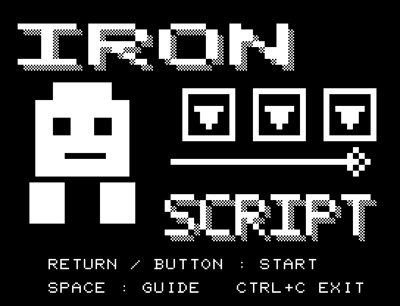
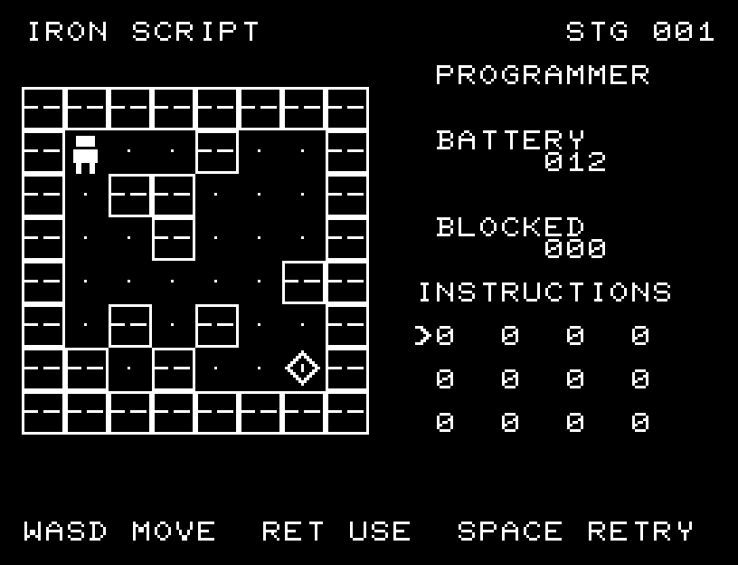
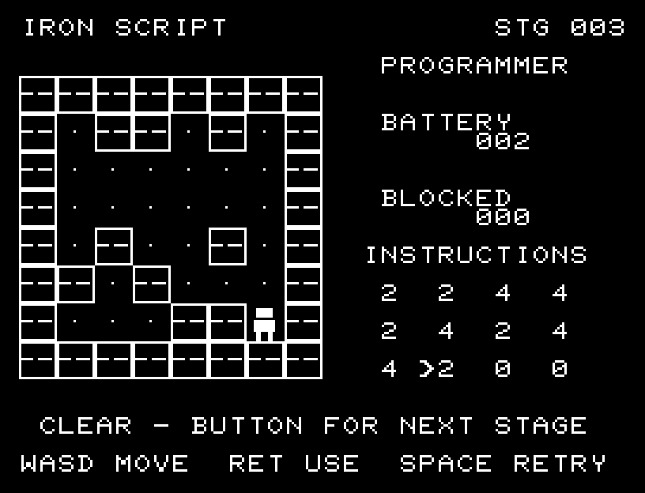

# IRON SCRIPT

[Wiki](https://github.com/zabaglione/jr100dev/wiki/IRON-SCRIPT) · [プレイ](https://zabaglione.github.io/pyjr100emu/?game=iron-script)

ロボットに12枠の命令列を渡し、壁を避けてダイヤの端末へ導きます。20の異なる地形に挑戦します。



## タイトルのデザイン

大きなロボットと命令ボタンを左右に置き、横に広いIRONで工場の重さを表します。

## 画面の奥行き

金属の壁とロボット、床の鋲で工場の立体感を出しました。命令列は区切りのある操作盤に収めています。

## ゲーム専用フォント

ゲーム中の**数字0〜9の10文字を計器盤フォント**（角張った太線）で揃えています。部分的な英字の置き換えは行いません。タイトルの操作案内・説明・パスワード入力は通常フォントに統一しています。既存のロゴと絵柄を保ち、空きPCG枠だけを使用します。

## 動きとクリア演出

クリア時は完成した盤面・結果を残し、約1.6秒のジングルと余韻を挟みます。その後、キーを押し直して次の操作に進みます。クリア直前から押し続けたキーや、演出中に押したキーで結果を飛ばすことはありません。

## 操作と遊び方

A/Dで命令枠を選び、W/Sで命令を変更、RETURNで実行します。0は待機、1は上、2は下、3は左、4は右です。実行後も命令を修正できます。

方向キーはキーボードまたはパッド、RETURNはパッドのボタンでも操作できます。SPACEでこの面のやり直し確認を開きます。やり直し確認はNOが初期選択です。A/Dで選び、RETURNで確定、SPACEで取り消します。確認中は進行を止めます。CTRL+CでBASICへ戻ります。

右側に残りの命令数、壁に当たった回数、命令列を表示します。





## ビルドと検証

バージョン 1.4.0。開始番地 `$0300`、ゲーム本体と定数は 9,336 bytes。画面・作業領域・復帰用の保存領域・512 bytesのスタックを含めて標準RAM 16KB内で動作します。PCGは32文字を場面ごとに切り替えます。

```sh
make -C games/iron_script
make -C games/iron_script test
```

出力はゲームの `build/` ディレクトリに作られます。`rules.py` はビルド時にMB8861Hの機械語へ変換されます。JR-100上でPythonを実行する方式ではありません。

キー入力による全ステージのクリア、失敗を含む入力試験、画面範囲、RAM配置、スタック、PCM出力をエミュレーターで検査しています。掲載画像は所有するBASIC ROMからPRGを起動した実フレームです。実機での動作・音声は未確認です。

```sh
.venv/bin/python games/native/replay.py iron_script --rom /path/to/owned-rom.prg --capture --keyboard
```

タイトルには長めの単音曲、プレイ中には効果音を付けています。ソース・画像・曲は[MIT License](https://github.com/zabaglione/jr100dev/blob/main/games/LICENSE)。`art/`にはPCG Workbench用の画面データもあります。
