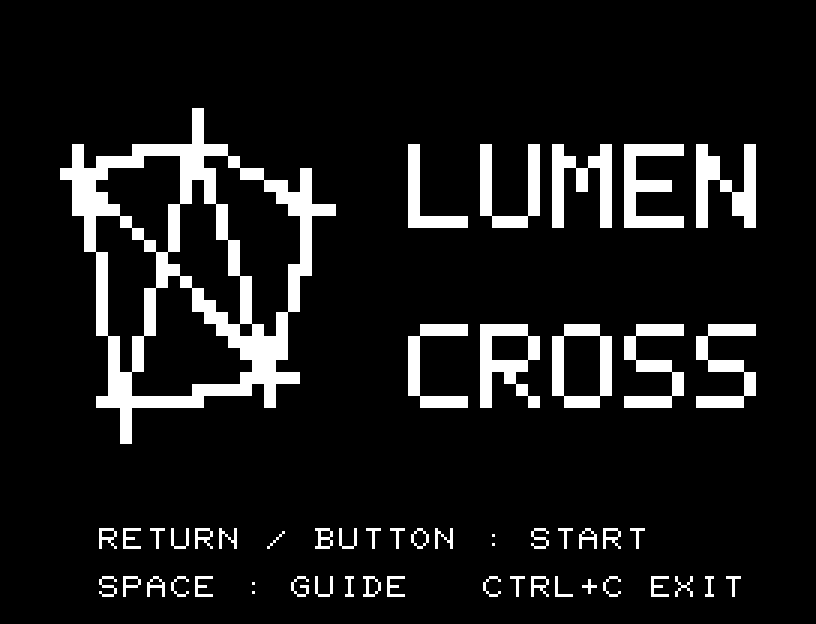
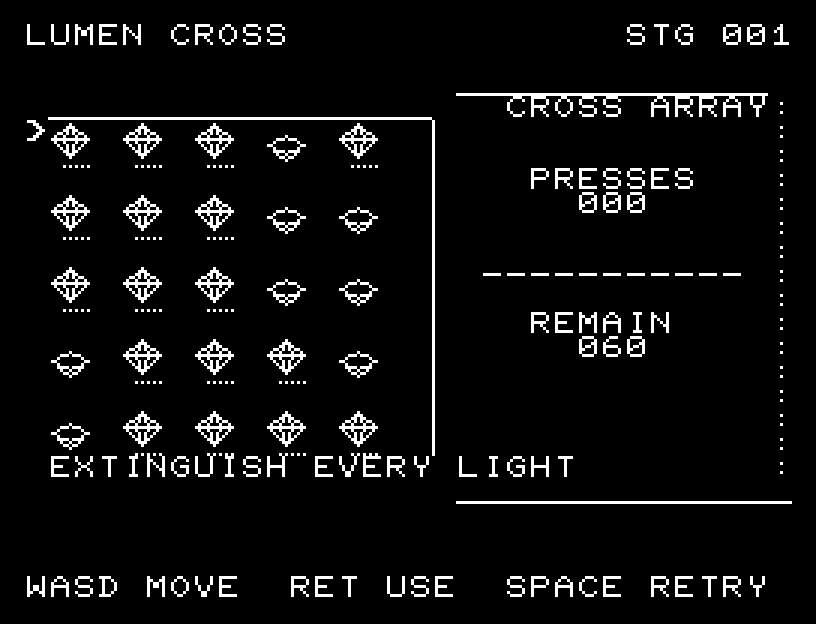
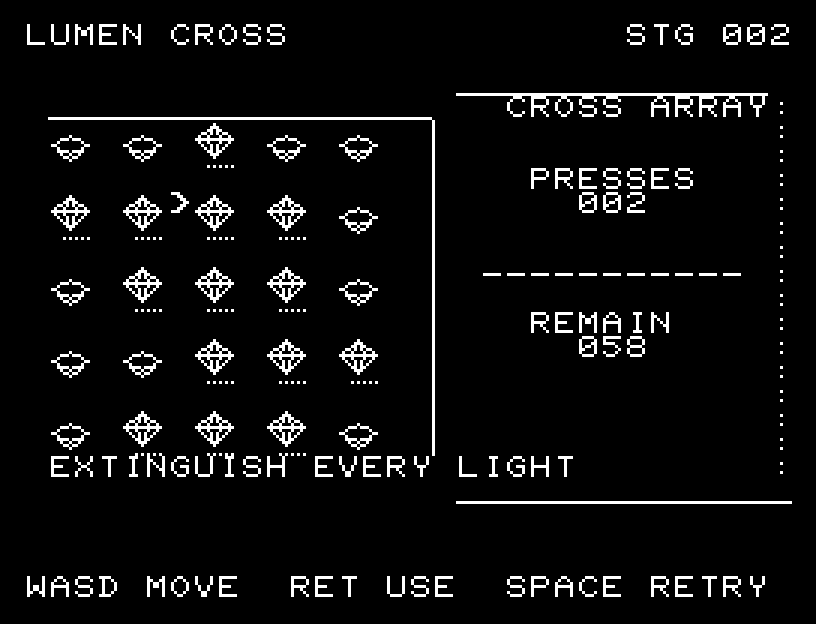

# LUMEN CROSS

[Wiki](https://github.com/zabaglione/jr100dev/wiki/LUMEN-CROSS) · [プレイ](https://zabaglione.github.io/pyjr100emu/?game=lumen-cross)

選んだ場所と上下左右の明かりを反転し、すべて消灯する10面のパズルです。端では盤外の明かりは反転しません。



## 画面の奥行き

点灯は背の高い結晶、消灯は低くくぼんだ台座にして、高さでも状態を区別できるようにしました。盤面と回数計には薄い縁を付けています。

## ゲーム専用フォント

ゲーム中の**数字0〜9の10文字を結晶フォント**（細い角形と斜めの切り口）で揃えています。部分的な英字の置き換えは行いません。タイトルの操作案内・説明・パスワード入力は通常フォントに統一しています。既存のロゴと絵柄を保ち、空きPCG枠だけを使用します。

## 操作と遊び方

WASDで場所を選び、RETURNで十字に反転します。1面60回まで操作できます。

方向キーはキーボードまたはパッド、RETURNはパッドのボタンでも操作できます。SPACEでこの面のやり直し確認を開きます。やり直し確認はNOが初期選択です。A/Dで選び、RETURNで確定、SPACEで取り消します。確認中は進行を止めます。CTRL+CでBASICへ戻ります。

盤面と残る明かり、操作回数を確認して手順を考えます。





## ビルドと検証

バージョン 1.2.1。開始番地 `$0300`、ゲーム本体と定数は 6,577 bytes。画面・作業領域・復帰用の保存領域・512 bytesのスタックを含めて標準RAM 16KB内で動作します。PCGは32文字を場面ごとに切り替えます。

```sh
make -C games/lumen_cross
make -C games/lumen_cross test
```

出力はゲームの `build/` ディレクトリに作られます。`rules.py` はビルド時にMB8861Hの機械語へ変換されます。JR-100上でPythonを実行する方式ではありません。

キー入力による全ステージのクリア、失敗を含む入力試験、画面範囲、RAM配置、スタック、PCM出力をエミュレーターで検査しています。掲載画像は所有するBASIC ROMからPRGを起動した実フレームです。実機での動作・音声は未確認です。

```sh
.venv/bin/python games/native/replay.py lumen_cross --rom /path/to/owned-rom.prg --capture --keyboard
```

タイトルには長めの単音曲、プレイ中には効果音を付けています。ソース・画像・曲は[MIT License](https://github.com/zabaglione/jr100dev/blob/main/games/LICENSE)。`art/`にはPCG Workbench用の画面データもあります。
