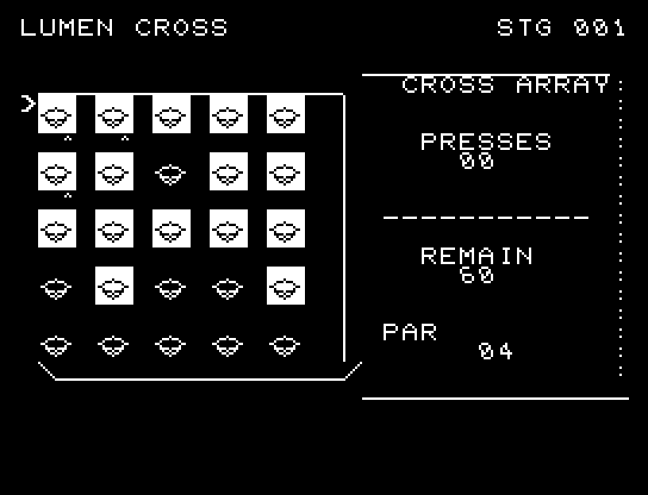
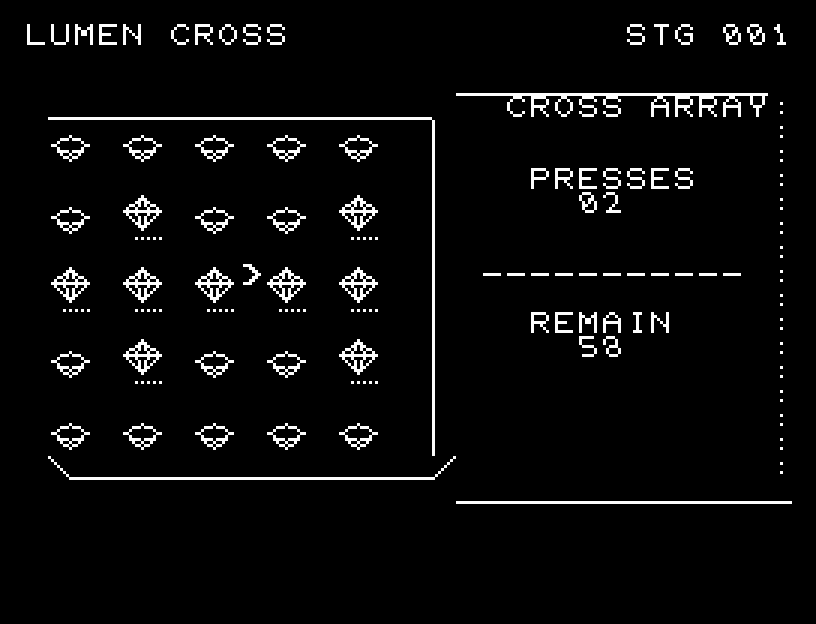
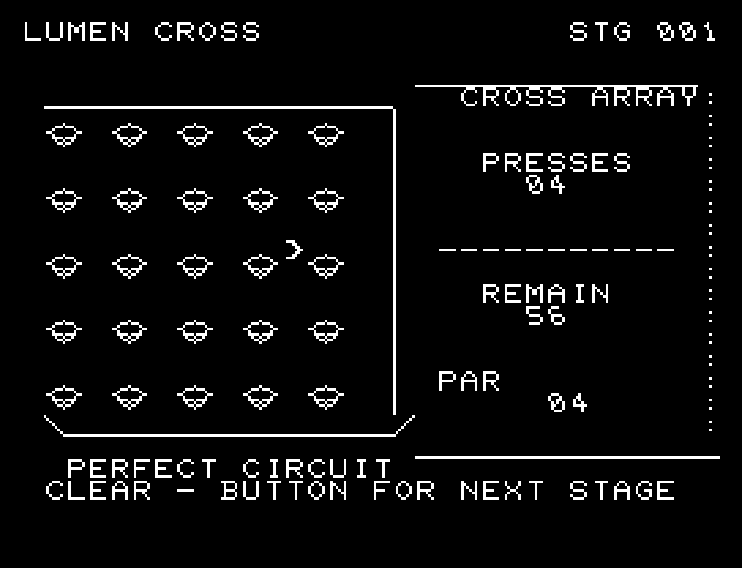

# LUMEN CROSS

[Wiki](https://github.com/zabaglione/jr100dev/wiki/LUMEN-CROSS) · [プレイ](https://zabaglione.github.io/pyjr100emu/?game=lumen-cross)

選んだ場所と上下左右の明かりを反転し、すべて消灯する全18面。クリアだけでなく、最短回数PARでのPERFECT CIRCUITを目指せます。


## 紹介画像とプレイ動画







**[音付きプレイ動画を見る（約31秒）](https://zabaglione.github.io/pyjr100emu/gameplay.html?game=lumen-cross)**

1ステージのクリアまでを収録。

## タイトルのデザイン

左半分の大きな十字と右の光の結晶を対置します。ロゴの白い正面と網点の側面で明暗を分けています。

## 画面の奥行き

各明かりが細くなり、側面を経て逆の面へ開く5段階の反転を行います。中心から周囲へ音と動きが波及し、影響する十字全体を予告します。

## ゲーム専用フォント

ゲーム中の**数字0〜9の10文字を結晶フォント**（細い角形と斜めの切り口）で揃えています。部分的な英字の置き換えは行いません。タイトルの操作案内・説明・パスワード入力は通常フォントに統一しています。既存のロゴと絵柄を保ち、空きPCG枠だけを使用します。

## 動きとクリア演出

各明かりが細くなり、側面を経て逆の面へ開く5段階の反転を行います。中心から周囲へ音と動きが波及し、影響する十字全体を予告します。被弾や結果を確認する間は、追加入力で表示を飛ばせません。

クリア時は完成した盤面・結果を残し、約1.6秒のジングルと余韻を挟みます。失敗時も原因を表示し、ジングルの後に短い間を置きます。その後、キーを押し直して次の操作に進みます。直前から押し続けたキーや、演出中に押したキーで結果を飛ばすことはありません。

## 操作と遊び方

WASDで場所を選び、RETURNで十字に反転します。選択位置から影響する明かりすべてに印が付きます。端では盤外を反転しません。

方向キーはキーボードまたはパッド、RETURNはパッドのボタンでも操作できます。SPACEでこの面のやり直し確認を開きます。やり直し確認はNOが初期選択です。A/Dで選び、RETURNで確定、SPACEで取り消します。確認中は進行を止めます。CTRL+CでBASICへ戻ります。

各明かりが細くなり、側面を経て逆の面へ開く5段階の反転を行います。中心から周囲へ音と動きが波及し、影響する十字全体を予告します。演出が終わってから次のキーを押してください。

PRESSESは使用回数、REMAINは60回からの残り操作回数、PARはその面の最短回数です。同じ場所を2回押すと元に戻る性質を使い、反転する組合せを考えます。


## ソースコード

ゲーム本体は [`rules.py`](rules.py) です。ビルド時にMB8861Hの機械語へ変換します。

ビルド設定は [`game.json`](game.json) と [`Makefile`](Makefile) です。共有コードと生成物の関係は[全ゲームのソース一覧](../SOURCES.md)を参照してください。

## ビルドと検証

バージョン 2.0.0。開始番地 `$0300`、ゲーム本体と定数は 7,170 bytes。画面・作業領域・復帰用の保存領域・512 bytesのスタックを含めて標準RAM 16KB内で動作します。PCGは32文字を場面ごとに切り替えます。

```sh
make -C games/lumen_cross
make -C games/lumen_cross test
```

出力はゲームの `build/` ディレクトリに作られます。JR-100上でPythonを実行する方式ではありません。

キー入力による全ステージのクリア、失敗を含む入力試験、画面範囲、RAM配置、スタック、PCM出力をエミュレーターで検査しています。掲載画像は所有するBASIC ROMからPRGを起動した実フレームです。実機での動作・音声は未確認です。

```sh
.venv/bin/python games/native/replay.py lumen_cross --rom /path/to/owned-rom.prg --capture --keyboard
```

タイトルには長めの単音曲、プレイ中には効果音を付けています。ソース・画像・曲は[MIT License](https://github.com/zabaglione/jr100dev/blob/main/games/LICENSE)。`art/`にはPCG Workbench用の画面データもあります。
