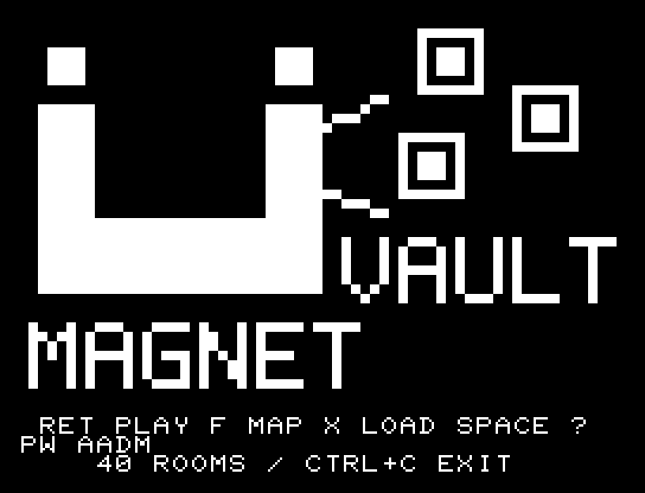
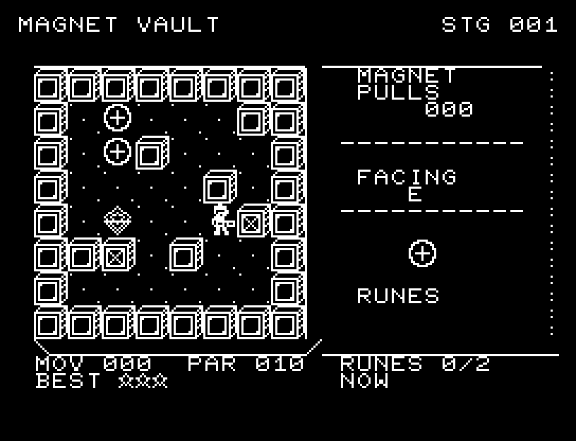
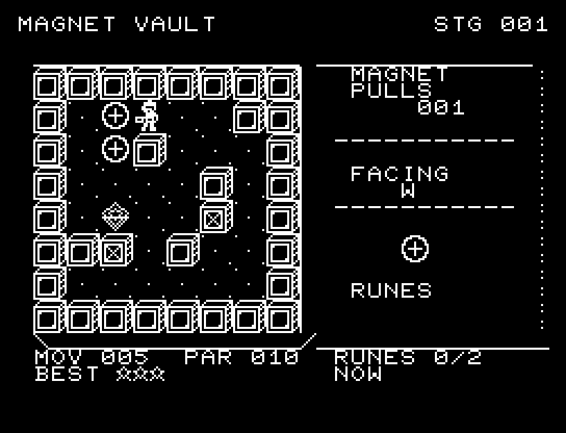
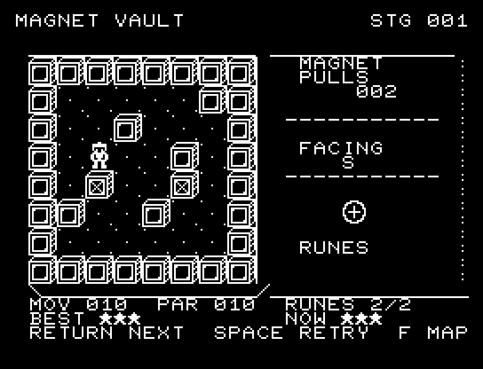
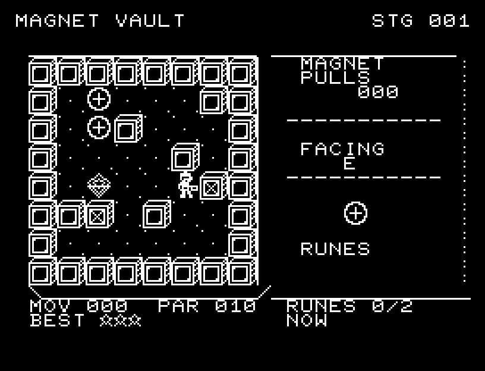
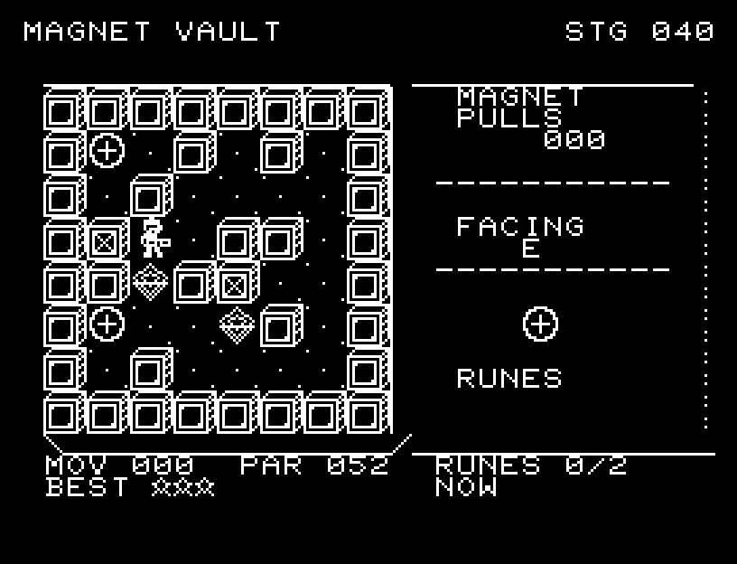
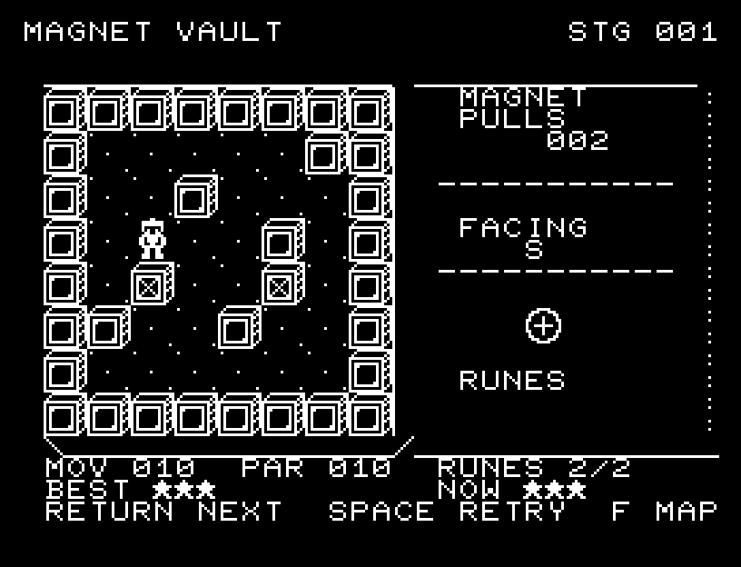
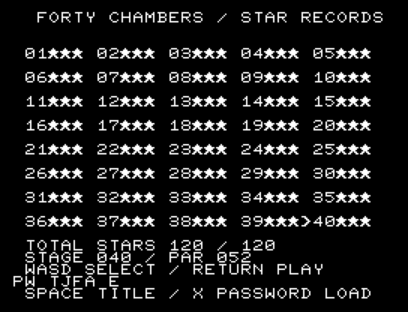
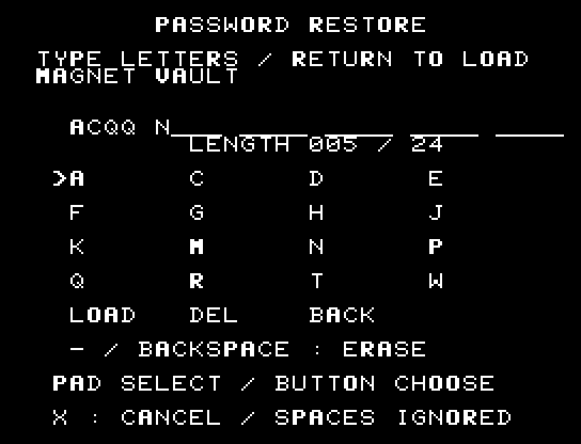
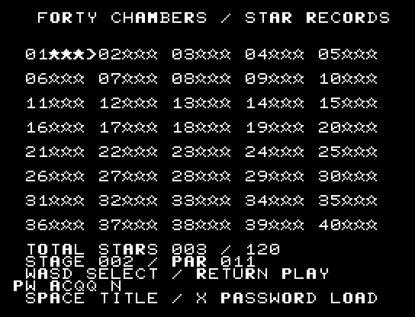

# MAGNET VAULT

[Wiki](https://github.com/zabaglione/jr100dev/wiki/MAGNET-VAULT) · [プレイ](https://zabaglione.github.io/pyjr100emu/?game=magnet-vault)

箱を押さず、磁力で手前に引いて2つの菱形ソケットに収めるパズルです。40面で箱・ソケット・開始位置を変え、後半には狭い通路や箱同士の移動順を考える部屋を用意しました。丸いルーンは箱を運ぶ途中に自分が歩いて回収します。



## 紹介画像とプレイ動画







**[音付きプレイ動画を見る（約31秒）](https://zabaglione.github.io/pyjr100emu/gameplay.html?game=magnet-vault)**

1ステージのクリアまでを収録。

## タイトルのデザイン

巨大なU字磁石から金属片が吸い寄せられる構図です。MAGNETを下、VAULTを磁力の先に配置します。

## 画面の奥行き

金属壁と運搬箱を立体化し、箱には斜めの補強材を残しました。収納穴はくぼんだ台座、磁力操作の主人公はロボットとして描いています。 向きに応じて1体4文字のPCGを書き換えます。 移動時には半マスの中間位置とSEを挟みます。

## ゲーム専用フォント

今回は通常フォントを維持しています。絵柄やアニメーションに使うPCGを残すと、一式の数字・英字を揃える枠が足りないためです。一部の文字だけ書体が変わる置き換えは行いません。

## 動きとクリア演出

ロボットは進行方向を向いて動きます。歩行と金属塊を引く動きには途中の位置と移動音があり、どの塊を動かしたか確認できます。被弾や結果を確認する間は、追加入力で表示を飛ばせません。

クリア時は完成した盤面・結果を残し、約1.6秒のジングルと余韻を挟みます。失敗時も原因を表示し、ジングルの後に短い間を置きます。その後、キーを押し直して次の操作に進みます。直前から押し続けたキーや、演出中に押したキーで結果を飛ばすことはありません。

## 操作と遊び方

WASDで歩行と向きを変え、RETURNで正面の箱を1マス引きます。引くと自分は1マス後退します。歩行・向きの変更・成功した引き寄せをそれぞれ1手と数えます。壁や箱に向いてその場で向きだけを変える操作も1手です。向きも位置も変わらない入力、失敗した引き寄せは数えません。箱ではルーンを回収できません。

方向キーはキーボードまたはパッド、RETURNはパッドのボタンでも操作できます。SPACEでこの面のやり直し確認を開きます。やり直し確認はNOが初期選択です。A/Dで選び、RETURNで確定、SPACEで取り消します。確認中は進行を止めます。CTRL+CでBASICへ戻ります。

ロボットは進行方向を向いて動きます。歩行と金属塊を引く動きには途中の位置と移動音があり、どの塊を動かしたか確認できます。演出が終わってから次のキーを押してください。

MAGNETのPULLSは成功した引き寄せ回数。FACINGは現在の向きN/S/W/Eです。下部のMOVは使用手数、PARは規定手数、RUNESは任意ルーンの回収数です。





## 手数と星評価

規定手数を超えても失敗にはならず、そのままクリアできます。ルーンは丸い枠に十字の印がある任意の回収物で、各面に2つあります。

| 評価 | 条件 |
| --- | --- |
| 星1 | 規定手数を超えてクリア。ルーンの回収数は問いません。 |
| 星2 | 規定手数以内でクリアし、ルーンが未回収。 |
| 星3 | 規定手数以内でクリアし、ルーン2つを両方回収。 |

PARは、両方のルーンを回収してクリアできる最短手数です。すべての面に、ルーンを取り切らずに短い手数でクリアする経路もあります。手数が255を超えるとMOVは255+を表示し、評価は星1です。



## 40面の構成と再挑戦

| 面 | 難度の段階 | PARの範囲 |
| --- | --- | ---: |
| 1〜8 | 入門 | 10〜12 |
| 9〜16 | 基本 | 13〜19 |
| 17〜24 | 応用 | 21〜25 |
| 25〜32 | 上級 | 29〜36 |
| 33〜40 | 最終課題 | 39〜52 |

Fで面選択を開き、WASDまたはパッドで選び、RETURNまたはボタンで開始します。全40面を最初から選択でき、選択した面のPARと各面の最高評価を確認できます。面選択のSPACEはタイトルへ戻ります。

クリア後はSPACEで同じ面に再挑戦、RETURNで次の面へ進みます。BESTは最高評価、NOWは今回の評価です。低い評価で再クリアしてもBESTは下がりません。ゲーム終了後も続ける場合は、次のパスワードを記録してください。



## パスワードで続きから

タイトルと面選択の下部に表示される **PW** を書き留めてください。選択中の面番号と、全40面の最高評価を復元できます。盤面の途中経過は保存せず、復元後にRETURNでその面の最初から再開します。

コードは空白を除いて **4〜24文字**。順番に3つ星を取って進める場合は通常5〜6文字です。数字は使わず、次の16種類の大文字だけを使います。

```text
ACDEFGHJKMNPQRTW
```

1. タイトルまたは面選択でXを押します。
2. コードを入力し、RETURNで復元します。表示上の区切り空白は入力しても省略しても構いません。
3. 修正はBackspace（実機ではマイナスキー）、取り消しはXです。

入力画面ではパッドの方向で文字を選び、ボタンで追加する方法も使えます。最後にLOADを選んでボタンを押すと復元します。DELは1文字削除、BACKは取り消しです。入力ミスや別作品のコードを検査し、エラー時は現在の記録を変更しません。





## ビルドと検証

バージョン 1.6.1。開始番地 `$0300`、ゲーム本体と定数は 11,343 bytes。画面・作業領域・復帰用の保存領域・512 bytesのスタックを含めて標準RAM 16KB内で動作します。PCGは32文字を場面ごとに切り替えます。

```sh
make -C games/magnet_vault
make -C games/magnet_vault test
```

出力はゲームの `build/` ディレクトリに作られます。`rules.py` はビルド時にMB8861Hの機械語へ変換されます。JR-100上でPythonを実行する方式ではありません。

盤面はビルド時に2マスを1バイトへ圧縮します。`levels.json` が編集用の面データ、`challenges.json` がクリア経路とルーン回収経路、`solutions.json` が全40面の3つ星リプレイです。`native/campaign_levels.py` で再生成でき、`native/campaign_checks.py` は全盤面の解探索、評価条件、再挑戦、面選択、最高評価の保持、手数カウンターの上限を検査します。回転・鏡映だけの地形の重複は除外しています。`native/password_checks.py` はパスワードの圧縮・展開、誤入力の検出、別作品のコード拒否と、再起動後のキー／パッド入力による記録復元を検証します。

キー入力による全ステージのクリア、失敗を含む入力試験、画面範囲、RAM配置、スタック、PCM出力をエミュレーターで検査しています。掲載画像は所有するBASIC ROMからPRGを起動した実フレームです。実機での動作・音声は未確認です。

```sh
.venv/bin/python games/native/replay.py magnet_vault --rom /path/to/owned-rom.prg --capture --keyboard
```

タイトルには長めの単音曲、プレイ中には効果音を付けています。ソース・画像・曲は[MIT License](https://github.com/zabaglione/jr100dev/blob/main/games/LICENSE)。`art/`にはPCG Workbench用の画面データもあります。
