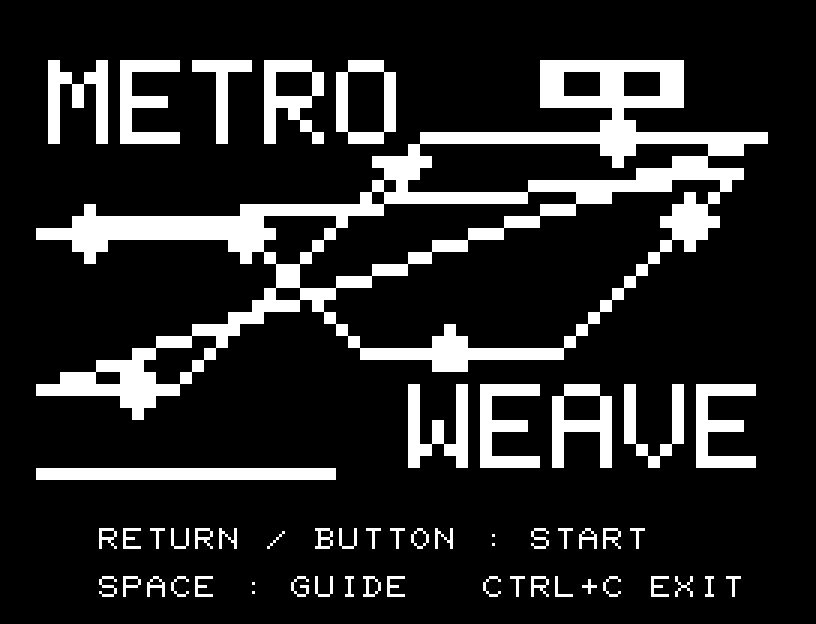
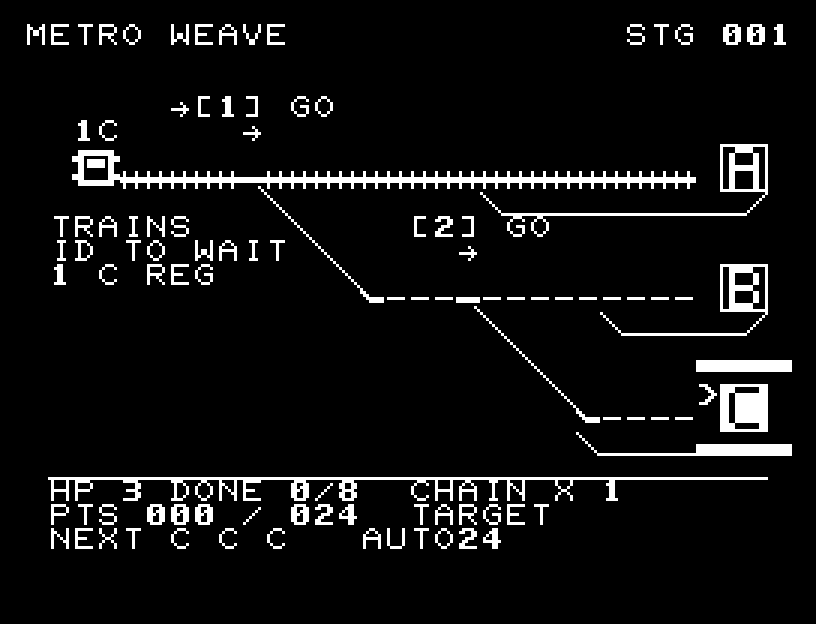
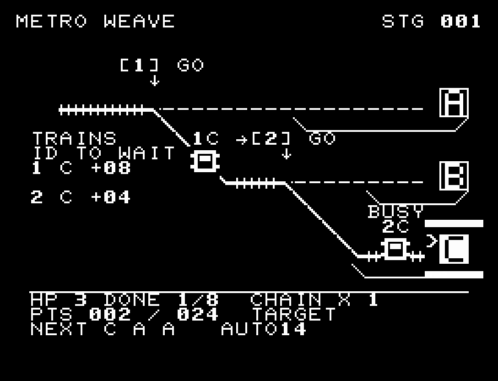
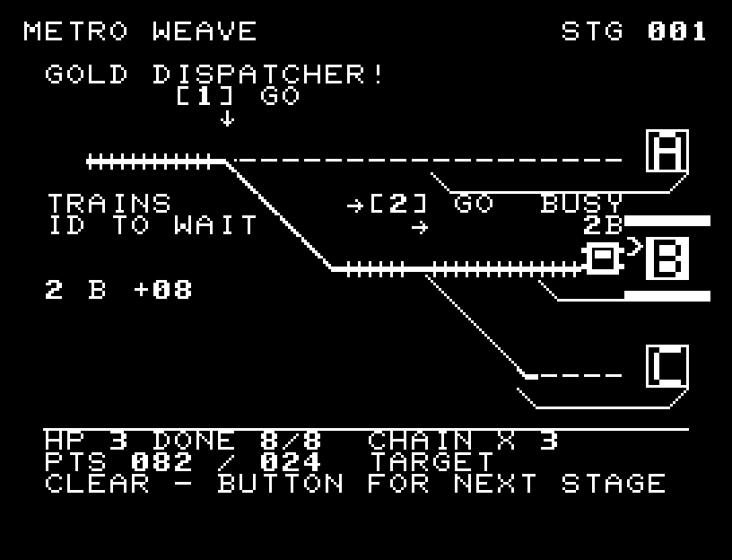
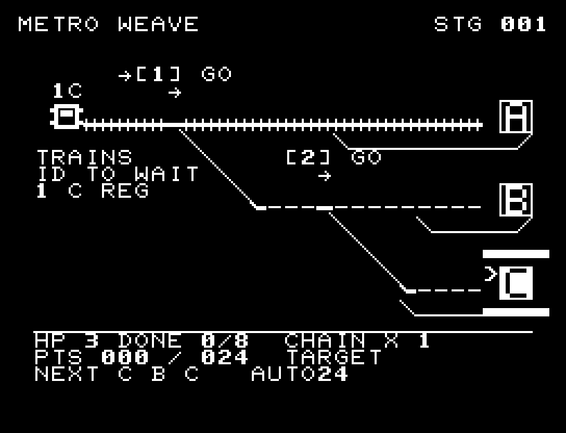
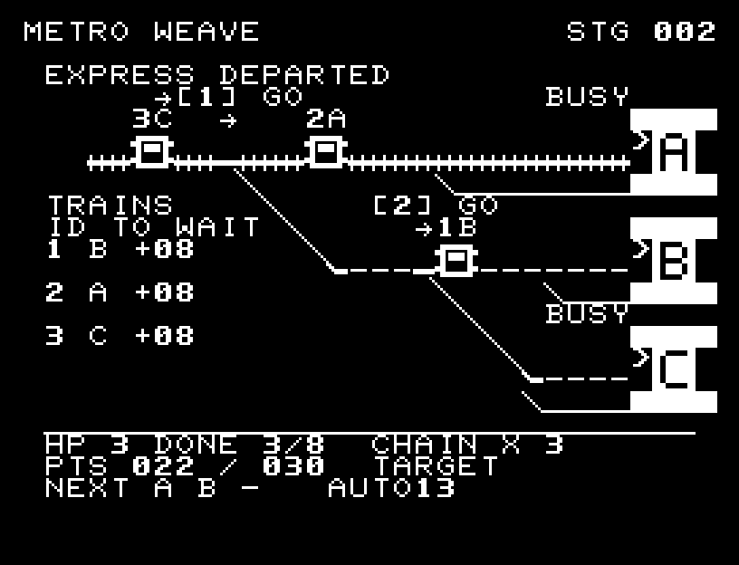

# METRO WEAVE

[Wiki](https://github.com/zabaglione/jr100dev/wiki/METRO-WEAVE) · [プレイ](https://zabaglione.github.io/pyjr100emu/?game=metro-weave)

分岐と信号を操作し、列車を同じ文字の駅へ届ける運行ゲームです。各シフトは8本。通常便は自動で出発し、RETURNで次の1本を急行として早く出せます。同時運行は最初が2本、後半は3本まで。行先の順番はプレイごとに変わり、次の3本を予告します。



## 紹介画像とプレイ動画







**[音付きプレイ動画を見る（約38秒）](https://zabaglione.github.io/pyjr100emu/gameplay.html?game=metro-weave)**

1ステージのクリアまでを収録。

## タイトルのデザイン

交差する三本の路線と駅、上部の車両で交通網を描き、路線の余白へロゴを配置しています。

## 画面の奥行き

3本の線路を斜めの連絡線でつなぎ、選んだ経路を太く示します。複数の列車が1マスずつ進み、各車両の番号と行先、点灯した大型駅看板を対応させて読めます。同時運行する列車は俯瞰の車体PCG4文字を共有します。駅の荷下ろし、信号待ち、遅延、到着時の得点と連続成功を動き・点滅・SEで示します。常設の操作説明はヘルプにまとめました。

## ゲーム専用フォント

ゲーム中の**数字0〜9の10文字を計器盤フォント**（角張った太線）で揃えています。部分的な英字の置き換えは行いません。タイトルの操作案内・説明・パスワード入力は通常フォントに統一しています。既存のロゴと絵柄を保ち、空きPCG枠だけを使用します。

## 動きとクリア演出

3シフトで自動配車が速まり、同時運行数が2本から3本へ増えます。毎回変わる次の3本を読み、急行を手動増発できます。急行は得点が高い一方、信号待ち・荷下ろし待ちで遅延し、HPと連続成功を失います。車体は1マスずつ動き、自動で車間を保ちます。常設の操作説明はタイトル・ヘルプへ移し、本編は列車・進路・行先・待ち時間・得点を表示します。被弾や結果を確認する間は、追加入力で表示を飛ばせません。

クリア時は完成した盤面・結果を残し、約1.6秒のジングルと余韻を挟みます。失敗時も原因を表示し、ジングルの後に短い間を置きます。その後、キーを押し直して次の操作に進みます。直前から押し続けたキーや、演出中に押したキーで結果を飛ばすことはありません。

## 操作と遊び方

W/Sでポイント1・2を選び、Dで進路、AでSTOP／GOを切り替えます。ポイント1はA駅への直進かポイント2への下り、ポイント2はB駅への直進かC駅への下りです。太い線路が現在の経路です。列車は到達した時点の設定に従い、設定は手で変えるまで保ちます。列車のそばの番号と行先、点灯した駅看板を見て運行してください。

方向キーはキーボードまたはパッド、RETURNはパッドのボタンでも操作できます。SPACEでこの面のやり直し確認を開きます。やり直し確認はNOが初期選択です。A/Dで選び、RETURNで確定、SPACEで取り消します。確認中は進行を止めます。CTRL+CでBASICへ戻ります。

3シフトで自動配車が速まり、同時運行数が2本から3本へ増えます。毎回変わる次の3本を読み、急行を手動増発できます。急行は得点が高い一方、信号待ち・荷下ろし待ちで遅延し、HPと連続成功を失います。車体は1マスずつ動き、自動で車間を保ちます。常設の操作説明はタイトル・ヘルプへ移し、本編は列車・進路・行先・待ち時間・得点を表示します。演出が終わってから次のキーを押してください。

通常便は2点、時間内の急行は4点。連続成功で得点が2倍、3倍になります。急行のWAIT欄は停車できる残りの猶予で、!00になった列車は遅延です。駅のBUSY中は荷下ろし待ちになり、後続列車も自動で間隔を空けて停まります。同じ駅へ急行を詰めると遅れやすいため、次の行先と混雑を見て通常便を待つか急行を出すか判断します。誤配や遅延はHPが1減り、連続成功も途切れます。HPが0になる前に8本を運行し、1・2・3シフトでそれぞれ24・30・36点を取るとクリア。44点でSILVER、60点でGOLDです。





## ビルドと検証

バージョン 2.0.0。開始番地 `$0300`、ゲーム本体と定数は 11,282 bytes。画面・作業領域・復帰用の保存領域・512 bytesのスタックを含めて標準RAM 16KB内で動作します。PCGは32文字を場面ごとに切り替えます。

```sh
make -C games/metro_weave
make -C games/metro_weave test
```

出力はゲームの `build/` ディレクトリに作られます。`rules.py` はビルド時にMB8861Hの機械語へ変換されます。JR-100上でPythonを実行する方式ではありません。

キー入力による全ステージのクリア、失敗を含む入力試験、画面範囲、RAM配置、スタック、PCM出力をエミュレーターで検査しています。掲載画像は所有するBASIC ROMからPRGを起動した実フレームです。実機での動作・音声は未確認です。

```sh
.venv/bin/python games/native/replay.py metro_weave --rom /path/to/owned-rom.prg --capture --keyboard
```

タイトルには長めの単音曲、プレイ中には効果音を付けています。ソース・画像・曲は[MIT License](https://github.com/zabaglione/jr100dev/blob/main/games/LICENSE)。`art/`にはPCG Workbench用の画面データもあります。
