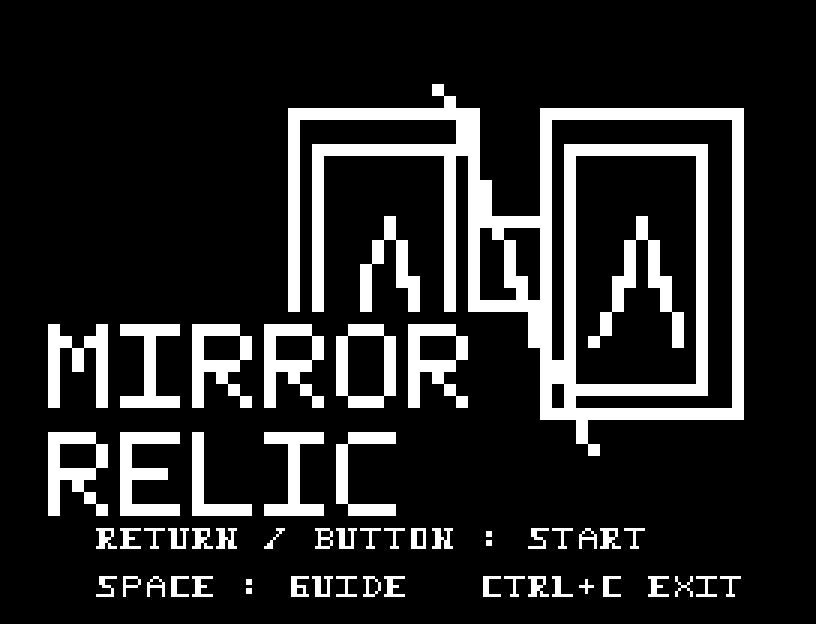
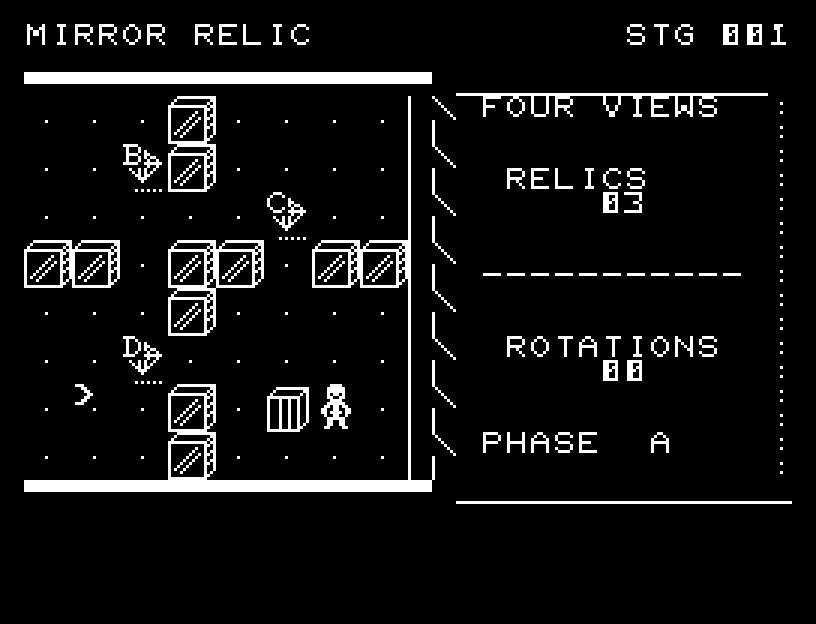
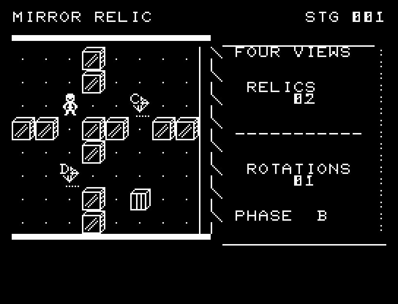
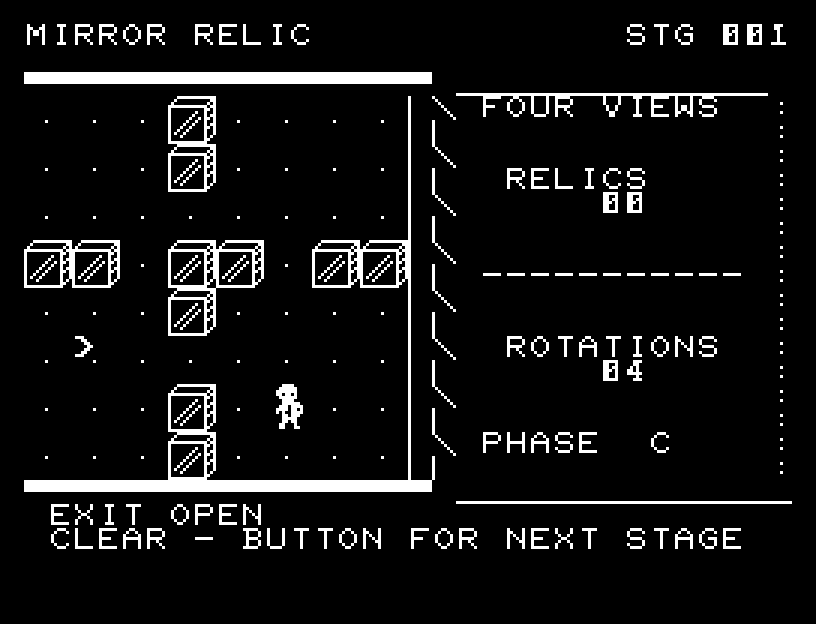
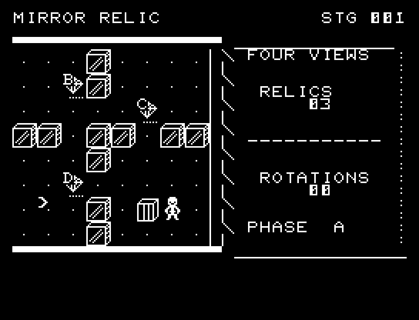
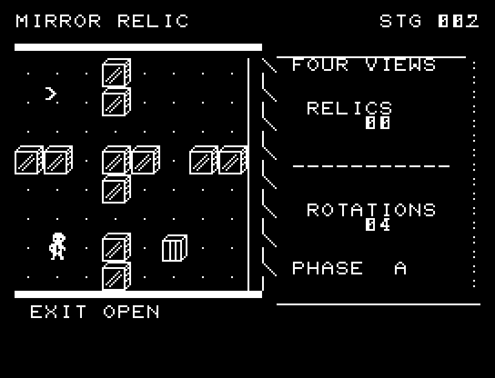

# MIRROR RELIC

[Wiki](https://github.com/zabaglione/jr100dev/wiki/MIRROR-RELIC) · [プレイ](https://zabaglione.github.io/pyjr100emu/?game=mirror-relic)

移動と90度の鏡回転で3つの遺物を集め、門へ着く全6面です。遺物のA〜Dは必要な位相で、同じ位相のときに踏むと回収できます。



## 紹介画像とプレイ動画







**[音付きプレイ動画を見る（約32秒）](https://zabaglione.github.io/pyjr100emu/gameplay.html?game=mirror-relic)**

1ステージのクリアまでを収録。

## タイトルのデザイン

中央の縦長の鏡と左右の対称な紋章を描き、石の刻印風の文字で遺物の雰囲気を出します。

## 画面の奥行き

陰影のある壁と遺物の位相文字を描き分け、歩行と鏡移動に途中の位置、SE、回収の光を使います。回転前の予告で到着位置を確認できます。

## ゲーム専用フォント

ゲーム中の**数字0〜9の10文字を石碑フォント**（上下の飾りを持つ刻印）で揃えています。部分的な英字の置き換えは行いません。タイトルの操作案内・説明・パスワード入力は通常フォントに統一しています。既存のロゴと絵柄を保ち、空きPCG枠だけを使用します。

## 動きとクリア演出

陰影のある壁と遺物の位相文字を描き分け、歩行と鏡移動に途中の位置、SE、回収の光を使います。回転前の予告で到着位置を確認できます。被弾や結果を確認する間は、追加入力で表示を飛ばせません。

クリア時は完成した盤面・結果を残し、約1.6秒のジングルと余韻を挟みます。失敗時も原因を表示し、ジングルの後に短い間を置きます。その後、キーを押し直して次の操作に進みます。直前から押し続けたキーや、演出中に押したキーで結果を飛ばすことはありません。

## 操作と遊び方

WASDで歩き、RETURNで時計回り、Xで反時計回りに位置を回転させます。回転するとPHASEも1段進むか戻ります。時計回りの移動先は矢印で予告され、壁の位置へは回転できません。

方向キーはキーボードまたはパッド、RETURNはパッドのボタンでも操作できます。SPACEでこの面のやり直し確認を開きます。やり直し確認はNOが初期選択です。A/Dで選び、RETURNで確定、SPACEで取り消します。確認中は進行を止めます。CTRL+CでBASICへ戻ります。

陰影のある壁と遺物の位相文字を描き分け、歩行と鏡移動に途中の位置、SE、回収の光を使います。回転前の予告で到着位置を確認できます。演出が終わってから次のキーを押してください。

RELICSは残る遺物、ROTATIONSは回転回数、PHASEは現在の位相。回転は20回まで。通路で回転後の位置関係を変え、遺物の位相に合わせて回収します。





## ビルドと検証

バージョン 3.0.0。開始番地 `$0300`、ゲーム本体と定数は 8,431 bytes。画面・作業領域・復帰用の保存領域・512 bytesのスタックを含めて標準RAM 16KB内で動作します。PCGは32文字を場面ごとに切り替えます。

```sh
make -C games/mirror_relic
make -C games/mirror_relic test
```

出力はゲームの `build/` ディレクトリに作られます。`rules.py` はビルド時にMB8861Hの機械語へ変換されます。JR-100上でPythonを実行する方式ではありません。

キー入力による全ステージのクリア、失敗を含む入力試験、画面範囲、RAM配置、スタック、PCM出力をエミュレーターで検査しています。掲載画像は所有するBASIC ROMからPRGを起動した実フレームです。実機での動作・音声は未確認です。

```sh
.venv/bin/python games/native/replay.py mirror_relic --rom /path/to/owned-rom.prg --capture --keyboard
```

タイトルには長めの単音曲、プレイ中には効果音を付けています。ソース・画像・曲は[MIT License](https://github.com/zabaglione/jr100dev/blob/main/games/LICENSE)。`art/`にはPCG Workbench用の画面データもあります。
