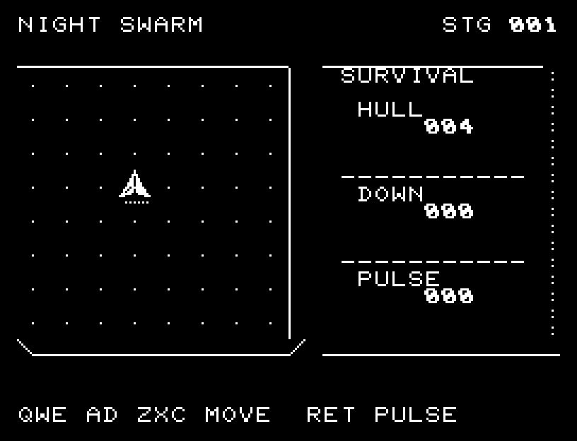
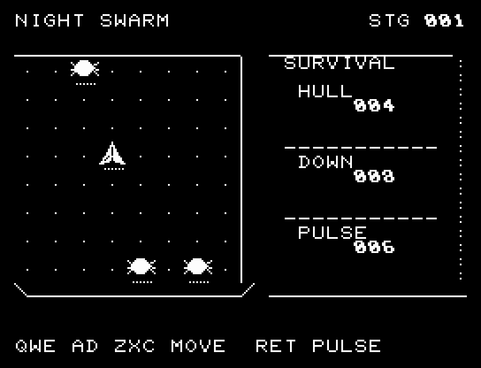
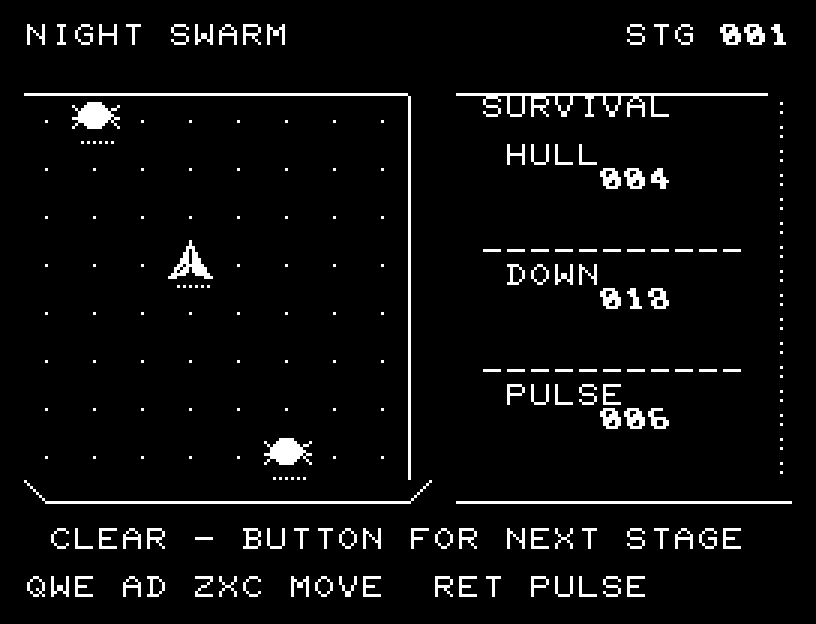

# NIGHT SWARM

[Wiki](https://github.com/zabaglione/jr100dev/wiki/NIGHT-SWARM) · [プレイ](https://zabaglione.github.io/pyjr100emu/?game=night-swarm)

8方向へ逃げながら18体の敵を倒します。ごく近い敵への射撃は自動で、範囲攻撃には再使用までの待ち時間があります。接触4回で失敗です。


## 紹介画像とプレイ動画

**[音付きプレイ動画を見る（約33秒）](https://zabaglione.github.io/pyjr100emu/gameplay.html?game=night-swarm)**

1ステージのクリアまでを収録。途中を省略せず、通常の速度で収録しています。画面を確認する間を入れた自動キー入力によるプレイです。



[](https://zabaglione.github.io/pyjr100emu/gameplay.html?game=night-swarm)



## タイトルのデザイン

ロゴを取り囲む敵の群れと下部の小さな自機で圧迫感を出し、ロゴに網点の側面を付けています。

## 画面の奥行き

機体と敵に輪郭の明暗と接地影を付け、戦場の縁に厚みを加えました。8方向移動と攻撃の位置関係は正方格子のままです。

## ゲーム専用フォント

ゲーム中の**数字0〜9の10文字をスピードフォント**（右へ傾く太線）で揃えています。部分的な英字の置き換えは行いません。タイトルの操作案内・説明・パスワード入力は通常フォントに統一しています。既存のロゴと絵柄を保ち、空きPCG枠だけを使用します。

## 動きとクリア演出

倒した敵は、発光して破片が外側へ散る順に消えます。接触時は被弾音と点滅が入り、危険な位置を確認できます。演出中の追加入力は受け付けません。

クリア時は完成した盤面・結果を残し、約1.6秒のジングルと余韻を挟みます。失敗時も原因を表示し、ジングルの後に短い間を置きます。その後、キーを押し直して次の操作に進みます。直前から押し続けたキーや、演出中に押したキーで結果を飛ばすことはありません。

## 操作と遊び方

QWE／AD／ZXCで8方向移動、RETURNで準備済みのパルスを放ちます。Sは移動に使いません。

方向キーはキーボードまたはパッド、RETURNはパッドのボタンでも操作できます。SPACEでこの面のやり直し確認を開きます。やり直し確認はNOが初期選択です。A/Dで選び、RETURNで確定、SPACEで取り消します。確認中は進行を止めます。CTRL+CでBASICへ戻ります。

倒した敵は、発光して破片が外側へ散る順に消えます。接触時は被弾音と点滅が入り、危険な位置を確認できます。演出が終わってから次のキーを押してください。

右側に耐久力、撃破数、パルスの再使用待ちを表示します。


## ビルドと検証

バージョン 1.5.0。開始番地 `$0300`、ゲーム本体と定数は 7,648 bytes。画面・作業領域・復帰用の保存領域・512 bytesのスタックを含めて標準RAM 16KB内で動作します。PCGは32文字を場面ごとに切り替えます。

```sh
make -C games/night_swarm
make -C games/night_swarm test
```

出力はゲームの `build/` ディレクトリに作られます。`rules.py` はビルド時にMB8861Hの機械語へ変換されます。JR-100上でPythonを実行する方式ではありません。

キー入力による全ステージのクリア、失敗を含む入力試験、画面範囲、RAM配置、スタック、PCM出力をエミュレーターで検査しています。掲載画像は所有するBASIC ROMからPRGを起動した実フレームです。実機での動作・音声は未確認です。

```sh
.venv/bin/python games/native/replay.py night_swarm --rom /path/to/owned-rom.prg --capture --keyboard
```

タイトルには長めの単音曲、プレイ中には効果音を付けています。ソース・画像・曲は[MIT License](https://github.com/zabaglione/jr100dev/blob/main/games/LICENSE)。`art/`にはPCG Workbench用の画面データもあります。
