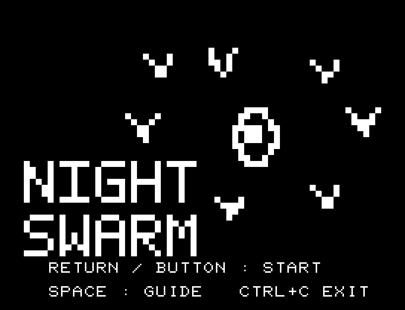
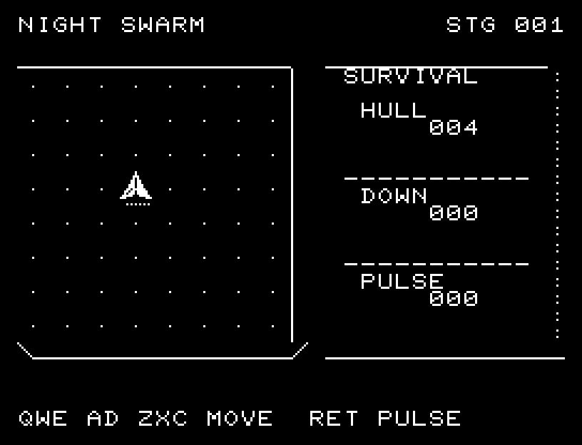
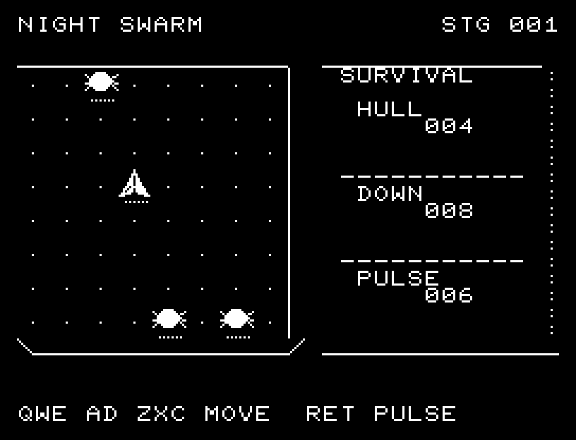

# NIGHT SWARM

[Wiki](https://github.com/zabaglione/jr100dev/wiki/NIGHT-SWARM) · [プレイ](https://zabaglione.github.io/pyjr100emu/?game=night-swarm)

8方向へ逃げながら18体の敵を倒します。ごく近い敵への射撃は自動で、範囲攻撃には再使用までの待ち時間があります。接触4回で失敗です。



## 画面の奥行き

機体と敵に輪郭の明暗と接地影を付け、戦場の縁に厚みを加えました。8方向移動と攻撃の位置関係は正方格子のままです。

## 操作と遊び方

QWE／AD／ZXCで8方向移動、RETURNで準備済みのパルスを放ちます。Sは移動に使いません。

方向キーはキーボードまたはパッド、RETURNはパッドのボタンでも操作できます。SPACEでこの面をやり直し、CTRL+CでBASICへ戻ります。

右側に耐久力、撃破数、パルスの再使用待ちを表示します。





## ビルドと検証

バージョン 1.1.0。開始番地 `$0300`、ゲーム本体と定数は 7,275 bytes。画面・作業領域・復帰用の保存領域・512 bytesのスタックを含めて標準RAM 16KB内で動作します。PCGは32文字を場面ごとに切り替えます。

```sh
make -C games/night_swarm
make -C games/night_swarm test
```

出力はゲームの `build/` ディレクトリに作られます。`rules.py` はビルド時にMB8861Hの機械語へ変換されます。JR-100上でPythonを実行する方式ではありません。

キー入力による全ステージのクリア、失敗を含む入力試験、画面範囲、RAM配置、スタック、PCM出力をエミュレーターで検査しています。掲載画像は所有するBASIC ROMからPRGを起動した実フレームです。実機での動作・音声は未確認です。

```sh
.venv/bin/python games/native/replay.py night_swarm --rom /path/to/owned-rom.prg --capture --keyboard
```

タイトルには長めの単音曲、プレイ中には効果音を付けています。ソース・画像・曲は[MIT License](https://github.com/zabaglione/jr100dev/blob/main/games/LICENSE)。`art/`にはPCG Workbench用の画面データもあります。
