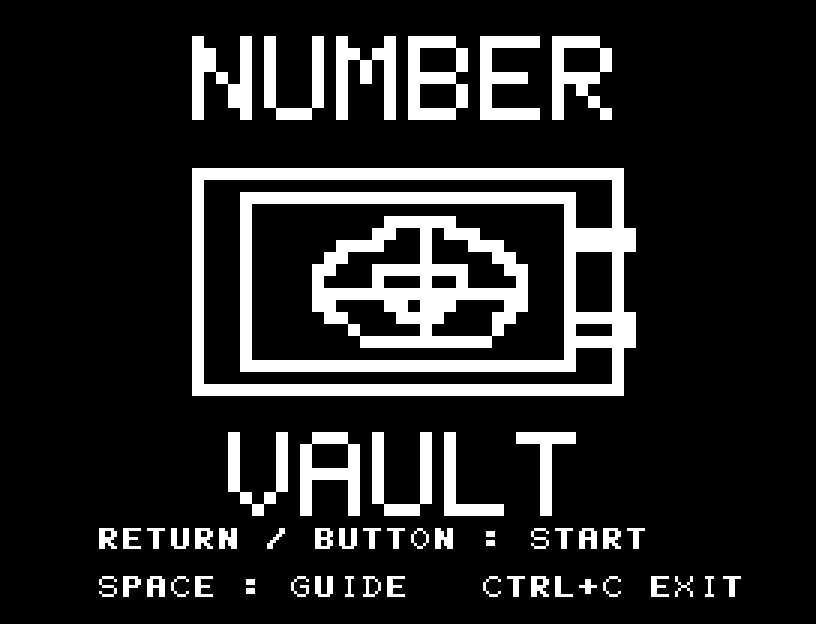
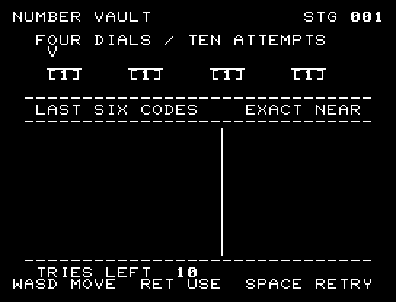
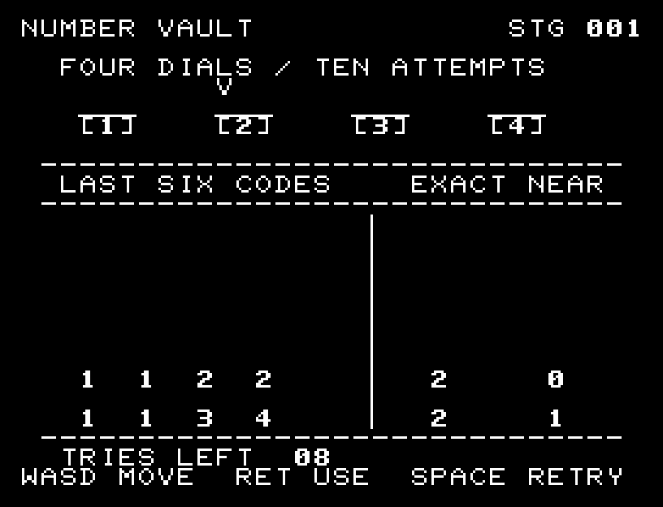
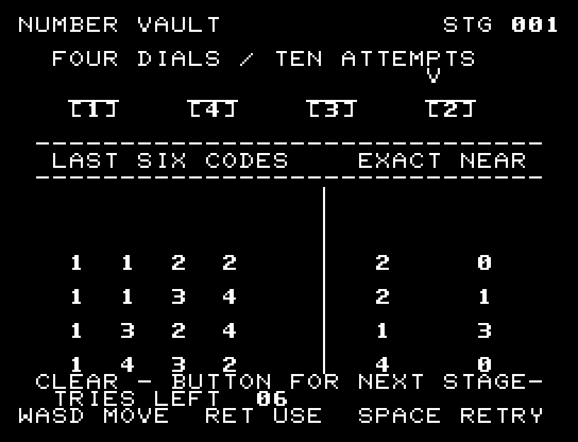
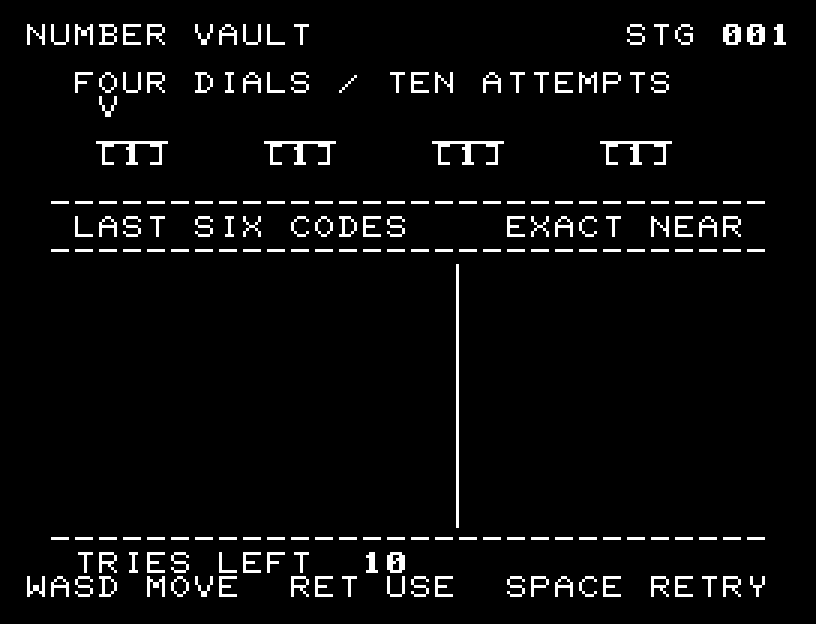
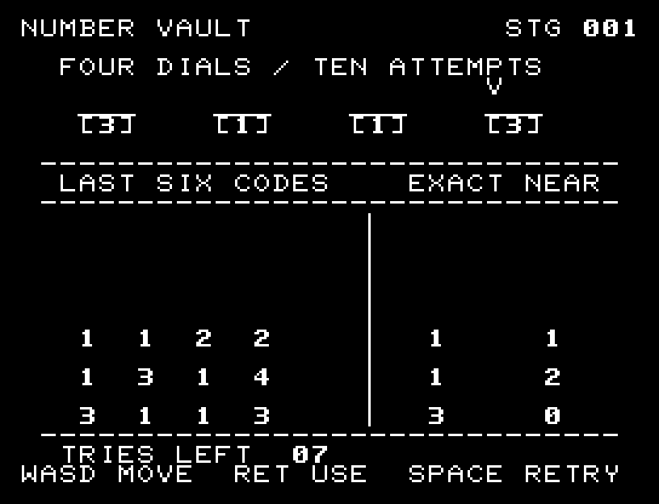

# NUMBER VAULT

[Wiki](https://github.com/zabaglione/jr100dev/wiki/NUMBER-VAULT) · [プレイ](https://zabaglione.github.io/pyjr100emu/?game=number-vault)

1～4の4桁の暗証番号を、重複を含めて推理します。10回以内に正解すると次の金庫へ進みます。



## 紹介画像とプレイ動画







**[音付きプレイ動画を見る（約30秒）](https://zabaglione.github.io/pyjr100emu/gameplay.html?game=number-vault)**

1ステージのクリアまでを収録。

## タイトルのデザイン

左の大きな金庫と右の「314」の番号窓を主役にし、NUMBERとVAULTを上下に分けています。

## 画面の奥行き

暗証番号のダイヤルと一致数の計器を厚い金庫の操作盤に配置しました。数字と選択矢印は読みやすさを優先しています。 暗号を開始時に変えます。ダイヤルを回す途中と4桁の照合を描き、直近6回の入力と位置一致・数字一致の数を残します。

## ゲーム専用フォント

ゲーム中の**数字0〜9の10文字を計器盤フォント**（角張った太線）で揃えています。部分的な英字の置き換えは行いません。タイトルの操作案内・説明・パスワード入力は通常フォントに統一しています。既存のロゴと絵柄を保ち、空きPCG枠だけを使用します。

## 動きとクリア演出

暗号を開始時に変えます。ダイヤルを回す途中と4桁の照合を描き、直近6回の入力と位置一致・数字一致の数を残します。被弾や結果を確認する間は、追加入力で表示を飛ばせません。

クリア時は完成した盤面・結果を残し、約1.6秒のジングルと余韻を挟みます。失敗時も原因を表示し、ジングルの後に短い間を置きます。その後、キーを押し直して次の操作に進みます。直前から押し続けたキーや、演出中に押したキーで結果を飛ばすことはありません。

## 操作と遊び方

A/Dで桁を選び、W/Sで数を変え、RETURNで試します。EXACTは数も位置も一致、NEARは数だけ一致した個数です。同じ数を重複して数えません。

方向キーはキーボードまたはパッド、RETURNはパッドのボタンでも操作できます。SPACEでこの面のやり直し確認を開きます。やり直し確認はNOが初期選択です。A/Dで選び、RETURNで確定、SPACEで取り消します。確認中は進行を止めます。CTRL+CでBASICへ戻ります。

暗号を開始時に変えます。ダイヤルを回す途中と4桁の照合を描き、直近6回の入力と位置一致・数字一致の数を残します。





## ビルドと検証

バージョン 2.0.0。開始番地 `$0300`、ゲーム本体と定数は 7,490 bytes。画面・作業領域・復帰用の保存領域・512 bytesのスタックを含めて標準RAM 16KB内で動作します。PCGは32文字を場面ごとに切り替えます。

```sh
make -C games/number_vault
make -C games/number_vault test
```

出力はゲームの `build/` ディレクトリに作られます。`rules.py` はビルド時にMB8861Hの機械語へ変換されます。JR-100上でPythonを実行する方式ではありません。

キー入力による全ステージのクリア、失敗を含む入力試験、画面範囲、RAM配置、スタック、PCM出力をエミュレーターで検査しています。掲載画像は所有するBASIC ROMからPRGを起動した実フレームです。実機での動作・音声は未確認です。

```sh
.venv/bin/python games/native/replay.py number_vault --rom /path/to/owned-rom.prg --capture --keyboard
```

タイトルには長めの単音曲、プレイ中には効果音を付けています。ソース・画像・曲は[MIT License](https://github.com/zabaglione/jr100dev/blob/main/games/LICENSE)。`art/`にはPCG Workbench用の画面データもあります。
