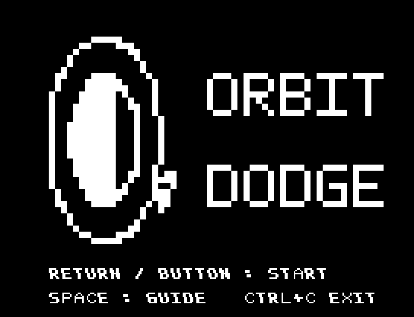
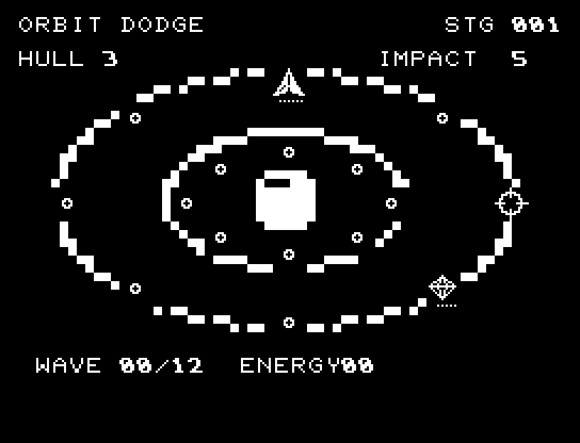
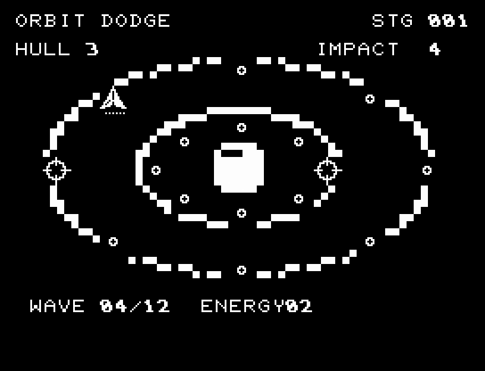
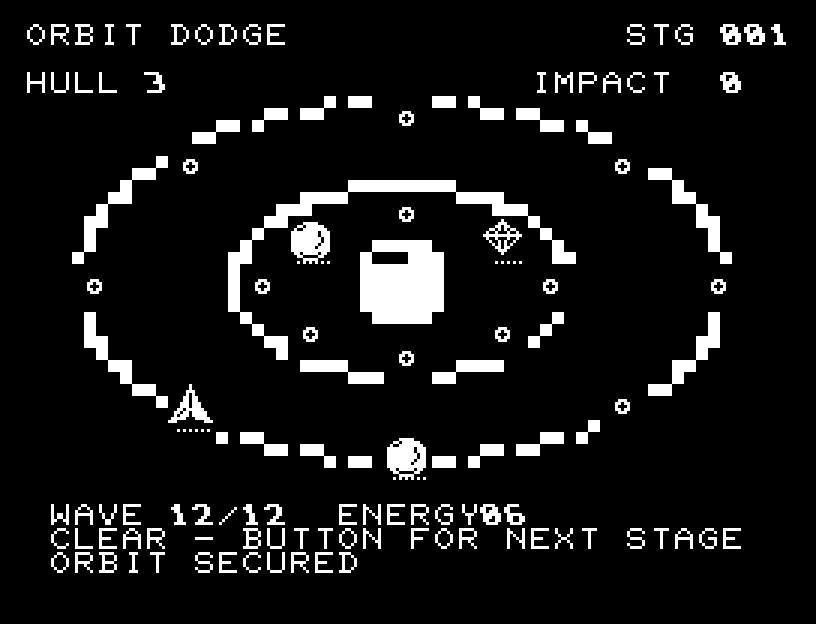
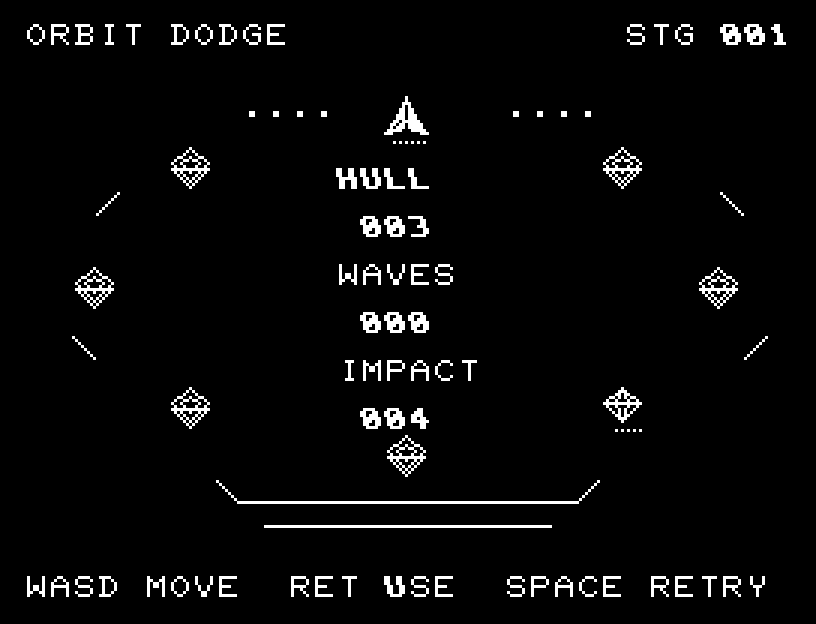
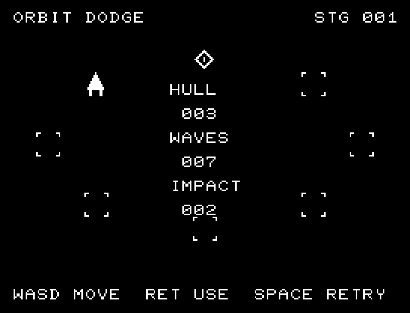

# ORBIT DODGE

[Wiki](https://github.com/zabaglione/jr100dev/wiki/ORBIT-DODGE) · [プレイ](https://zabaglione.github.io/pyjr100emu/?game=orbit-dodge)

外周と内周の2軌道を渡り、照準からの光線を避ける全6面です。12波から22波へ増え、後半は両軌道への同時照射と短い予告時間に挑みます。



## 紹介画像とプレイ動画







**[音付きプレイ動画を見る（約49秒）](https://zabaglione.github.io/pyjr100emu/gameplay.html?game=orbit-dodge)**

1ステージのクリアまでを収録。

## タイトルのデザイン

大きな三日月と軌道を左に、迫る射線を右に配置し、ロゴを軌道の手前に重ねています。

## 画面の奥行き

セミグラフィックスで2本の軌道を描き、移動の軌跡、照準から伸びる光線、回収の光とSEを加えました。小さな軌道点・照準・エネルギーは別の形です。

## ゲーム専用フォント

ゲーム中の**数字0〜9の10文字をスピードフォント**（右へ傾く太線）で揃えています。部分的な英字の置き換えは行いません。タイトルの操作案内・説明・パスワード入力は通常フォントに統一しています。既存のロゴと絵柄を保ち、空きPCG枠だけを使用します。

## 動きとクリア演出

セミグラフィックスで2本の軌道を描き、移動の軌跡、照準から伸びる光線、回収の光とSEを加えました。小さな軌道点・照準・エネルギーは別の形です。被弾や結果を確認する間は、追加入力で表示を飛ばせません。

クリア時は完成した盤面・結果を残し、約1.6秒のジングルと余韻を挟みます。失敗時も原因を表示し、ジングルの後に短い間を置きます。その後、キーを押し直して次の操作に進みます。直前から押し続けたキーや、演出中に押したキーで結果を飛ばすことはありません。

## 操作と遊び方

A/DまたはW/Sで軌道上を左右に移動し、RETURNで内外の軌道を切り替えます。照射の瞬間に菱形のエネルギーへ乗ると加点。連続取得は1点、2点、3点と増えます。照準位置に残ると被弾します。

方向キーはキーボードまたはパッド、RETURNはパッドのボタンでも操作できます。SPACEでこの面のやり直し確認を開きます。やり直し確認はNOが初期選択です。A/Dで選び、RETURNで確定、SPACEで取り消します。確認中は進行を止めます。CTRL+CでBASICへ戻ります。

セミグラフィックスで2本の軌道を描き、移動の軌跡、照準から伸びる光線、回収の光とSEを加えました。小さな軌道点・照準・エネルギーは別の形です。演出が終わってから次のキーを押してください。

HULLは体力、IMPACTは発射までのカウント、WAVEは消化した波と目標、ENERGYは得点。目標の波数以上のエネルギーでGOLD ORBITになります。取得を狙う移動と、安全な軌道への退避を選びます。





## ソースコード

ゲーム本体は [`rules.py`](rules.py) です。ビルド時にMB8861Hの機械語へ変換します。

ビルド設定は [`game.json`](game.json) と [`Makefile`](Makefile) です。共有コードと生成物の関係は[全ゲームのソース一覧](../SOURCES.md)を参照してください。

## ビルドと検証

バージョン 3.0.0。開始番地 `$0300`、ゲーム本体と定数は 8,887 bytes。画面・作業領域・復帰用の保存領域・512 bytesのスタックを含めて標準RAM 16KB内で動作します。PCGは32文字を場面ごとに切り替えます。

```sh
make -C games/orbit_dodge
make -C games/orbit_dodge test
```

出力はゲームの `build/` ディレクトリに作られます。JR-100上でPythonを実行する方式ではありません。

キー入力による全ステージのクリア、失敗を含む入力試験、画面範囲、RAM配置、スタック、PCM出力をエミュレーターで検査しています。掲載画像は所有するBASIC ROMからPRGを起動した実フレームです。実機での動作・音声は未確認です。

```sh
.venv/bin/python games/native/replay.py orbit_dodge --rom /path/to/owned-rom.prg --capture --keyboard
```

タイトルには長めの単音曲、プレイ中には効果音を付けています。ソース・画像・曲は[MIT License](https://github.com/zabaglione/jr100dev/blob/main/games/LICENSE)。`art/`にはPCG Workbench用の画面データもあります。
