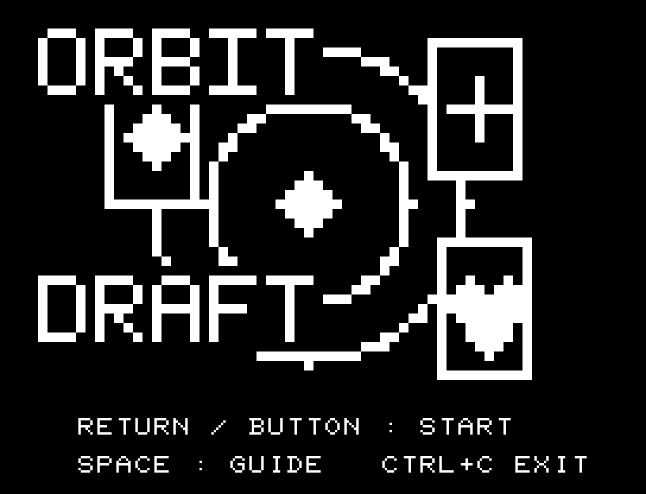
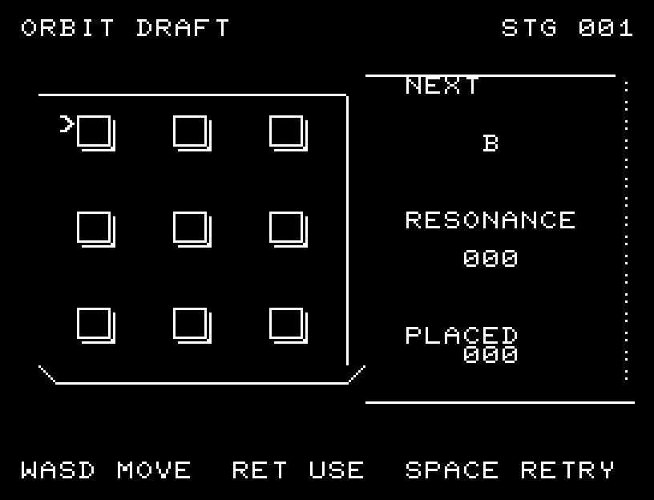
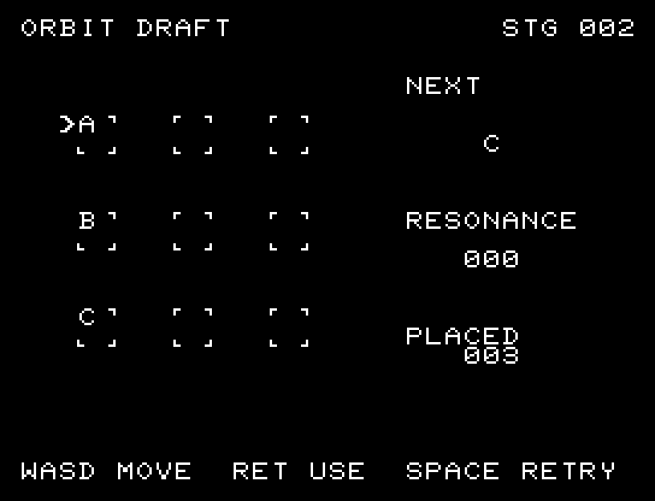

# ORBIT DRAFT

[Wiki](https://github.com/zabaglione/jr100dev/wiki/ORBIT-DRAFT) · [プレイ](https://zabaglione.github.io/pyjr100emu/?game=orbit-draft)

次に来る札を3×3の盤へ配置し、同じA・B・Cを一列に揃えます。一列3点で、9枚を置いた時点で6点以上なら成功です。



## タイトルのデザイン

三枚のカードを軌道上に配置し、ORBITを左上、DRAFTを左下に置いて円を挟みます。

## 画面の奥行き

札の置き場を厚みのある小さな台座にし、盤の手前と側面に縁を付けました。3行3列の対応関係はそのままです。

## ゲーム専用フォント

ゲーム中の**数字0〜9の10文字を結晶フォント**（細い角形と斜めの切り口）で揃えています。部分的な英字の置き換えは行いません。タイトルの操作案内・説明・パスワード入力は通常フォントに統一しています。既存のロゴと絵柄を保ち、空きPCG枠だけを使用します。

## 操作と遊び方

WASDで空き場所を選び、RETURNで次の札を置きます。配札の異なる3ラウンドがあります。

方向キーはキーボードまたはパッド、RETURNはパッドのボタンでも操作できます。SPACEでこの面のやり直し確認を開きます。やり直し確認はNOが初期選択です。A/Dで選び、RETURNで確定、SPACEで取り消します。確認中は進行を止めます。CTRL+CでBASICへ戻ります。

次の札と得点を盤の横に表示します。





## ビルドと検証

バージョン 1.3.0。開始番地 `$0300`、ゲーム本体と定数は 6,920 bytes。画面・作業領域・復帰用の保存領域・512 bytesのスタックを含めて標準RAM 16KB内で動作します。PCGは32文字を場面ごとに切り替えます。

```sh
make -C games/orbit_draft
make -C games/orbit_draft test
```

出力はゲームの `build/` ディレクトリに作られます。`rules.py` はビルド時にMB8861Hの機械語へ変換されます。JR-100上でPythonを実行する方式ではありません。

キー入力による全ステージのクリア、失敗を含む入力試験、画面範囲、RAM配置、スタック、PCM出力をエミュレーターで検査しています。掲載画像は所有するBASIC ROMからPRGを起動した実フレームです。実機での動作・音声は未確認です。

```sh
.venv/bin/python games/native/replay.py orbit_draft --rom /path/to/owned-rom.prg --capture --keyboard
```

タイトルには長めの単音曲、プレイ中には効果音を付けています。ソース・画像・曲は[MIT License](https://github.com/zabaglione/jr100dev/blob/main/games/LICENSE)。`art/`にはPCG Workbench用の画面データもあります。
