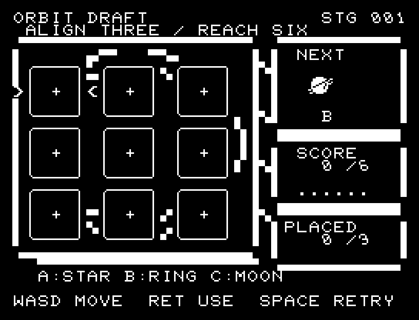
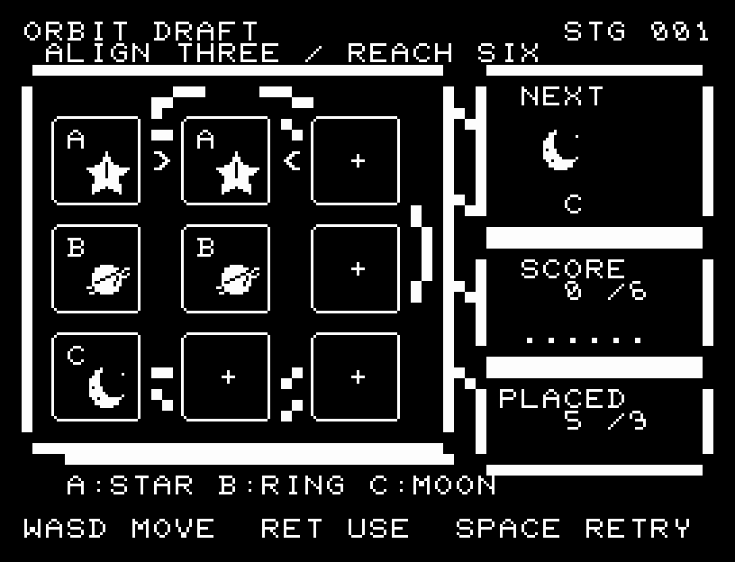
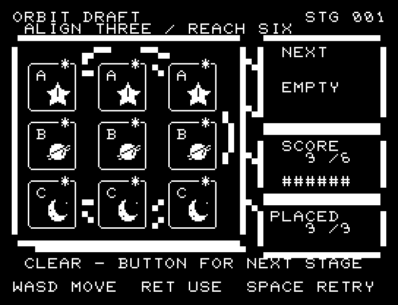

# ORBIT DRAFT

[Wiki](https://github.com/zabaglione/jr100dev/wiki/ORBIT-DRAFT) · [プレイ](https://zabaglione.github.io/pyjr100emu/?game=orbit-draft)

次に来る札を3×3の盤へ配置し、同じA・B・Cを一列に揃えます。一列3点で、9枚を置いた時点で6点以上なら成功です。


## 紹介画像とプレイ動画







**[音付きプレイ動画を見る（約34秒）](https://zabaglione.github.io/pyjr100emu/gameplay.html?game=orbit-draft)**

1ステージのクリアまでを収録。

## タイトルのデザイン

三枚のカードを軌道上に配置し、ORBITを左上、DRAFTを左下に置いて円を挟みます。

## 画面の奥行き

Aは星、Bは環のある惑星、Cは月の大きな天体カードです。厚みのある軌道盤に九つのカード枠を並べ、次の札・得点と目標への進み具合・配置数を別の計器に表示します。選択中の枠は左右の矢印で挟み、完成した列のカードには星印を残します。

## ゲーム専用フォント

ゲーム中の**数字0〜9の10文字を結晶フォント**（細い角形と斜めの切り口）で揃えています。部分的な英字の置き換えは行いません。タイトルの操作案内・説明・パスワード入力は通常フォントに統一しています。既存のロゴと絵柄を保ち、空きPCG枠だけを使用します。

## 動きとクリア演出

天体カードがNEXTから選択した枠へ飛び、一列揃うと三つの天体が段階的に発光します。配置音と共鳴音を分け、加点表示を見せてから次の札へ進みます。演出中の追加入力は受け付けません。

クリア時は完成した盤面・結果を残し、約1.6秒のジングルと余韻を挟みます。失敗時も原因を表示し、ジングルの後に短い間を置きます。その後、キーを押し直して次の操作に進みます。直前から押し続けたキーや、演出中に押したキーで結果を飛ばすことはありません。

## 操作と遊び方

WASDで空き場所を選び、RETURNで次の札を置きます。配札の異なる3ラウンドがあります。

方向キーはキーボードまたはパッド、RETURNはパッドのボタンでも操作できます。SPACEでこの面のやり直し確認を開きます。やり直し確認はNOが初期選択です。A/Dで選び、RETURNで確定、SPACEで取り消します。確認中は進行を止めます。CTRL+CでBASICへ戻ります。

天体カードがNEXTから選択した枠へ飛び、一列揃うと三つの天体が段階的に発光します。配置音と共鳴音を分け、加点表示を見せてから次の札へ進みます。演出が終わってから次のキーを押してください。

Aは星、Bは環のある惑星、Cは月です。左右の矢印で選んだ枠へ、NEXTの札が飛んで配置されます。縦・横・斜めに同じ札が三つ揃うと、その列が発光してRESONANCE +3を表示します。完成したカードには星印を残します。SCOREは現在の得点と目標6点、PLACEDは配置済みの枚数です。


## ビルドと検証

バージョン 1.6.0。開始番地 `$0300`、ゲーム本体と定数は 8,335 bytes。画面・作業領域・復帰用の保存領域・512 bytesのスタックを含めて標準RAM 16KB内で動作します。PCGは32文字を場面ごとに切り替えます。

```sh
make -C games/orbit_draft
make -C games/orbit_draft test
```

出力はゲームの `build/` ディレクトリに作られます。`rules.py` はビルド時にMB8861Hの機械語へ変換されます。JR-100上でPythonを実行する方式ではありません。

キー入力による全ステージのクリア、失敗を含む入力試験、画面範囲、RAM配置、スタック、PCM出力をエミュレーターで検査しています。掲載画像は所有するBASIC ROMからPRGを起動した実フレームです。実機での動作・音声は未確認です。

```sh
.venv/bin/python games/native/replay.py orbit_draft --rom /path/to/owned-rom.prg --capture --keyboard
```

タイトルには長めの単音曲、プレイ中には効果音を付けています。ソース・画像・曲は[MIT License](https://github.com/zabaglione/jr100dev/blob/main/games/LICENSE)。`art/`にはPCG Workbench用の画面データもあります。
