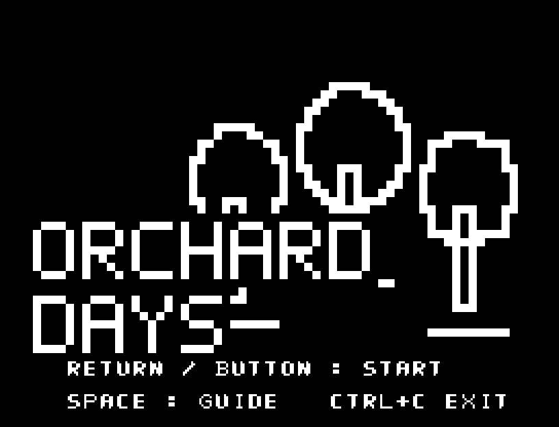
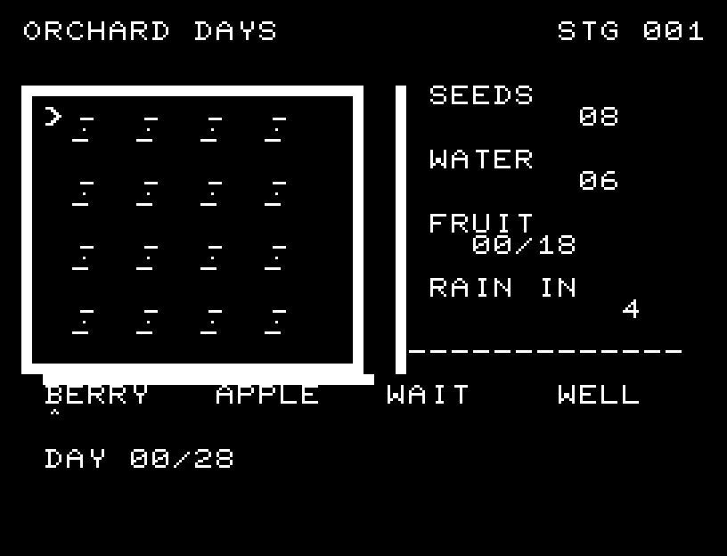
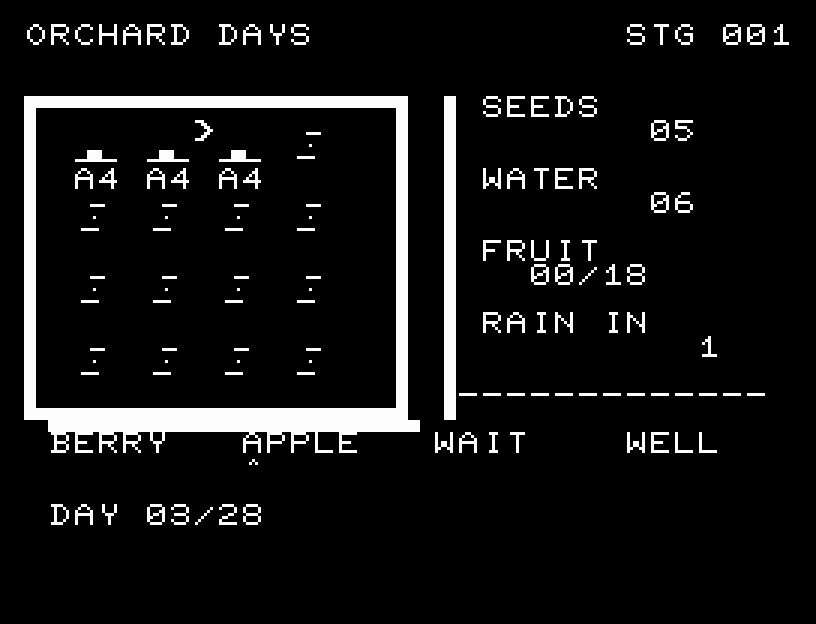
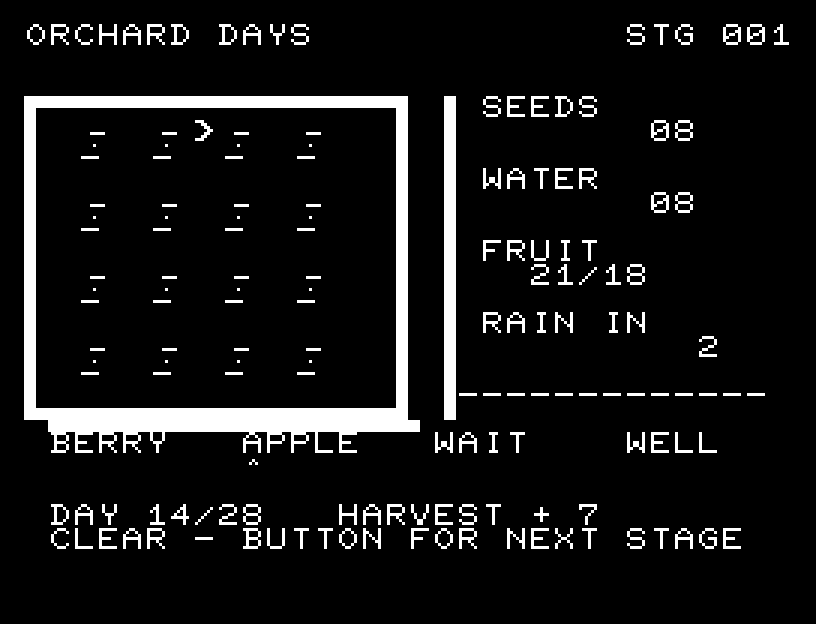
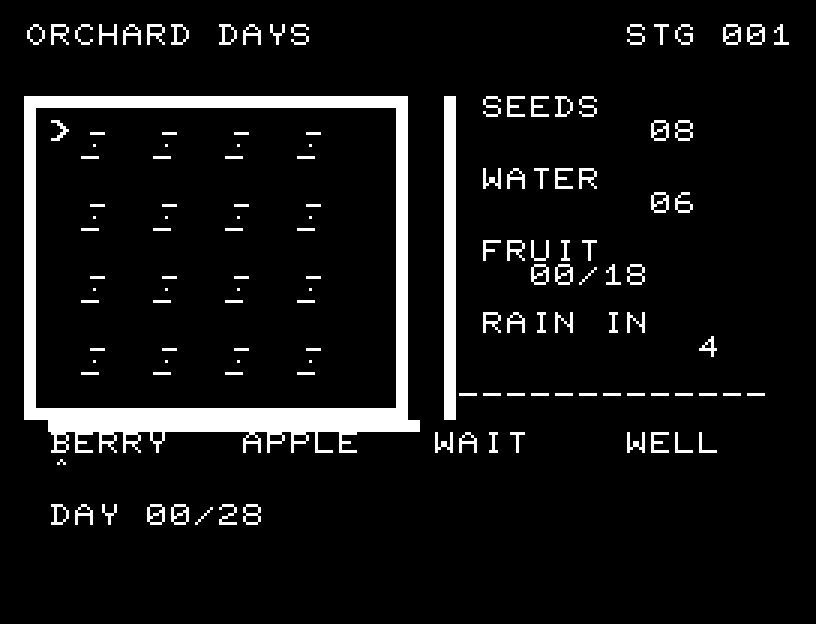
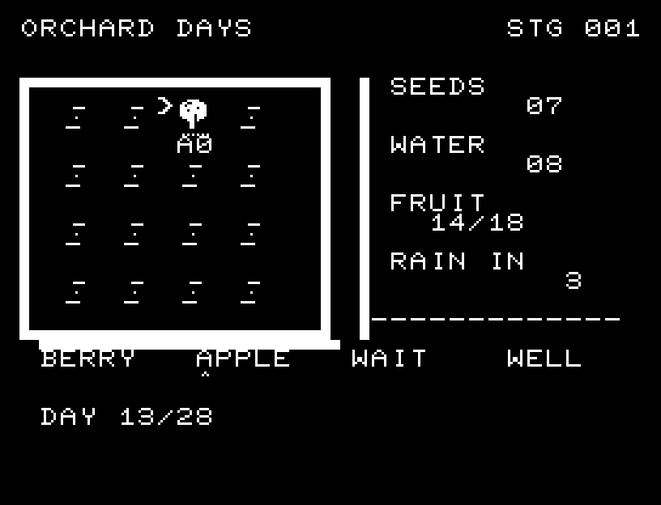

# ORCHARD DAYS

[Wiki](https://github.com/zabaglione/jr100dev/wiki/ORCHARD-DAYS) · [プレイ](https://zabaglione.github.io/pyjr100emu/?game=orchard-days)

4×4の畑で作物を育てる全3季。28日以内に18・24・30点の収穫を目指します。早いベリーは2回育てて3点、遅いリンゴは4回育てて7点です。



## 紹介画像とプレイ動画







**[音付きプレイ動画を見る（約33秒）](https://zabaglione.github.io/pyjr100emu/gameplay.html?game=orchard-days)**

1ステージのクリアまでを収録。

## タイトルのデザイン

大きさの違う三本の果樹を白いシルエットで描き、果実を黒い抜きで示す明るい農園の表紙です。

## 画面の奥行き

畑の囲いと計器を整え、種・水滴が飛び、雨や水やりで対象の作物が1段ずつ育つ様子を表示します。収穫物が得点へ移る動きとSEも加えました。

## ゲーム専用フォント

今回は通常フォントを維持しています。絵柄やアニメーションに使うPCGを残すと、一式の数字・英字を揃える枠が足りないためです。一部の文字だけ書体が変わる置き換えは行いません。

## 動きとクリア演出

畑の囲いと計器を整え、種・水滴が飛び、雨や水やりで対象の作物が1段ずつ育つ様子を表示します。収穫物が得点へ移る動きとSEも加えました。被弾や結果を確認する間は、追加入力で表示を飛ばせません。

クリア時は完成した盤面・結果を残し、約1.6秒のジングルと余韻を挟みます。失敗時も原因を表示し、ジングルの後に短い間を置きます。その後、キーを押し直して次の操作に進みます。直前から押し続けたキーや、演出中に押したキーで結果を飛ばすことはありません。

## 操作と遊び方

WASDで畑や下段の道具を選び、RETURNで作業します。BERRY／APPLEで植える種類を選択。空き畑には種まき、育成中なら水やり、実った作物なら収穫です。WAITは1日待機、WELLは1日を使って水を3補給します。種類の選択では日数を使いません。

方向キーはキーボードまたはパッド、RETURNはパッドのボタンでも操作できます。SPACEでこの面のやり直し確認を開きます。やり直し確認はNOが初期選択です。A/Dで選び、RETURNで確定、SPACEで取り消します。確認中は進行を止めます。CTRL+CでBASICへ戻ります。

畑の囲いと計器を整え、種・水滴が飛び、雨や水やりで対象の作物が1段ずつ育つ様子を表示します。収穫物が得点へ移る動きとSEも加えました。演出が終わってから次のキーを押してください。

種は8、水は6で開始。種まきで種1、水やりで水1を使い、収穫すると種1が戻ります。雨は4・5・6日ごとで、全作物が1段育ち、水が4増えます。水は最大9。RAIN INで次の雨を読み、井戸へ行く日と作物を選びます。





## ビルドと検証

バージョン 2.0.0。開始番地 `$0300`、ゲーム本体と定数は 8,494 bytes。画面・作業領域・復帰用の保存領域・512 bytesのスタックを含めて標準RAM 16KB内で動作します。PCGは32文字を場面ごとに切り替えます。

```sh
make -C games/orchard_days
make -C games/orchard_days test
```

出力はゲームの `build/` ディレクトリに作られます。`rules.py` はビルド時にMB8861Hの機械語へ変換されます。JR-100上でPythonを実行する方式ではありません。

キー入力による全ステージのクリア、失敗を含む入力試験、画面範囲、RAM配置、スタック、PCM出力をエミュレーターで検査しています。掲載画像は所有するBASIC ROMからPRGを起動した実フレームです。実機での動作・音声は未確認です。

```sh
.venv/bin/python games/native/replay.py orchard_days --rom /path/to/owned-rom.prg --capture --keyboard
```

タイトルには長めの単音曲、プレイ中には効果音を付けています。ソース・画像・曲は[MIT License](https://github.com/zabaglione/jr100dev/blob/main/games/LICENSE)。`art/`にはPCG Workbench用の画面データもあります。
