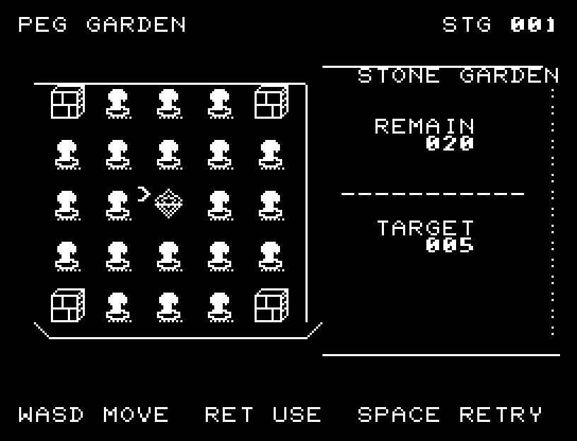
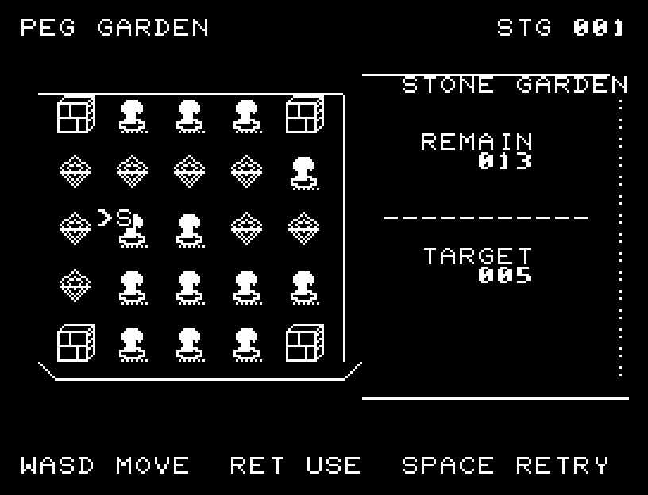
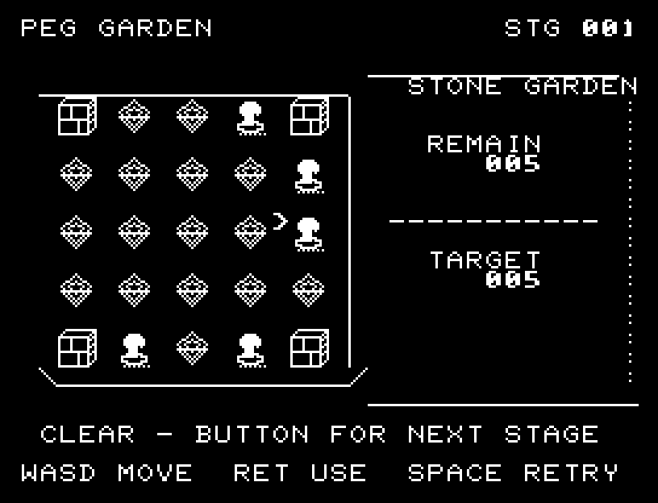

# PEG GARDEN

[Wiki](https://github.com/zabaglione/jr100dev/wiki/PEG-GARDEN) · [プレイ](https://zabaglione.github.io/pyjr100emu/?game=peg-garden)

隣の石を飛び越して取り除き、石を5個以下に減らす庭園パズルです。


## 紹介画像とプレイ動画

**[音付きプレイ動画を見る（約30秒）](https://zabaglione.github.io/pyjr100emu/gameplay.html?game=peg-garden)**

1ステージのクリアまでを収録。長い途中経過を省略したダイジェストです。省略箇所にはLATERを表示し、動作と音の速度は変えていません。画面を確認する間を入れた自動キー入力によるプレイです。



[](https://zabaglione.github.io/pyjr100emu/gameplay.html?game=peg-garden)



## タイトルのデザイン

駒を飛び越える軌跡と右の若葉を組み合わせ、盤上の遊びを庭の成長として描きます。

## 画面の奥行き

石を高さのあるペグ、空き位置をくぼんだ受け皿にし、庭の縁に厚みを加えました。選択記号と飛び越せる位置は平面の格子で示します。

## ゲーム専用フォント

ゲーム中の**数字0〜9の10文字を栽培フォント**（丸みのある太線）で揃えています。部分的な英字の置き換えは行いません。タイトルの操作案内・説明・パスワード入力は通常フォントに統一しています。既存のロゴと絵柄を保ち、空きPCG枠だけを使用します。

## 動きとクリア演出

選んだ駒が隣の駒を飛び越え、空いた穴に着地する様子を表示します。演出中の追加入力は受け付けません。

クリア時は完成した盤面・結果を残し、約1.6秒のジングルと余韻を挟みます。失敗時も原因を表示し、ジングルの後に短い間を置きます。その後、キーを押し直して次の操作に進みます。直前から押し続けたキーや、演出中に押したキーで結果を飛ばすことはありません。

## 操作と遊び方

WASDで位置を選び、RETURNで石を選択し、2マス先の空き位置を選んでRETURNを押します。間の石が取り除かれます。

方向キーはキーボードまたはパッド、RETURNはパッドのボタンでも操作できます。SPACEでこの面のやり直し確認を開きます。やり直し確認はNOが初期選択です。A/Dで選び、RETURNで確定、SPACEで取り消します。確認中は進行を止めます。CTRL+CでBASICへ戻ります。

選んだ駒が隣の駒を飛び越え、空いた穴に着地する様子を表示します。演出が終わってから次のキーを押してください。

庭園の石、選択中の石、残数を表示します。


## ビルドと検証

バージョン 1.5.0。開始番地 `$0300`、ゲーム本体と定数は 6,515 bytes。画面・作業領域・復帰用の保存領域・512 bytesのスタックを含めて標準RAM 16KB内で動作します。PCGは32文字を場面ごとに切り替えます。

```sh
make -C games/peg_garden
make -C games/peg_garden test
```

出力はゲームの `build/` ディレクトリに作られます。`rules.py` はビルド時にMB8861Hの機械語へ変換されます。JR-100上でPythonを実行する方式ではありません。

キー入力による全ステージのクリア、失敗を含む入力試験、画面範囲、RAM配置、スタック、PCM出力をエミュレーターで検査しています。掲載画像は所有するBASIC ROMからPRGを起動した実フレームです。実機での動作・音声は未確認です。

```sh
.venv/bin/python games/native/replay.py peg_garden --rom /path/to/owned-rom.prg --capture --keyboard
```

タイトルには長めの単音曲、プレイ中には効果音を付けています。ソース・画像・曲は[MIT License](https://github.com/zabaglione/jr100dev/blob/main/games/LICENSE)。`art/`にはPCG Workbench用の画面データもあります。
