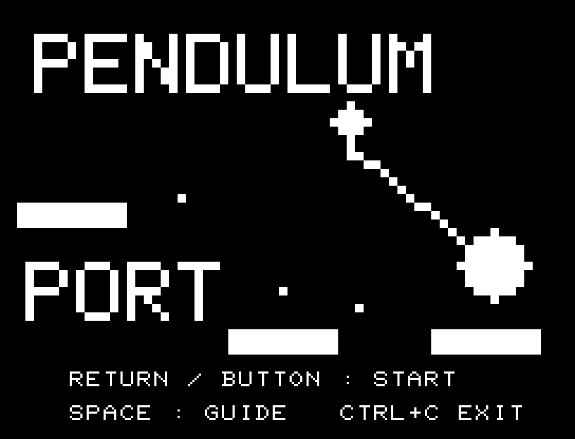
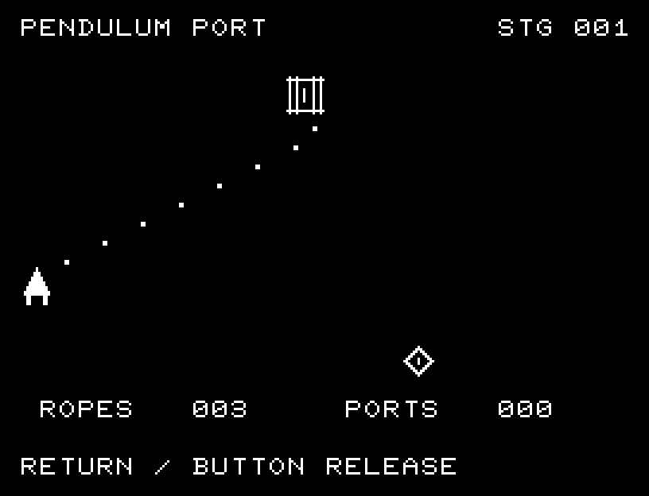
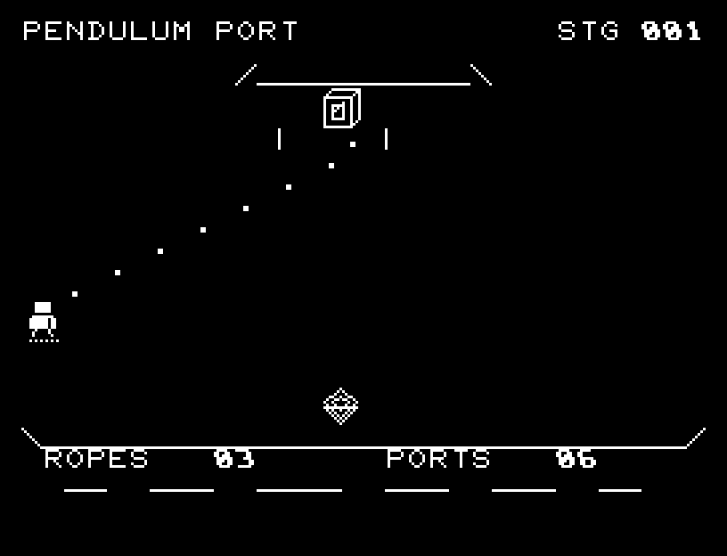

# PENDULUM PORT

[Wiki](https://github.com/zabaglione/jr100dev/wiki/PENDULUM-PORT) · [プレイ](https://zabaglione.github.io/pyjr100emu/?game=pendulum-port)

振り子を放すタイミングを選び、8つの足場へ渡ります。目標との差が1目盛以内なら成功、落下3回で終了です。



## タイトルのデザイン

細い振り子の線と大きな重りを主役にし、下の足場との間隔で渡る緊張感を出します。

## 画面の奥行き

支点に厚みを付け、手前の足場と奥の構造物を分けました。縄の軌跡と着地点は隠さず、タイミングを読みやすくしています。

## ゲーム専用フォント

ゲーム中の**数字0〜9の10文字をスピードフォント**（右へ傾く太線）で揃えています。部分的な英字の置き換えは行いません。タイトルの操作案内・説明・パスワード入力は通常フォントに統一しています。既存のロゴと絵柄を保ち、空きPCG枠だけを使用します。

## 動きとクリア演出

クリア時は完成した盤面・結果を残し、約1.6秒のジングルと余韻を挟みます。その後、キーを押し直して次の操作に進みます。クリア直前から押し続けたキーや、演出中に押したキーで結果を飛ばすことはありません。

## 操作と遊び方

RETURNで振り子を放します。ダイヤが次の着地点です。

方向キーはキーボードまたはパッド、RETURNはパッドのボタンでも操作できます。SPACEでこの面のやり直し確認を開きます。やり直し確認はNOが初期選択です。A/Dで選び、RETURNで確定、SPACEで取り消します。確認中は進行を止めます。CTRL+CでBASICへ戻ります。

振り子、目標位置、残る機会と渡った足場数を表示します。





## ビルドと検証

バージョン 1.4.0。開始番地 `$0300`、ゲーム本体と定数は 6,270 bytes。画面・作業領域・復帰用の保存領域・512 bytesのスタックを含めて標準RAM 16KB内で動作します。PCGは32文字を場面ごとに切り替えます。

```sh
make -C games/pendulum_port
make -C games/pendulum_port test
```

出力はゲームの `build/` ディレクトリに作られます。`rules.py` はビルド時にMB8861Hの機械語へ変換されます。JR-100上でPythonを実行する方式ではありません。

キー入力による全ステージのクリア、失敗を含む入力試験、画面範囲、RAM配置、スタック、PCM出力をエミュレーターで検査しています。掲載画像は所有するBASIC ROMからPRGを起動した実フレームです。実機での動作・音声は未確認です。

```sh
.venv/bin/python games/native/replay.py pendulum_port --rom /path/to/owned-rom.prg --capture --keyboard
```

タイトルには長めの単音曲、プレイ中には効果音を付けています。ソース・画像・曲は[MIT License](https://github.com/zabaglione/jr100dev/blob/main/games/LICENSE)。`art/`にはPCG Workbench用の画面データもあります。
