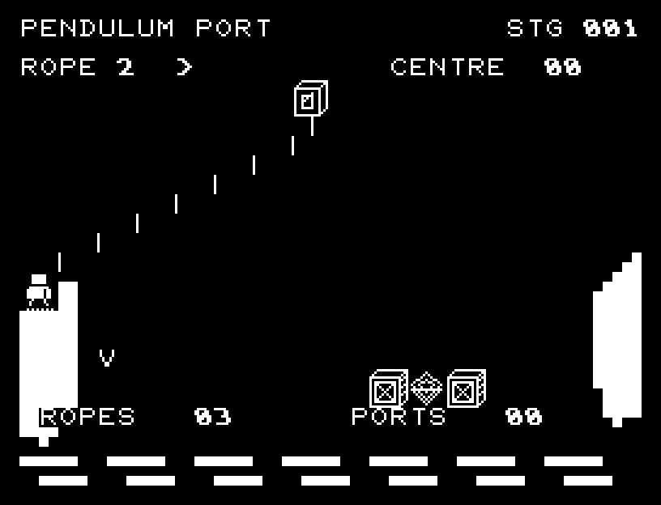
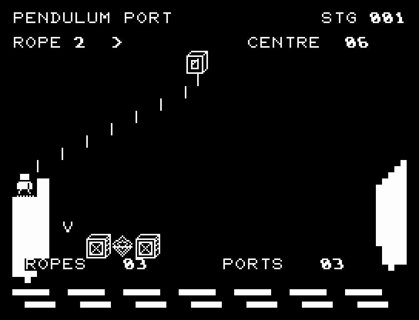
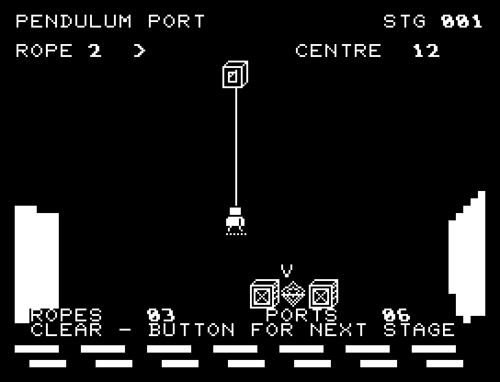

# PENDULUM PORT

[Wiki](https://github.com/zabaglione/jr100dev/wiki/PENDULUM-PORT) · [プレイ](https://zabaglione.github.io/pyjr100emu/?game=pendulum-port)

振り子から手を離し、足場へ飛び移る全6区間。6回から11回の着地を続けます。足場の中央は2点、端は1点で、後半には中央しか着地できない足場も現れます。


## 紹介画像とプレイ動画







**[音付きプレイ動画を見る（約30秒）](https://zabaglione.github.io/pyjr100emu/gameplay.html?game=pendulum-port)**

1ステージのクリアまでを収録。

## タイトルのデザイン

細い振り子の線と大きな重りを主役にし、下の足場との間隔で渡る緊張感を出します。

## 画面の奥行き

岸壁と波をセミグラフィックスで描き、振り子、放物線の跳躍、着地と落下の途中の位置を表示します。中央への着地は光と音で区別します。

## ゲーム専用フォント

ゲーム中の**数字0〜9の10文字をスピードフォント**（右へ傾く太線）で揃えています。部分的な英字の置き換えは行いません。タイトルの操作案内・説明・パスワード入力は通常フォントに統一しています。既存のロゴと絵柄を保ち、空きPCG枠だけを使用します。

## 動きとクリア演出

岸壁と波をセミグラフィックスで描き、振り子、放物線の跳躍、着地と落下の途中の位置を表示します。中央への着地は光と音で区別します。被弾や結果を確認する間は、追加入力で表示を飛ばせません。

クリア時は完成した盤面・結果を残し、約1.6秒のジングルと余韻を挟みます。失敗時も原因を表示し、ジングルの後に短い間を置きます。その後、キーを押し直して次の操作に進みます。直前から押し続けたキーや、演出中に押したキーで結果を飛ばすことはありません。

## 操作と遊び方

A/Dでロープの長さを1〜3に変え、RETURNで手を離します。移動している方向へロープの長さだけ進んで落ちます。V印が現在の着地点予告です。

方向キーはキーボードまたはパッド、RETURNはパッドのボタンでも操作できます。SPACEでこの面のやり直し確認を開きます。やり直し確認はNOが初期選択です。A/Dで選び、RETURNで確定、SPACEで取り消します。確認中は進行を止めます。CTRL+CでBASICへ戻ります。

岸壁と波をセミグラフィックスで描き、振り子、放物線の跳躍、着地と落下の途中の位置を表示します。中央への着地は光と音で区別します。演出が終わってから次のキーを押してください。

ROPEはロープの長さ、矢印は振れる方向、CENTREは着地点の得点、ROPESは残り挑戦回数、PORTSは渡った足場の数です。中央の菱形を狙うか、広い端で確実に進むかを選びます。


## ビルドと検証

バージョン 2.0.0。開始番地 `$0300`、ゲーム本体と定数は 7,314 bytes。画面・作業領域・復帰用の保存領域・512 bytesのスタックを含めて標準RAM 16KB内で動作します。PCGは32文字を場面ごとに切り替えます。

```sh
make -C games/pendulum_port
make -C games/pendulum_port test
```

出力はゲームの `build/` ディレクトリに作られます。`rules.py` はビルド時にMB8861Hの機械語へ変換されます。JR-100上でPythonを実行する方式ではありません。

キー入力による全ステージのクリア、失敗を含む入力試験、画面範囲、RAM配置、スタック、PCM出力をエミュレーターで検査しています。掲載画像は所有するBASIC ROMからPRGを起動した実フレームです。実機での動作・音声は未確認です。

```sh
.venv/bin/python games/native/replay.py pendulum_port --rom /path/to/owned-rom.prg --capture --keyboard
```

タイトルには長めの単音曲、プレイ中には効果音を付けています。ソース・画像・曲は[MIT License](https://github.com/zabaglione/jr100dev/blob/main/games/LICENSE)。`art/`にはPCG Workbench用の画面データもあります。
