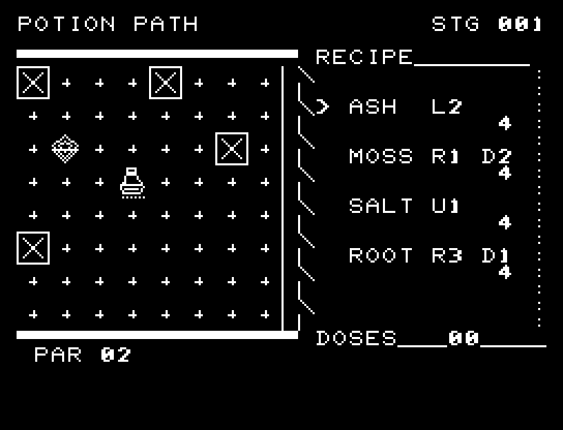
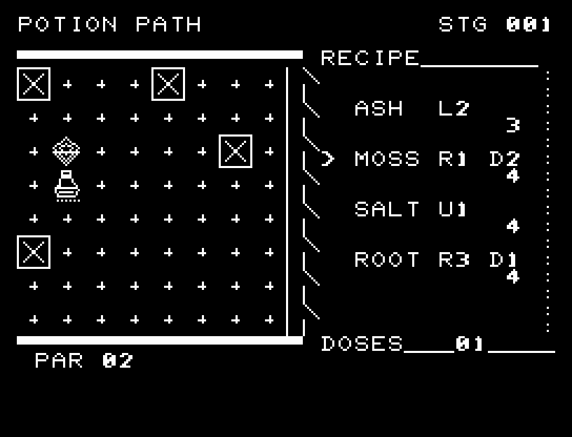
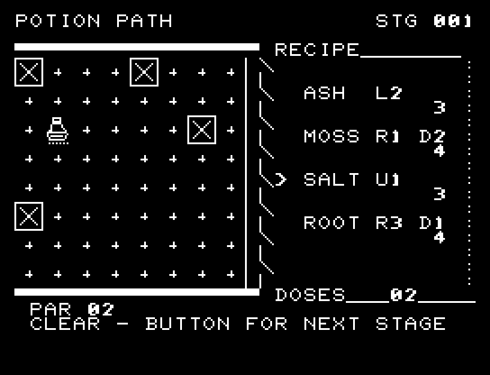

# POTION PATH

[Wiki](https://github.com/zabaglione/jr100dev/wiki/POTION-PATH) · [プレイ](https://zabaglione.github.io/pyjr100emu/?game=potion-path)

4種の材料で薬を移動させ、菱形の調合点へ届ける全20問です。材料は各4回まで、合計12回まで。毒のX印へ着地できないため、材料の残数と順序を考えます。


## 紹介画像とプレイ動画







**[音付きプレイ動画を見る（約35秒）](https://zabaglione.github.io/pyjr100emu/gameplay.html?game=potion-path)**

1ステージのクリアまでを収録。

## タイトルのデザイン

左の大きな薬瓶から右上へ材料の経路を伸ばし、POTIONとPATHを道の入口と出口に置きます。

## 画面の奥行き

毒の着地点を枠付きのXで示し、材料が容器から飛び、薬が次の位置へ移る過程を表示します。在庫切れと毒への着地を異なる短い原因表示で知らせます。

## ゲーム専用フォント

ゲーム中の**数字0〜9の10文字を栽培フォント**（丸みのある太線）で揃えています。部分的な英字の置き換えは行いません。タイトルの操作案内・説明・パスワード入力は通常フォントに統一しています。既存のロゴと絵柄を保ち、空きPCG枠だけを使用します。

## 動きとクリア演出

毒の着地点を枠付きのXで示し、材料が容器から飛び、薬が次の位置へ移る過程を表示します。在庫切れと毒への着地を異なる短い原因表示で知らせます。被弾や結果を確認する間は、追加入力で表示を飛ばせません。

クリア時は完成した盤面・結果を残し、約1.6秒のジングルと余韻を挟みます。失敗時も原因を表示し、ジングルの後に短い間を置きます。その後、キーを押し直して次の操作に進みます。直前から押し続けたキーや、演出中に押したキーで結果を飛ばすことはありません。

## 操作と遊び方

WASDで材料を選び、RETURNで注ぎます。ASHは左へ2、MOSSは右へ1・下へ2、SALTは上へ1、ROOTは右へ3・下へ1です。盤外・毒・在庫切れの操作では材料を消費しません。

方向キーはキーボードまたはパッド、RETURNはパッドのボタンでも操作できます。SPACEでこの面のやり直し確認を開きます。やり直し確認はNOが初期選択です。A/Dで選び、RETURNで確定、SPACEで取り消します。確認中は進行を止めます。CTRL+CでBASICへ戻ります。

毒の着地点を枠付きのXで示し、材料が容器から飛び、薬が次の位置へ移る過程を表示します。在庫切れと毒への着地を異なる短い原因表示で知らせます。演出が終わってから次のキーを押してください。

右側の各材料に残数、DOSESに使用回数、PARに最短回数を表示します。毒を飛び越えることはできますが、着地点にはできません。


## ビルドと検証

バージョン 3.0.0。開始番地 `$0300`、ゲーム本体と定数は 7,878 bytes。画面・作業領域・復帰用の保存領域・512 bytesのスタックを含めて標準RAM 16KB内で動作します。PCGは32文字を場面ごとに切り替えます。

```sh
make -C games/potion_path
make -C games/potion_path test
```

出力はゲームの `build/` ディレクトリに作られます。`rules.py` はビルド時にMB8861Hの機械語へ変換されます。JR-100上でPythonを実行する方式ではありません。

キー入力による全ステージのクリア、失敗を含む入力試験、画面範囲、RAM配置、スタック、PCM出力をエミュレーターで検査しています。掲載画像は所有するBASIC ROMからPRGを起動した実フレームです。実機での動作・音声は未確認です。

```sh
.venv/bin/python games/native/replay.py potion_path --rom /path/to/owned-rom.prg --capture --keyboard
```

タイトルには長めの単音曲、プレイ中には効果音を付けています。ソース・画像・曲は[MIT License](https://github.com/zabaglione/jr100dev/blob/main/games/LICENSE)。`art/`にはPCG Workbench用の画面データもあります。
