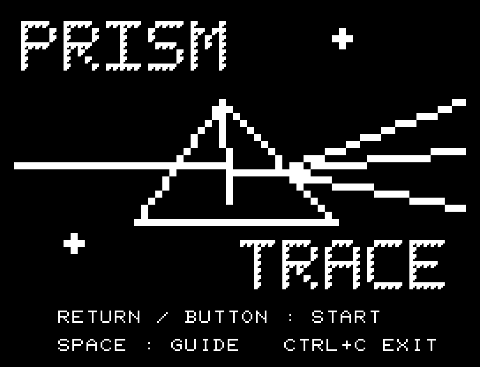
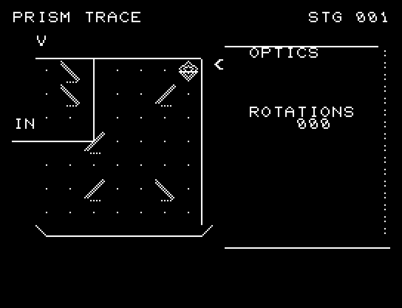
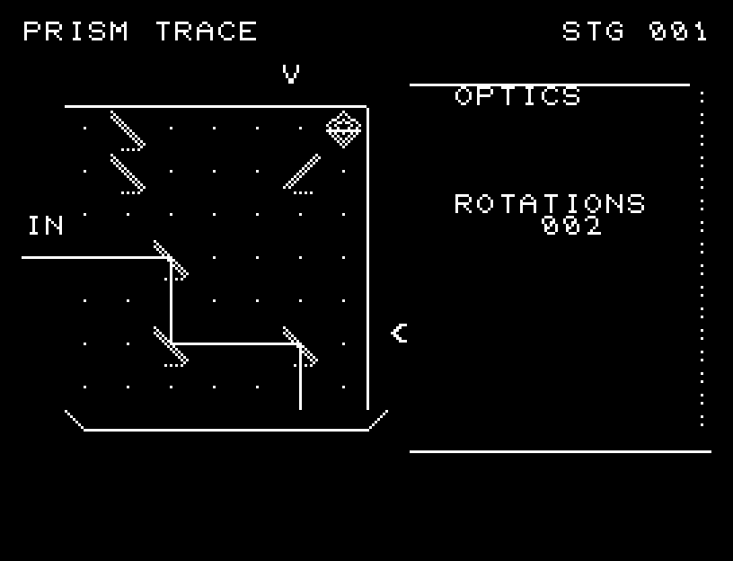
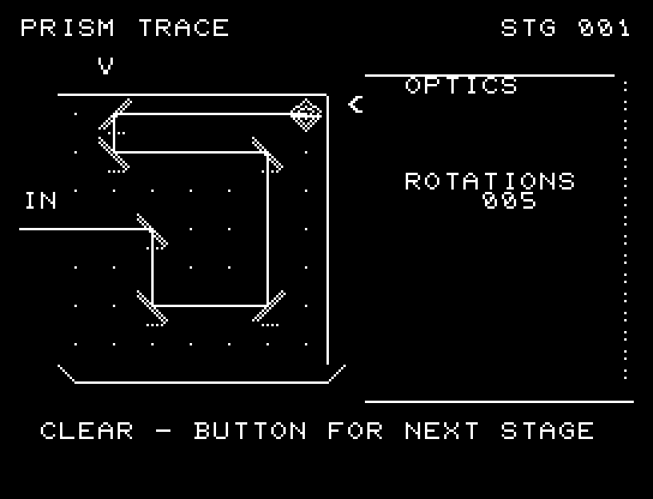
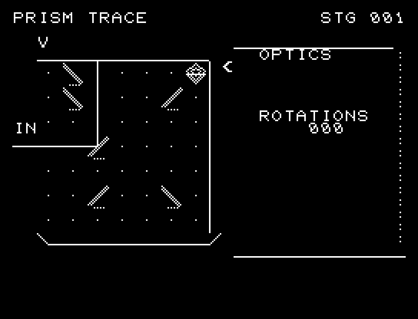
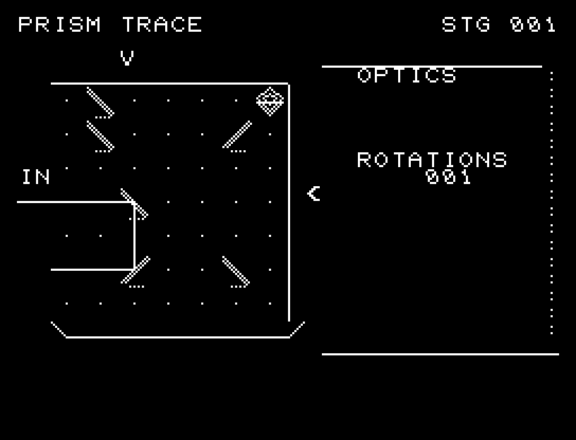

# PRISM TRACE

[Wiki](https://github.com/zabaglione/jr100dev/wiki/PRISM-TRACE) · [プレイ](https://zabaglione.github.io/pyjr100emu/?game=prism-trace)

6枚の鏡を回転し、左から入る光を右上の受光器へ届けます。光路は鏡を回すたびに更新されます。



## 紹介画像とプレイ動画







**[音付きプレイ動画を見る（約31秒）](https://zabaglione.github.io/pyjr100emu/gameplay.html?game=prism-trace)**

1ステージのクリアまでを収録。

## タイトルのデザイン

プリズムを通った光が三方向へ分かれる瞬間を描き、PRISMとTRACEを光路の上下に置きます。

## 画面の奥行き

鏡に細い側面と台座、受光器にくぼみを付けました。光はマスの境界でも途切れない線になり、鏡の面で直角に反射します。選択矢印は盤外に置き、光路を隠さずに位置を示します。

## ゲーム専用フォント

ゲーム中の**数字0〜9の10文字を結晶フォント**（細い角形と斜めの切り口）で揃えています。部分的な英字の置き換えは行いません。タイトルの操作案内・説明・パスワード入力は通常フォントに統一しています。既存のロゴと絵柄を保ち、空きPCG枠だけを使用します。

## 動きとクリア演出

鏡を回すと、光がつながった線として伸びていきます。鏡の面で線が折れ曲がり、反射音とともに受光器までの経路を追えます。被弾や結果を確認する間は、追加入力で表示を飛ばせません。

クリア時は完成した盤面・結果を残し、約1.6秒のジングルと余韻を挟みます。失敗時も原因を表示し、ジングルの後に短い間を置きます。その後、キーを押し直して次の操作に進みます。直前から押し続けたキーや、演出中に押したキーで結果を飛ばすことはありません。

## 操作と遊び方

WASDで鏡の位置を選び、RETURNで / と反対向きの鏡を切り替えます。盤面の上と右にある矢印の交点が選択位置です。

方向キーはキーボードまたはパッド、RETURNはパッドのボタンでも操作できます。SPACEでこの面のやり直し確認を開きます。やり直し確認はNOが初期選択です。A/Dで選び、RETURNで確定、SPACEで取り消します。確認中は進行を止めます。CTRL+CでBASICへ戻ります。

鏡を回すと、光がつながった線として伸びていきます。鏡の面で線が折れ曲がり、反射音とともに受光器までの経路を追えます。演出が終わってから次のキーを押してください。

光路は途切れない線で示し、鏡の位置で折れ曲がります。側面に回転回数を表示します。





## ビルドと検証

バージョン 1.6.1。開始番地 `$0300`、ゲーム本体と定数は 6,815 bytes。画面・作業領域・復帰用の保存領域・512 bytesのスタックを含めて標準RAM 16KB内で動作します。PCGは32文字を場面ごとに切り替えます。

```sh
make -C games/prism_trace
make -C games/prism_trace test
```

出力はゲームの `build/` ディレクトリに作られます。`rules.py` はビルド時にMB8861Hの機械語へ変換されます。JR-100上でPythonを実行する方式ではありません。

キー入力による全ステージのクリア、失敗を含む入力試験、画面範囲、RAM配置、スタック、PCM出力をエミュレーターで検査しています。掲載画像は所有するBASIC ROMからPRGを起動した実フレームです。実機での動作・音声は未確認です。

```sh
.venv/bin/python games/native/replay.py prism_trace --rom /path/to/owned-rom.prg --capture --keyboard
```

タイトルには長めの単音曲、プレイ中には効果音を付けています。ソース・画像・曲は[MIT License](https://github.com/zabaglione/jr100dev/blob/main/games/LICENSE)。`art/`にはPCG Workbench用の画面データもあります。
