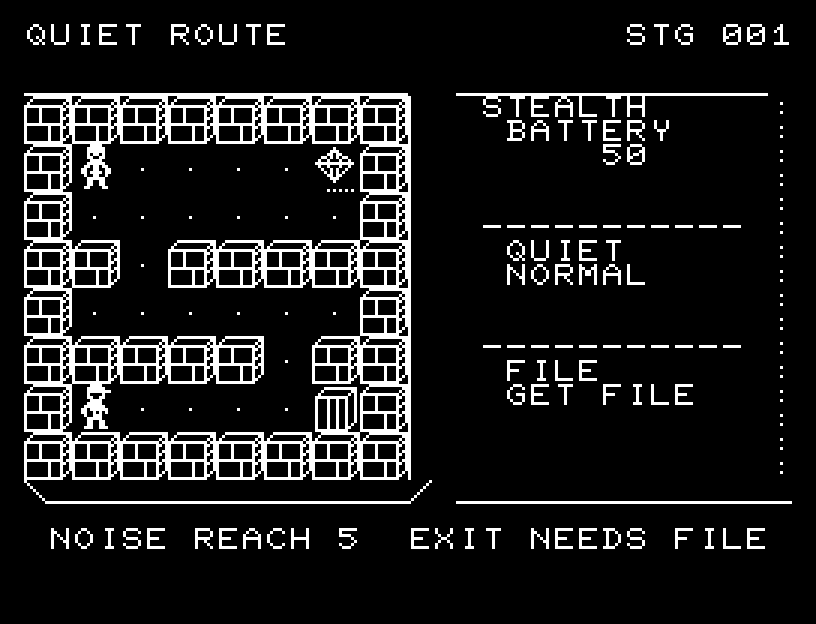
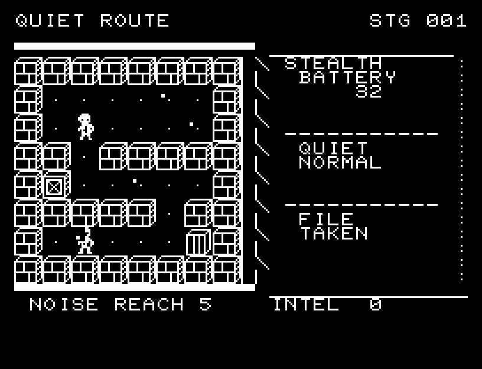
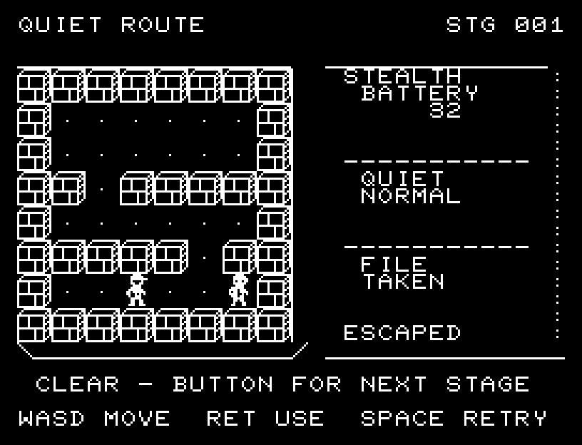

# QUIET ROUTE

[Wiki](https://github.com/zabaglione/jr100dev/wiki/QUIET-ROUTE) · [プレイ](https://zabaglione.github.io/pyjr100emu/?game=quiet-route)

警備員をかわして機密を取り、門から脱出する全6経路。寄り道の補給箱は追加情報と電池6を得られますが、巡回路に近づく必要があります。


## 紹介画像とプレイ動画







**[音付きプレイ動画を見る（約30秒）](https://zabaglione.github.io/pyjr100emu/gameplay.html?game=quiet-route)**

1ステージのクリアまでを収録。

## タイトルのデザイン

白い街のシルエットとサーチライトの中に黒い人影を隠し、上部に暗い空とロゴの余白を取ります。

## 画面の奥行き

主人公と警備員が向きを変えて中間位置を通り、足音の届く外周を点で示します。補給・機密・門を描き分け、発見された場面と原因を残して停止します。

## ゲーム専用フォント

今回は通常フォントを維持しています。絵柄やアニメーションに使うPCGを残すと、一式の数字・英字を揃える枠が足りないためです。一部の文字だけ書体が変わる置き換えは行いません。

## 動きとクリア演出

主人公と警備員が向きを変えて中間位置を通り、足音の届く外周を点で示します。補給・機密・門を描き分け、発見された場面と原因を残して停止します。被弾や結果を確認する間は、追加入力で表示を飛ばせません。

クリア時は完成した盤面・結果を残し、約1.6秒のジングルと余韻を挟みます。失敗時も原因を表示し、ジングルの後に短い間を置きます。その後、キーを押し直して次の操作に進みます。直前から押し続けたキーや、演出中に押したキーで結果を飛ばすことはありません。

## 操作と遊び方

WASDで移動、RETURNで通常歩行と静音歩行を切り替えます。通常は電池1、静音は2を使います。通常の足音は距離5未満、静音は距離2未満の警備員に聞こえます。

方向キーはキーボードまたはパッド、RETURNはパッドのボタンでも操作できます。SPACEでこの面のやり直し確認を開きます。やり直し確認はNOが初期選択です。A/Dで選び、RETURNで確定、SPACEで取り消します。確認中は進行を止めます。CTRL+CでBASICへ戻ります。

主人公と警備員が向きを変えて中間位置を通り、足音の届く外周を点で示します。補給・機密・門を描き分け、発見された場面と原因を残して停止します。演出が終わってから次のキーを押してください。

BATTERYは電池、QUIETは歩行状態、FILEは必須機密、INTELは追加情報です。機密を持って門へ入るとクリア。移動後に警備員が応答するため、接近する巡回と電池の残量を合わせて判断します。


## ソースコード

ゲーム本体は [`rules.py`](rules.py) です。ビルド時にMB8861Hの機械語へ変換します。

ビルド設定は [`game.json`](game.json) と [`Makefile`](Makefile) です。共有コードと生成物の関係は[全ゲームのソース一覧](../SOURCES.md)を参照してください。

## ビルドと検証

バージョン 2.0.0。開始番地 `$0300`、ゲーム本体と定数は 8,848 bytes。画面・作業領域・復帰用の保存領域・512 bytesのスタックを含めて標準RAM 16KB内で動作します。PCGは32文字を場面ごとに切り替えます。

```sh
make -C games/quiet_route
make -C games/quiet_route test
```

出力はゲームの `build/` ディレクトリに作られます。JR-100上でPythonを実行する方式ではありません。

キー入力による全ステージのクリア、失敗を含む入力試験、画面範囲、RAM配置、スタック、PCM出力をエミュレーターで検査しています。掲載画像は所有するBASIC ROMからPRGを起動した実フレームです。実機での動作・音声は未確認です。

```sh
.venv/bin/python games/native/replay.py quiet_route --rom /path/to/owned-rom.prg --capture --keyboard
```

タイトルには長めの単音曲、プレイ中には効果音を付けています。ソース・画像・曲は[MIT License](https://github.com/zabaglione/jr100dev/blob/main/games/LICENSE)。`art/`にはPCG Workbench用の画面データもあります。
