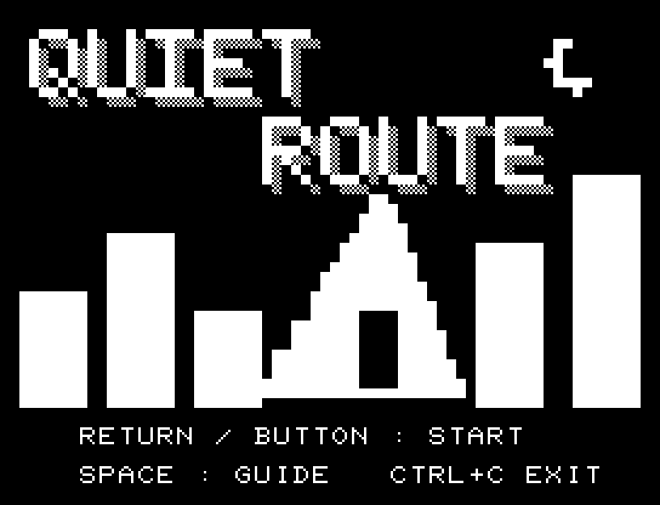
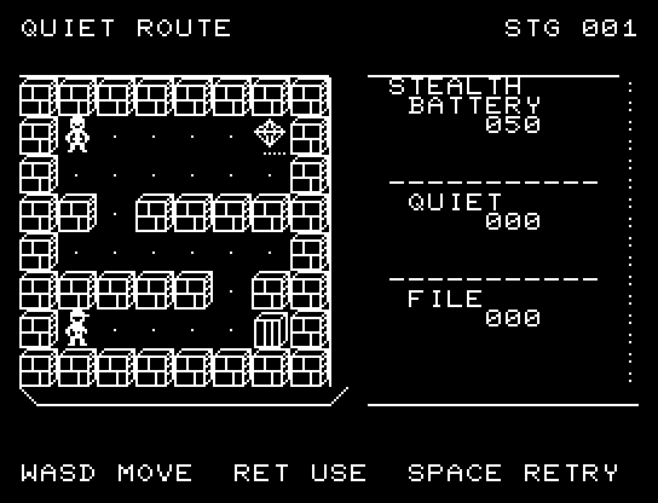
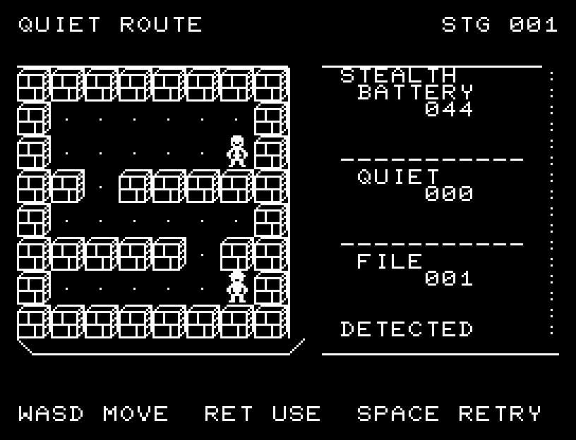

# QUIET ROUTE

[Wiki](https://github.com/zabaglione/jr100dev/wiki/QUIET-ROUTE) · [プレイ](https://zabaglione.github.io/pyjr100emu/?game=quiet-route)

巡回兵の視線と足音の届く範囲を読み、右上の機密を回収して右下の出口へ運びます。



## タイトルのデザイン

白い街のシルエットとサーチライトの中に黒い人影を隠し、上部に暗い空とロゴの余白を取ります。

## 画面の奥行き

石壁と扉の奥行き、人物の接地影で通路を表現しました。警備員は帽子とバイザーで主人公と区別できます。 向きに応じて1体4文字のPCGを書き換えます。 移動時には半マスの中間位置とSEを挟みます。

## ゲーム専用フォント

今回は通常フォントを維持しています。絵柄やアニメーションに使うPCGを残すと、一式の数字・英字を揃える枠が足りないためです。一部の文字だけ書体が変わる置き換えは行いません。

## 動きとクリア演出

探索者と警備員は進行方向を向き、マスの中間を通って移動します。探索者が動いてから警備員が応答するため、双方の行動を音とともに追えます。演出中の追加入力は受け付けません。

クリア時は完成した盤面・結果を残し、約1.6秒のジングルと余韻を挟みます。失敗時も原因を表示し、ジングルの後に短い間を置きます。その後、キーを押し直して次の操作に進みます。直前から押し続けたキーや、演出中に押したキーで結果を飛ばすことはありません。

## 操作と遊び方

WASDで移動、RETURNで静音歩行を切り替えます。静音中は移動に電池を2消費しますが、聞きつけられる距離が短くなります。

方向キーはキーボードまたはパッド、RETURNはパッドのボタンでも操作できます。SPACEでこの面のやり直し確認を開きます。やり直し確認はNOが初期選択です。A/Dで選び、RETURNで確定、SPACEで取り消します。確認中は進行を止めます。CTRL+CでBASICへ戻ります。

探索者と警備員は進行方向を向き、マスの中間を通って移動します。探索者が動いてから警備員が応答するため、双方の行動を音とともに追えます。演出が終わってから次のキーを押してください。

位置、巡回兵、視線、電池残量、機密の回収状態を確認してください。





## ビルドと検証

バージョン 1.4.0。開始番地 `$0300`、ゲーム本体と定数は 7,411 bytes。画面・作業領域・復帰用の保存領域・512 bytesのスタックを含めて標準RAM 16KB内で動作します。PCGは32文字を場面ごとに切り替えます。

```sh
make -C games/quiet_route
make -C games/quiet_route test
```

出力はゲームの `build/` ディレクトリに作られます。`rules.py` はビルド時にMB8861Hの機械語へ変換されます。JR-100上でPythonを実行する方式ではありません。

キー入力による全ステージのクリア、失敗を含む入力試験、画面範囲、RAM配置、スタック、PCM出力をエミュレーターで検査しています。掲載画像は所有するBASIC ROMからPRGを起動した実フレームです。実機での動作・音声は未確認です。

```sh
.venv/bin/python games/native/replay.py quiet_route --rom /path/to/owned-rom.prg --capture --keyboard
```

タイトルには長めの単音曲、プレイ中には効果音を付けています。ソース・画像・曲は[MIT License](https://github.com/zabaglione/jr100dev/blob/main/games/LICENSE)。`art/`にはPCG Workbench用の画面データもあります。
