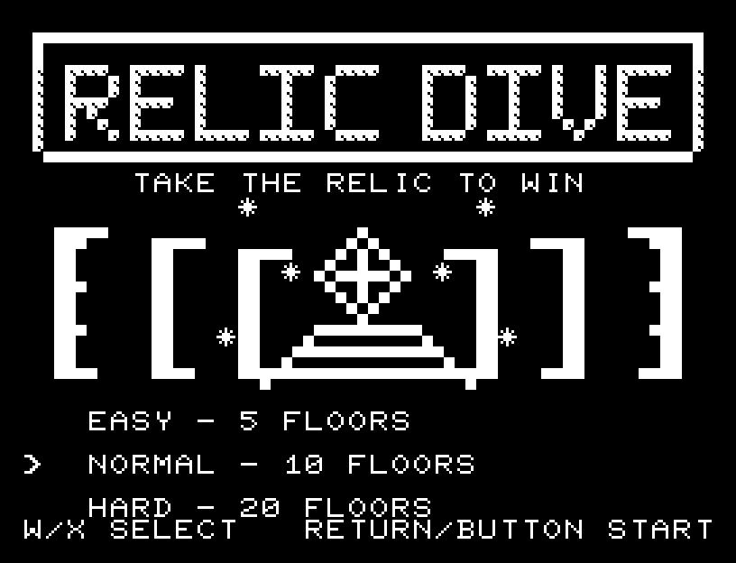
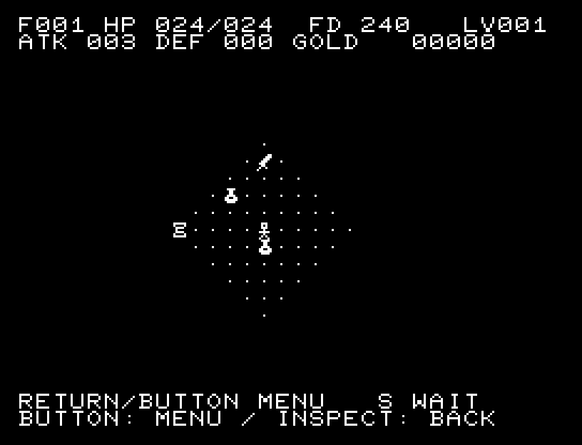
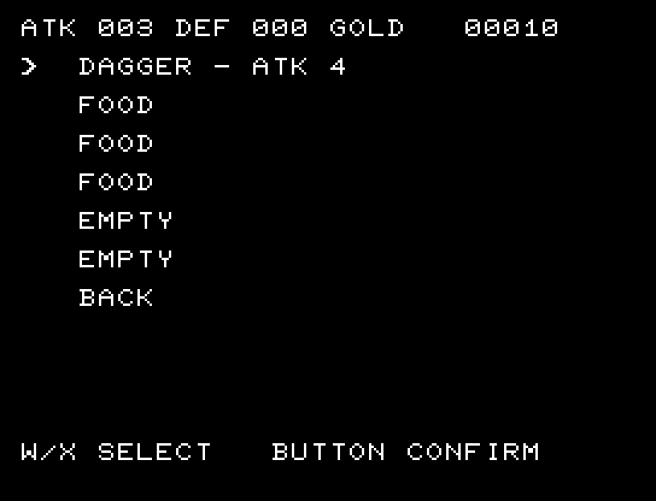

# RELIC DIVE for JR-100

[Wiki](https://github.com/zabaglione/jr100dev/wiki/RELIC-DIVE) · [プレイ](https://zabaglione.github.io/pyjr100emu/?game=relic-dive)

同じブラウザーで自分のBASIC ROMを登録済みなら、プレイリンクからタイトル画面まで自動起動します。



縦長の石文字、遺跡の門と遺物、明滅する光を描いたタイトル画面です。文字列を圧縮し、ゲーム内容を維持したまま標準16KB内に収めています。

JR-800版RELIC DIVEを、JR-100の標準16KB RAM向けに移植したターン制の迷宮探索ゲームです。階段を降り、最下層の遺物を拾うとクリアです。考えている間やメニュー操作中には時間が進みません。

## タイトルのデザイン

左の縦長の石文字と右の巨大な遺跡の門を対置します。門の奥の遺物と小さくきらめく光が探索へ誘います。

## 画面の奥行き

8×8ドットの石壁に明るい上面と斜めの肩、暗い側面を付けました。視界・品物・敵の記号と広い迷宮の表示範囲を保ち、追加RAMは使っていません。タイトルは石文字と遺跡の門を組み合わせた専用の構図です。

## ゲーム専用フォント

通常文字のフォント変更は保留しています。タイトルはPCG27枠、ゲーム中は31枠を使用し、コード・定数の空きは12バイトです。ロゴ・地形・アイテムの判別を優先しています。

## 動きとクリア演出

クリア時は完成した盤面・結果を残し、約1.9秒のジングルと余韻を挟みます。失敗時も原因を表示し、ジングルの後に短い間を置きます。その後、キーを押し直して次の操作に進みます。直前から押し続けたキーや、演出中に押したキーで結果を飛ばすことはありません。

## 起動

```sh
make -C games/relic_dive
```

`build/relic-dive.prg`を読み込み、BASICから次を実行します。

```basic
A=USR($0300)
```

BINとシンボルの配置マップも`build/`へ生成します。標準16KB用です。ゲームが使用する領域にBASICプログラムを残したまま併用しないでください。

タイトルで難易度を選び、RETURNまたはパッドのボタンで開始します。ロード時からRETURNを押していた場合は、一度離して押し直します。

## 操作

| 左上 | 上 | 右上 |
| --- | --- | --- |
| Q | W | E |
| **左：A** | **待機：S** | **右：D** |
| **左下：Z** | **下：X** | **右下：C** |

- RETURN：メニューを開く／決定。SPACE：戻る。
- パッド：十字で移動。縦横同時押しで斜め移動。1ボタンでメニューを開く／決定。
- メニュー内ではW・Xまたはパッドの上・下で選択します。選択は上下に循環し、先頭で上を押すと末尾の`BACK`へ移ります。そのままRETURNまたはパッドのボタンで戻れます。待機・探索・持ち物・下降・中断も、パッドだけで操作できます。
- 敵に向かって移動すると攻撃します。斜め方向は、進行先の両脇のどちらかが壁の場合は通れません。
- 安全な探索済みの直線通路だけ、上下左右の長押し移動が繰り返されます。敵、分岐、未探索、品物、階段、罠、空腹警告で停止します。攻撃・斜め移動・待機は押すたびに1回です。
- BREAK（CTRL+C）：ゲームを終了して呼び出し元へ戻ります。`SUSPEND`は電源を維持したままの中断で、ボタンまたはRETURNで再開します。電源断に備えた保存はありません。

## メニュー

| 項目 | 動作 |
| --- | --- |
| DESCEND - NO RETURN | 階段の上だけに表示。次の階へ進む。上には戻れない |
| INVENTORY | 6枠の持ち物。使用・装備・破棄を選ぶ |
| WAIT ONE TURN | 1ターン待機。敵・空腹・毒・自然回復も進む |
| INSPECT | 見える位置へカーソルを動かし、敵のHP・特徴や品物を調べる。ボタンで戻る |
| SUSPEND | 冒険を中断。ボタンで再開 |
| HELP | 操作説明 |
| SEARCH ONE TURN | 1ターンを使い、周囲の隠し通路と罠を発見 |
| BACK | 前の画面へ戻る |

## 画面と地形

64×32マスの迷宮を、32×20マスの表示範囲で上下左右にスクロールします。上2行は階層・HP・食料・レベル・攻撃力・防御力・金、下2行はメッセージと操作案内です。1マスは8×8ドットです。

状態表示の`F`は階層、`HP`は現在HP／最大HP、`FD`は食料、`LV`はレベルです。2行目の`ATK`は攻撃力、`DEF`は防御力、`GOLD`は金です。

| 画像 | 対象 | 意味 |
| --- | --- | --- |
|  | 主人公 | 操作している冒険者 |
|  | 壁 | 移動できず、視界も遮る。未発見の隠し通路もこの絵 |
|  | 床・通路 | 移動できる場所。未発見の罠も床に見える |
|  | 未探索 | まだ見ていない場所は真っ黒に表示 |
|  | 下り階段 | メニューからDESCENDを選んで次の階へ進む |
|  | 遺物 | 最下層の目的物。拾えばクリア |
|  | 発見済みの罠 | ダメージ罠・毒罠に共通の印。一度踏むと消える |

各階は6〜8部屋で、部屋の大きさや接続が変わり、部屋を持たない通路区画も生成されます。見た地形を記憶しますが、見えていない敵は表示しません。視界は壁に遮られる距離5の範囲です。

- **隠し通路**：壁として表示され、探索すると通れるようになります。生成候補がある階に最大2か所。通常の経路とは別の近道で、発見しなくても階段に到達できます。
- **罠**：各階にダメージ罠2個・毒罠2個。未発見時は床に見え、探索すると三角の印で表示されます。ダメージ罠はHPを3減らし、毒罠は毒を与えます。一度発動すると消えます。
- 探索は自分と隣接8マスの秘密を確実に発見します。地図の巻物は地形の記憶を埋めますが、隠し通路や罠の発見とは別です。

## 難易度と食料

| 難易度 | 階数 | 初期HP | 初期食料 | 食料回復量 | 回復薬 |
| --- | ---: | ---: | ---: | ---: | ---: |
| EASY | 5 | 24 | 240 | 80 | 12 |
| NORMAL | 10 | 20 | 200 | 60 | 8 |
| HARD | 20 | 16 | 160 | 45 | 6 |

食料は拾うだけでは食べません。持ち物から使用します。通常は1ターンに食料を1消費し（指輪装着中は2ターンに1）、食料があれば12ターンにHPが1自然回復します。食料が0なら2ターンにHPを1失います。食料の上限は255です。

## 敵の見分け方

画像は、このJR-100版が実際に使う8×8ドットのPCGを、ぼかさず64×64ピクセルに拡大したものです。敵は15種類で、深い階ほど出現する種類が増えます。HPと防御力は表の値、攻撃力にはEASYで−1、NORMALで±0、HARDで＋1の補正が入ります。INSPECTでも敵のHPと特徴を確認できます。

| 画像 | 敵 | HP | 攻撃 | 防御 | 特徴・対処 |
| --- | --- | ---: | ---: | ---: | --- |
|  | SLIME | 4 | 2 | 0 | 隔ターンで行動。動かない間に距離を取る |
|  | GOBLIN | 5 | 3 | 0 | 通常の近接型。通路で1体ずつ戦う |
|  | ORC | 9 | 4 | 1 | 防御のある近接型。強い武器が有効 |
|  | WRAITH | 6 | 3 | 0 | 接触時に食料を3奪う。長く隣接しない |
|  | RAT | 3 | 2 | 0 | HPは低いが毎ターン近づく |
|  | BAT | 4 | 2 | 0 | 不規則に移動。横からの接近に注意 |
|  | SKELETON | 7 | 4 | 1 | 防御のある攻撃型。囲まれないようにする |
|  | TROLL | 12 | 5 | 1 | 4ターンごとにHPを1回復。戦うなら短期決戦 |
|  | THIEF | 5 | 2 | 0 | 金を10盗むと逃げる |
|  | SNAKE | 5 | 2 | 0 | 毒を与える。回復薬で解除できる |
|  | RUST BEAST | 8 | 2 | 1 | 接触で防具を傷める。遠くから杖で攻撃する手もある |
|  | CENTAUR | 10 | 4 | 0 | 縦横の直線上を射撃。角で射線を切る |
|  | VAMPIRE | 12 | 4 | 1 | 6階以降。1/4の確率で最大HPを1減らす（下限8） |
|  | DRAGON | 16 | 5 | 1 | 6階以降。見える縦横の直線上へ炎を吐く |
|  | NYMPH | 7 | 2 | 0 | 7階以降。持ち物を1個盗むと逃げる。装備中の品は盗まれない |

3体倒すごとにレベルが上がり、現在HPと最大HPが2増えます。NYMPHに盗まれた品物は、倒しても戻りません。

## 品物の見分け方

薬・巻物・武器・防具は、それぞれ同じ分類で共通の絵を使います。種類や識別後の効果は、持ち物画面やINSPECTの名前で確認してください。

| 画像 | 品物 | 効果 |
| --- | --- | --- |
|  | FOOD | 食料を回復。回復量は難易度ごとに80／60／45。拾った後、持ち物から食べる |
|  | HEALING POTION | HPを12／8／6回復し、毒も解除 |
|  | POISON POTION | HPを3失う |
|  | STRENGTH POTION | 以後12回の行動中、攻撃力を1増やす |
|  | EXTRA HEALING POTION | HPを全回復し、毒も解除 |
|  | MAPPING SCROLL | 今の階の地形を記憶する。罠と隠し通路の発見とは別 |
|  | ESCAPE SCROLL | 探索済みの安全な床へ移動。適した場所がなければ移動しない |
|  | HOLD MONSTERS SCROLL | 読んだ時に見えている敵を、使用ターンを含め6ターン止める |
|  | AGGRAVATE MONSTERS SCROLL | 全ての敵に現在地を知らせ、停止中の敵も動き出す |
|  | DAGGER／SWORD／AXE | 装備すると攻撃力4／5／6 |
|  | CLOTH／LEATHER／MAIL | 装備すると防御力1／2／3 |
|  | GOLD | 自動取得で金が10増える。持ち物枠を使わない |
|  | MISSILE WAND | 3回使用できる攻撃の杖。視界内の敵1体に防御力を無視して8ダメージ |
|  | SLOW DIGESTION RING | 装着中は食料消費が2ターンに1。持ち物画面の[ON]が装着の印 |

薬は赤・青・緑・黄、巻物は太陽・月・星・空の外見で区別します。外見と効果の対応は冒険ごとに変わり、使用すると同じ外見の品物が識別されます。各階の品物は種類も個数もランダムです。薬や巻物が重複することも、回復手段・食料・装備・杖が出ないこともあります。杖と指輪は各1種類で、最初から名前が分かります。

持ち物は6枠です。武器・防具は別枠に装備します。交換した古い装備は足元へ置くため、足元に別の品物があると交換できません。満杯で拾えない品物は地面に残ります。

### 杖の使い方

1. 持ち物から`MISSILE WAND`を選び、`USE OR EQUIP`を決定します。
2. 移動キーまたはパッドで、カーソルを見えている敵へ合わせます。
3. RETURNまたはボタンで発射します。敵に当たると残り回数を1消費し、1ターン進みます。

SPACEで取り消せます。パッドだけなら、自分のマスへカーソルを戻すと`BACK`と表示されるので、ボタンで取り消します。対象のないマスでは発射しません。選択・取り消しにはターンも使用回数も消費しません。

名前の`[3]`〜`[0]`が残り回数です。落として拾い直しても回数は戻りません。空になった杖は破棄できます。杖が見つからない階もあります。

### 指輪の使い方

持ち物から指輪を使うと装着し、名前に`[ON]`が付きます。もう一度使うと外します。装着・取り外しはそれぞれ1ターンです。

装着できる指輪は1個で、装着中も持ち物1枠を使います。別の指輪を装着すると、それまでの指輪は自動的に外れます。装着中の指輪を破棄すると効果がなくなり、地面には外れた状態で置かれます。装着中の指輪はNYMPHに盗まれません。

食料が0になった後の空腹ダメージや、自然回復の間隔は変わりません。

## 攻略のヒント

- **次の階の補給を当てにしない。** 食料や回復手段は毎階揃いません。余裕のあるうちに持ち歩き、探索を続けるか階段へ向かうかを判断してください。
- **指輪を見つけたら装着する。** 食料の減りが半分になり、広い迷宮を探索しやすくなります。装着中も持ち物1枠を使う点には注意してください。
- **杖を危険な敵に使う。** 残り回数を確認し、RUST BEASTやVAMPIREなど、接触を避けたい敵を優先します。
- **食料は持ち物から食べる。** 拾っただけでは回復しません。回復量に合わせて食べると、上限255を超える分を無駄にせずに済みます。安全な場所でも待機には食料を使います。
- **装備は早めに更新する。** 攻撃力が上がるほど戦闘が短くなり、防御力が上がるほど消耗を減らせます。交換する時は足元の品物を避けてください。
- **未識別品は余裕のある時に試す。** 毒の薬や敵を誘う巻物もあります。敵に囲まれ、HPも少ない状況で試すのは危険です。外見と効果は新しい冒険ごとに変わります。
- **全ての敵を倒す必要はない。** 斜め移動を使って距離を取り、通路では一度に相手をする敵を減らします。RUST BEASTやVAMPIREとの接触は特に避けたいところです。NYMPHが近い時は、回復薬や食料を盗まれる前に距離を取りましょう。
- **射撃には角を使う。** CENTAURとDRAGONが見える時は、同じ行・列に立ち続けないようにします。壁の向こうへ回り込めば射線を切れます。
- **停止の巻物で逃げ道を作る。** 効果中に回復したり、敵の横を抜けたりできます。読んだ時に見えなかった敵は止まりません。脱出の巻物も、既に探索した安全な移動先があれば役立ちます。
- **怪しい床や壁ではSEARCH。** 周囲の罠と隠し通路を確実に発見できます。ただし1ターン使うので、敵が隣にいる時は先に安全を確保してください。
- **階段を見つけたら物資と相談する。** 食料が少なければ探索を切り上げ、次の階へ賭ける選択もありますが、補給は保証されません。一度降りると戻れません。最下層では遺物を拾うとクリアです。

## 出典

[JR-800版RELIC DIVE](https://github.com/zabaglione/jr800-web-emulator/tree/main/sdk/examples/lcd/07-relic-dive)のMITライセンスのゲーム処理・独自画像を移植しました。ゲーム画像の列形式をJR-100 PCGの行形式へ変換しています。

## 公開版の画面と検証





バージョン：1.5.0。ゲーム本体と定数は11,508 bytes、PCGはタイトルで27文字、ゲーム中は31文字を切り替えて使います。RAM画面・作業領域・復帰用保存領域・512 bytesのスタックを含め、標準RAM 16KB内に収めています。開始・被弾時には効果音、成功・失敗時にはジングルを流します。通常プレイ中のBGMはありません。

```sh
make -C games/relic_dive test
.venv/bin/python games/relic_dive/capture.py --rom /path/to/owned-rom.prg
```

地形1,000種と3難易度のクリア入力をC++エミュレーターで検査します。掲載スクリーンショットは所有するBASIC ROMからPRGを自動起動し、キー入力で取得した実フレームです。実機でのロード・表示・操作は未確認です。
