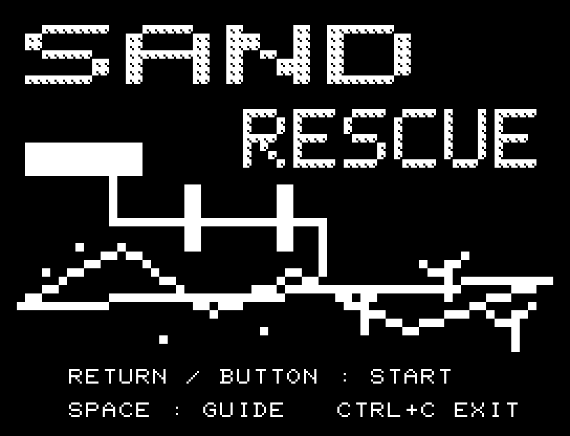
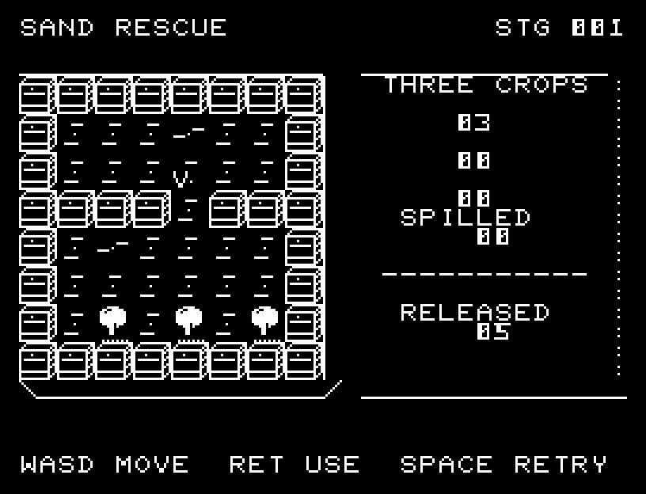
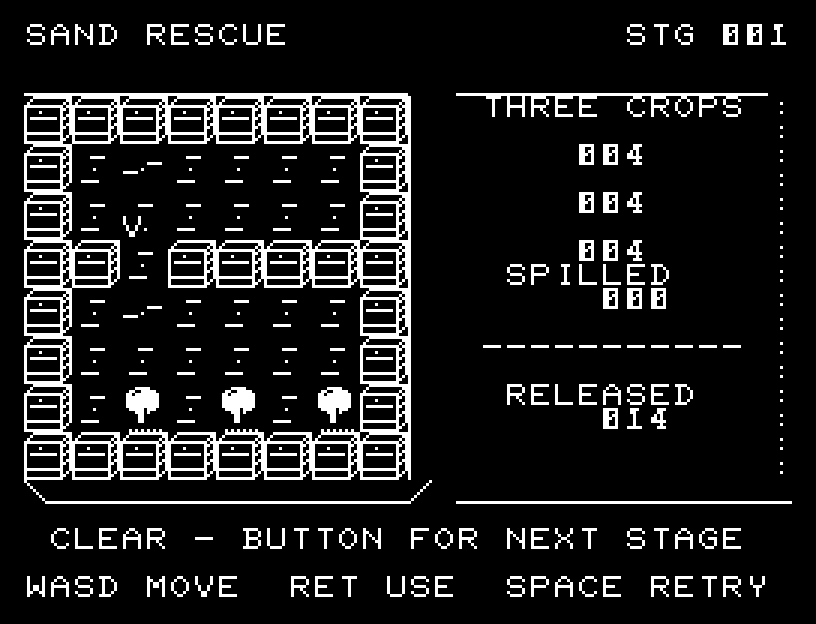
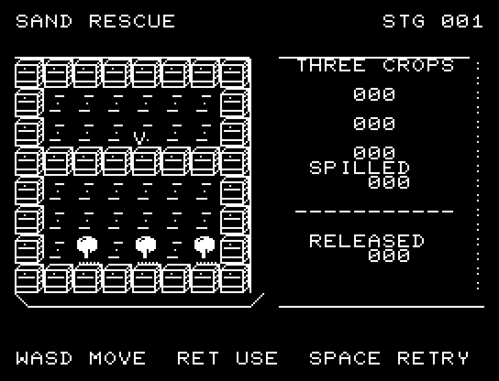
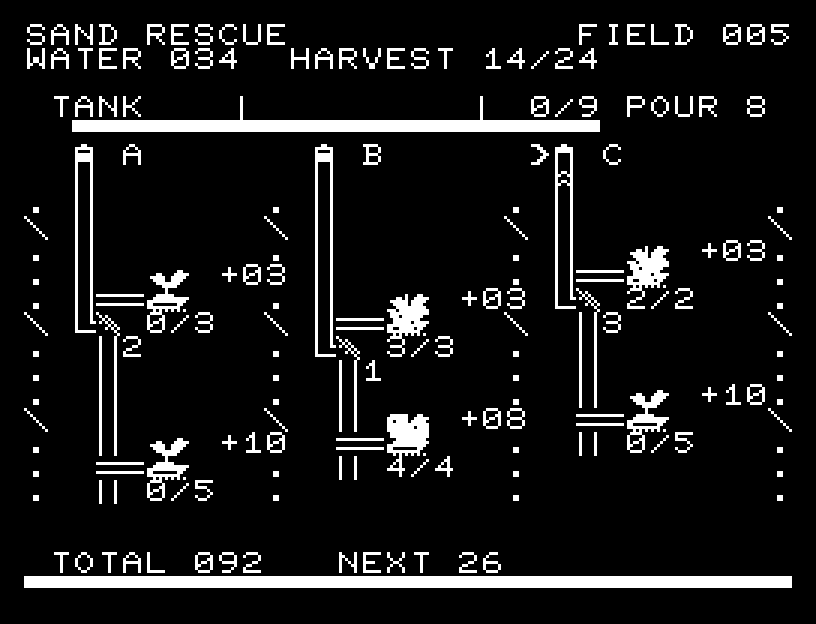

# SAND RESCUE

[Wiki](https://github.com/zabaglione/jr100dev/wiki/SAND-RESCUE) · [プレイ](https://zabaglione.github.io/pyjr100emu/?game=sand-rescue)

水源が4滴ごとに移る灌漑装置で、3つの作物へ4滴ずつ届けます。水源のあふれ6回、または貯水量30を使い切ると失敗です。



## 紹介画像とプレイ動画






**[音付きプレイ動画を見る（約30秒）](https://zabaglione.github.io/pyjr100emu/gameplay.html?game=sand-rescue)**

1ステージのクリアまでを収録。

## タイトルのデザイン

上の水路から砂丘と作物へ流れを引き、石の刻印風のロゴで乾いた土地の雰囲気を出します。

## 画面の奥行き

堰を土の断面、作物を幹と影のある木にし、水を短い波線で区別しました。流れの分岐と水門の位置は正方格子を保っています。

## ゲーム専用フォント

ゲーム中の**数字0〜9の10文字を石碑フォント**（上下の飾りを持つ刻印）で揃えています。部分的な英字の置き換えは行いません。タイトルの操作案内・説明・パスワード入力は通常フォントに統一しています。既存のロゴと絵柄を保ち、空きPCG枠だけを使用します。

## 動きとクリア演出

クリア時は完成した盤面・結果を残し、約1.6秒のジングルと余韻を挟みます。失敗時も原因を表示し、ジングルの後に短い間を置きます。その後、キーを押し直して次の操作に進みます。直前から押し続けたキーや、演出中に押したキーで結果を飛ばすことはありません。

## 操作と遊び方

A/Dで堰を選び、RETURNでその堰だけを開けます。古い水が通り抜けてから次の流路へ切り替えてください。

方向キーはキーボードまたはパッド、RETURNはパッドのボタンでも操作できます。SPACEでこの面のやり直し確認を開きます。やり直し確認はNOが初期選択です。A/Dで選び、RETURNで確定、SPACEで取り消します。確認中は進行を止めます。CTRL+CでBASICへ戻ります。

流れる水、堰、水源、3つの作物の給水数を表示します。





## ビルドと検証

バージョン 1.5.0。開始番地 `$0300`、ゲーム本体と定数は 7,035 bytes。画面・作業領域・復帰用の保存領域・512 bytesのスタックを含めて標準RAM 16KB内で動作します。PCGは32文字を場面ごとに切り替えます。

```sh
make -C games/sand_rescue
make -C games/sand_rescue test
```

出力はゲームの `build/` ディレクトリに作られます。`rules.py` はビルド時にMB8861Hの機械語へ変換されます。JR-100上でPythonを実行する方式ではありません。

キー入力による全ステージのクリア、失敗を含む入力試験、画面範囲、RAM配置、スタック、PCM出力をエミュレーターで検査しています。掲載画像は所有するBASIC ROMからPRGを起動した実フレームです。実機での動作・音声は未確認です。

```sh
.venv/bin/python games/native/replay.py sand_rescue --rom /path/to/owned-rom.prg --capture --keyboard
```

タイトルには長めの単音曲、プレイ中には効果音を付けています。ソース・画像・曲は[MIT License](https://github.com/zabaglione/jr100dev/blob/main/games/LICENSE)。`art/`にはPCG Workbench用の画面データもあります。
