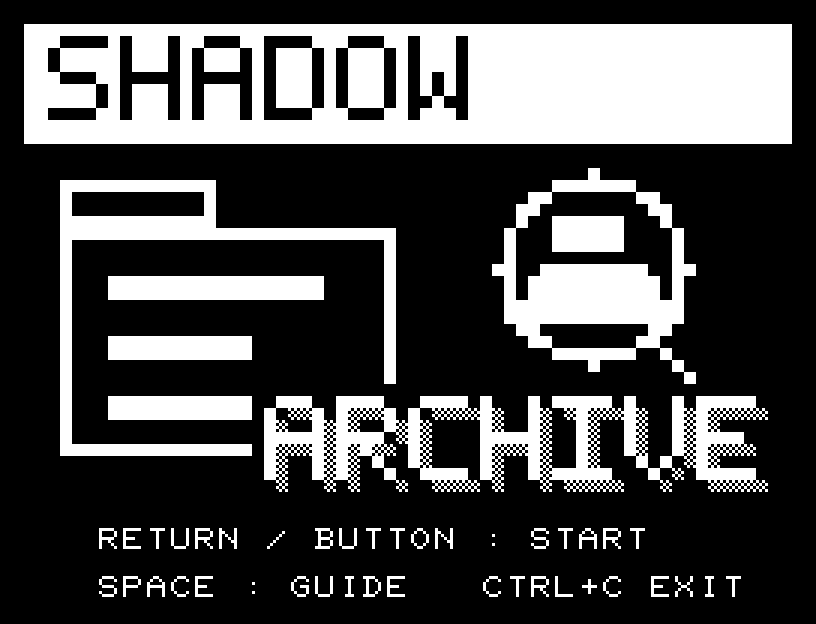
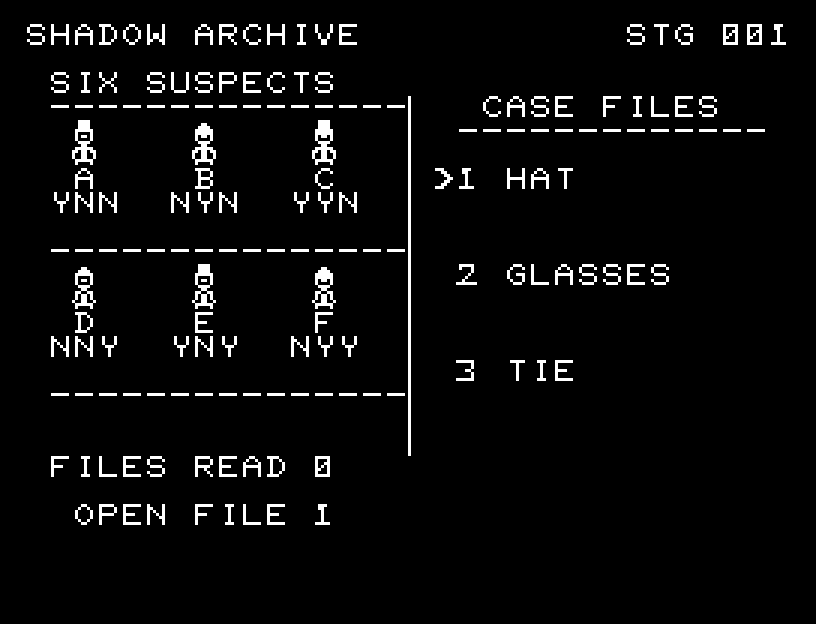
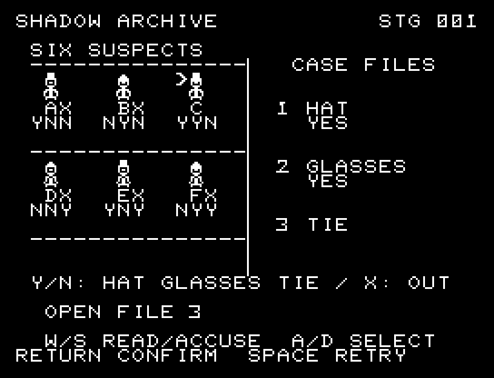
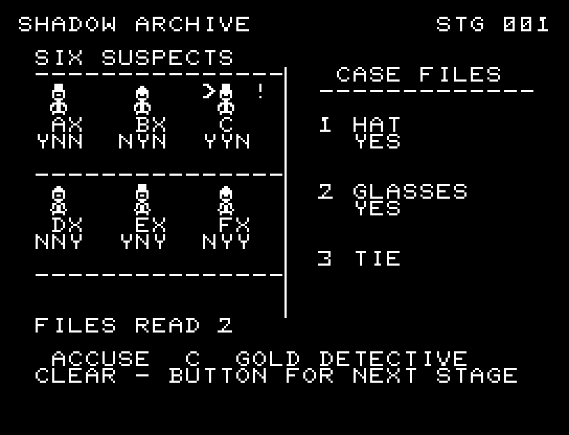
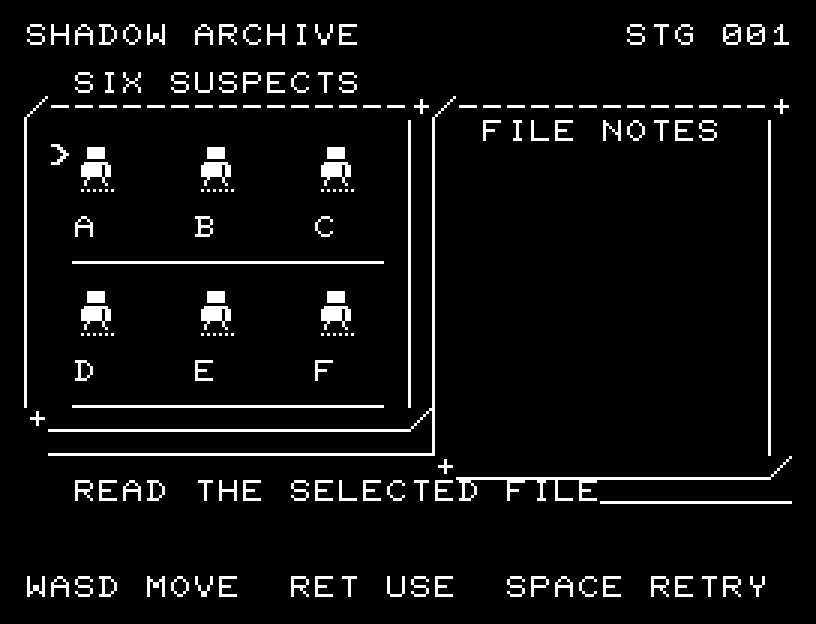
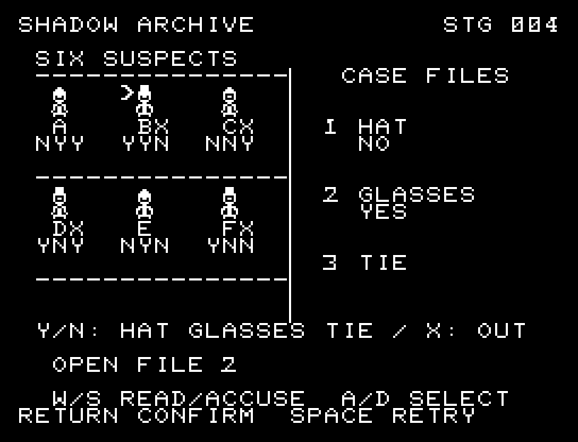

# SHADOW ARCHIVE

[Wiki](https://github.com/zabaglione/jr100dev/wiki/SHADOW-ARCHIVE) · [プレイ](https://zabaglione.github.io/pyjr100emu/?game=shadow-archive)

帽子・眼鏡・ネクタイの特徴から6人の容疑者を絞る全12事件。必要な調書を選び、2件以下の閲覧で解決するとGOLD DETECTIVEになります。



## 紹介画像とプレイ動画







**[音付きプレイ動画を見る（約32秒）](https://zabaglione.github.io/pyjr100emu/gameplay.html?game=shadow-archive)**

1ステージのクリアまでを収録。

## タイトルのデザイン

白帯の黒文字SHADOW、黒塗りの資料、人物を拡大する虫眼鏡で、機密資料の表紙を表します。

## 画面の奥行き

容疑者の枠と調書の区切りを整え、紙が開く途中の形と音を加えました。選択先を明示し、告発した相手と結果を残して停止します。

## ゲーム専用フォント

ゲーム中の**数字0〜9の10文字を活字フォント**（読みやすいセリフ体）で揃えています。部分的な英字の置き換えは行いません。タイトルの操作案内・説明・パスワード入力は通常フォントに統一しています。既存のロゴと絵柄を保ち、空きPCG枠だけを使用します。

## 動きとクリア演出

容疑者の枠と調書の区切りを整え、紙が開く途中の形と音を加えました。選択先を明示し、告発した相手と結果を残して停止します。被弾や結果を確認する間は、追加入力で表示を飛ばせません。

クリア時は完成した盤面・結果を残し、約1.6秒のジングルと余韻を挟みます。失敗時も原因を表示し、ジングルの後に短い間を置きます。その後、キーを押し直して次の操作に進みます。直前から押し続けたキーや、演出中に押したキーで結果を飛ばすことはありません。

## 操作と遊び方

W/Sで調書と告発を切り替え、A/Dで対象を選び、RETURNで開く・告発します。調書と容疑者は別々の選択位置を保持します。

方向キーはキーボードまたはパッド、RETURNはパッドのボタンでも操作できます。SPACEでこの面のやり直し確認を開きます。やり直し確認はNOが初期選択です。A/Dで選び、RETURNで確定、SPACEで取り消します。確認中は進行を止めます。CTRL+CでBASICへ戻ります。

容疑者の枠と調書の区切りを整え、紙が開く途中の形と音を加えました。選択先を明示し、告発した相手と結果を残して停止します。演出が終わってから次のキーを押してください。

容疑者の下の3文字は帽子・眼鏡・ネクタイの順にY＝あり、N＝なし。開いた調書と矛盾する容疑者にはXが付きます。読んだ調書を再び選んでも閲覧数は増えません。





## ソースコード

ゲーム本体は [`rules.py`](rules.py) です。ビルド時にMB8861Hの機械語へ変換します。

ビルド設定は [`game.json`](game.json) と [`Makefile`](Makefile) です。共有コードと生成物の関係は[全ゲームのソース一覧](../SOURCES.md)を参照してください。

## ビルドと検証

バージョン 2.1.0。開始番地 `$0300`、ゲーム本体と定数は 7,582 bytes。画面・作業領域・復帰用の保存領域・512 bytesのスタックを含めて標準RAM 16KB内で動作します。PCGは32文字を場面ごとに切り替えます。

```sh
make -C games/shadow_archive
make -C games/shadow_archive test
```

出力はゲームの `build/` ディレクトリに作られます。JR-100上でPythonを実行する方式ではありません。

キー入力による全ステージのクリア、失敗を含む入力試験、画面範囲、RAM配置、スタック、PCM出力をエミュレーターで検査しています。掲載画像は所有するBASIC ROMからPRGを起動した実フレームです。実機での動作・音声は未確認です。

```sh
.venv/bin/python games/native/replay.py shadow_archive --rom /path/to/owned-rom.prg --capture --keyboard
```

タイトルには長めの単音曲、プレイ中には効果音を付けています。ソース・画像・曲は[MIT License](https://github.com/zabaglione/jr100dev/blob/main/games/LICENSE)。`art/`にはPCG Workbench用の画面データもあります。
