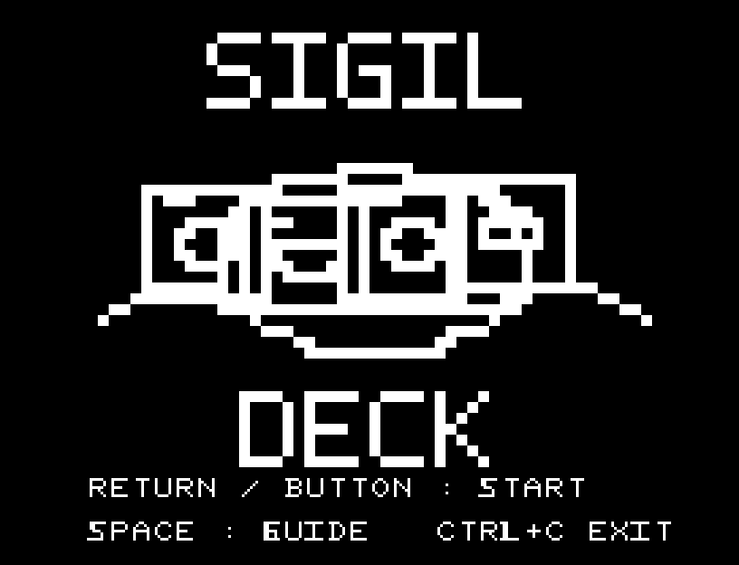
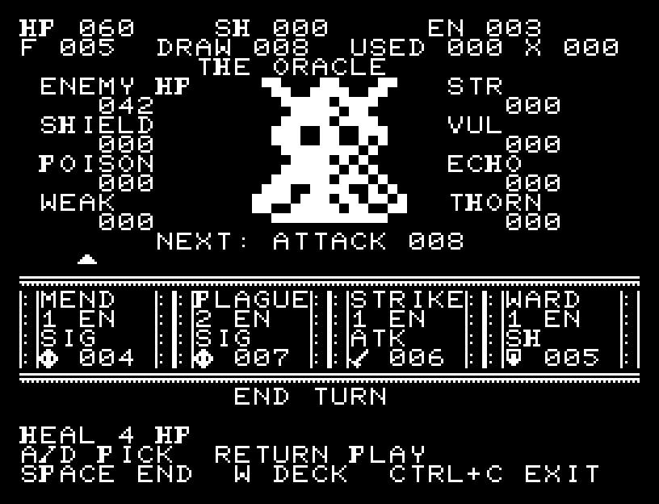
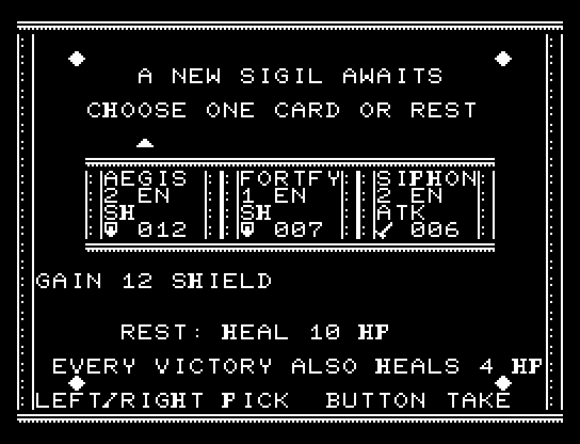
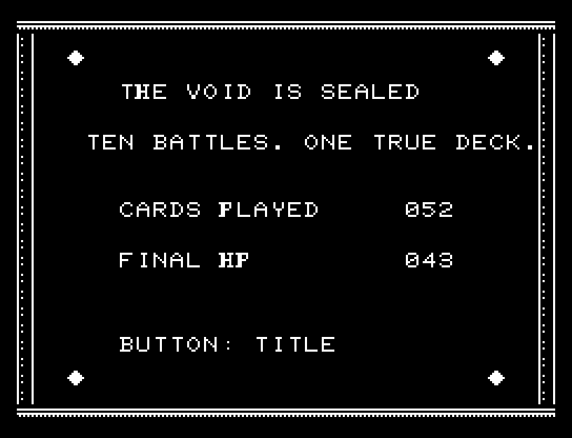

# SIGIL DECK

**紋章を集め、自分のデッキで虚空の王を封じる。**

手札4枚、エナジー3から始まる10戦のカードバトル。24種のカードから勝利報酬を選び、攻撃・防御・毒・回復を組み合わせます。通常敵6種とボス2種が登場します。JR-100・標準RAM 16KB用です。



## 画面の奥行き

大型の敵は輪郭と目を残して片側を網点で陰影付けし、足元に接地影を加えました。カード枠には明るい縁と薄い影を付けています。

## ゲーム専用フォント

**石碑フォント**（上下の飾りを持つ刻印）を採用。タイトル／説明用に4文字、ゲーム用に5文字を割り当てています。ゲーム中の対象は `HP+>/` です。空きPCG枠だけを使い、残りの文字は通常フォントで表示します。数字を変更する作品では0〜9を一式で揃えています。

## 操作

| 操作 | キーボード | 方向＋1ボタンパッド |
| --- | --- | --- |
| カード／END TURN／報酬を選ぶ | A / D | 左／右 |
| 使用／決定 | RETURN | ボタン |
| END TURNへ選択を移す | SPACE | 左右でEND TURNを選ぶ |
| デッキを見る | W | 上 |
| デッキ表示から戻る | 任意のゲーム操作キー | 方向またはボタン |
| BASICへ戻る | CTRL+C | キーボードを使用 |

カードの上にある矢印が選択位置です。画面下に選択カードの効果を表示します。残りエナジーが足りないときや空の枠は使用できません。END TURNを選んで決定すると敵が行動します。

## 戦闘とデッキ

- HPは最大60。各ターンにエナジーが3へ戻り、手札を4枚引きます。
- 使用したカードとターン終了時の残り手札は捨て札へ。山札が尽きると捨て札を山札に戻します。
- EXHAUSTのカードはその戦闘から除外され、次の戦闘で戻ります。効果を処理中のカードを自分自身のドローで引くことはありません。
- 敵の次の行動をNEXTに表示します。攻撃・防御・強攻撃の順に循環します。
- SHは防御値。まず防御で攻撃を受け、残りがHPに入ります。自分の防御は次の自分のターンで消えます。敵の防御も次の敵行動までです。
- POISONは敵行動の前に防御を無視してダメージを与え、1ずつ減ります。
- WEAKは敵の攻撃を3減らし、VULは自分の攻撃を50%増やします。端数は切り捨てます。
- STRは戦闘中の攻撃加算、ECHOは次の攻撃を2倍、THORNはそのターンの敵攻撃に対する反撃です。
- HUDのDRAWは山札、USEDは捨て札、Xは消滅札の枚数です。
- 勝利すると3枚から1枚を加えるか、RESTでHPを10回復します。どちらも追加でHPが4回復します。最後のボスを倒せばクリアです。



5戦目のボス、THE ORACLE。敵の大きなシルエット、次の行動、自分の強化と手札を一画面で確認できます。



勝利報酬でデッキを伸ばすか、回復を選ぶかを判断します。取得したカードは以後の戦闘でも使えます。

## カード24種

| 表示名 | EN | 効果 |
| --- | ---: | --- |
| STRIKE | 1 | 攻撃6 |
| WARD | 1 | 防御5 |
| SPARK | 0 | 攻撃3 |
| MEND | 1 | 回復4 |
| FOCUS | 0 | エナジー+1 |
| VENOM | 1 | 毒+3 |
| CLEAVE | 2 | 攻撃12 |
| AEGIS | 2 | 防御12 |
| HASTE | 1 | 1枚引き、エナジー+1 |
| SIPHON | 2 | 攻撃6、回復3 |
| SCORCH | 1 | 攻撃4、毒+2 |
| THORN | 1 | 防御4、反撃3 |
| BASH | 2 | 攻撃9、その後VULを2ターン |
| ECHO | 1 | 次の攻撃を2倍 |
| FORTFY | 1 | 防御7、残った防御を次ターンへ1回保持 |
| RITUAL | 2 | 戦闘中の攻撃+2 |
| PURGE | 0 | WEAKを2ターン |
| INSIGT | 0 | 2枚引く。手札上限4 |
| SURGE | 0 | エナジー+2、EXHAUST |
| RESTOR | 2 | 回復9、EXHAUST |
| DOOM | 3 | 攻撃20 |
| BARRIR | 3 | 防御22 |
| PLAGUE | 2 | 毒+7 |
| FINISH | 1 | 攻撃4。敵HPが12以下なら攻撃+12 |



## ビルドと検証

```sh
make -C games/sigil_deck
JR100EMU_ROOT=/path/to/pyjr100emu make -C games/sigil_deck test
JR100EMU_ROOT=/path/to/pyjr100emu python3 games/sigil_deck/replay.py --keyboard
JR100EMU_ROOT=/path/to/pyjr100emu python3 games/sigil_deck/replay.py \
  --rom /path/to/owned-rom.prg --captures games/sigil_deck/build/screens
```

リポジトリの[共通ビルド手順](../README.md)で準備してください。生成物は`build/sigil-deck.prg`、入口は`$0300`です。画像の取得にはPillowが必要です。

1.1.0のコード・データは9,216 bytes。標準16KB内に画面バッファ・状態・復帰用保存領域・512 bytesのスタックを配置しています。PCGは32スロット。タイトル曲、約53秒で一巡する戦闘BGM、カード・攻撃・防御・回復・毒・被弾・勝敗の効果音を収録しています。効果音中も入力とBGMの時刻が進みます。

24種のカード効果、枚数の保存、使用中カードの再ドロー防止、消滅札の復帰、状態上限、毒・防御・反撃の順序、同時撃破時の敗北優先をMB8861Hエミュレーターで確認しています。入力だけによる10戦クリア、所有BASIC ROM経由の起動、実フレーム取得も確認しました。**エミュレーター確認済み／実機未確認**です。

`cards.json`と`enemies.json`に内容、`assets.py`に自作の画像・曲があります。`art/`のJSONはPCG / CRT Workbenchで開ける実画面の編集用資料です。ROM字形は含みません。

オリジナルのコード・ロゴ・画像・曲は[MIT License](../LICENSE)です。

BGMは32小節のオリジナル単音曲です。休符と4つの展開を持たせ、エミュレーター上の一巡はタイトル約64秒、戦闘約53秒です。効果音を優先している間も曲の進行は続きます。
