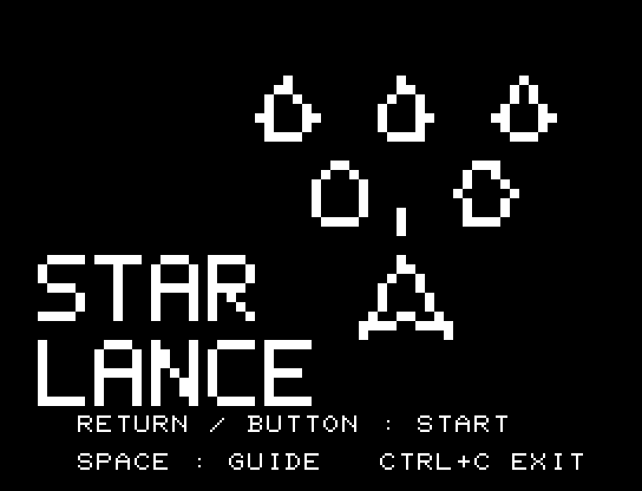
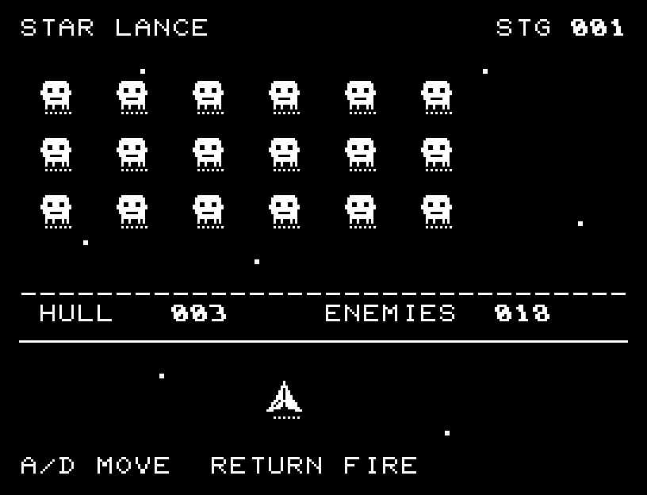
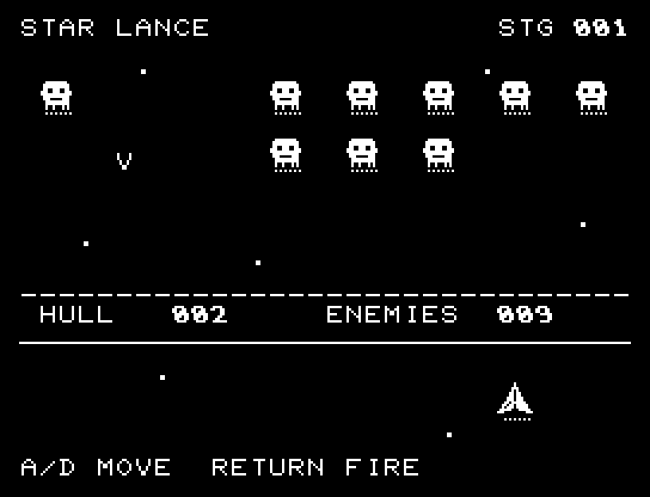

# STAR LANCE

[Wiki](https://github.com/zabaglione/jr100dev/wiki/STAR-LANCE) · [プレイ](https://zabaglione.github.io/pyjr100emu/?game=star-lance)

左右へ動く18機の編隊を縦のランスで撃ち落とします。落下するミサイルを避け、飛行カウント220以内に全滅させます。



## 画面の奥行き

機体に面の明暗、敵に輪郭と影を付け、大小の星を離して配置しました。敵弾と自機の位置は平面のままです。

## ゲーム専用フォント

ゲーム中の**数字0〜9の10文字をスピードフォント**（右へ傾く太線）で揃えています。部分的な英字の置き換えは行いません。タイトルの操作案内・説明・パスワード入力は通常フォントに統一しています。既存のロゴと絵柄を保ち、空きPCG枠だけを使用します。

## 操作と遊び方

A/Dで自機を移動、RETURNで発射します。連射には待ち時間があります。

方向キーはキーボードまたはパッド、RETURNはパッドのボタンでも操作できます。SPACEでこの面をやり直し、CTRL+CでBASICへ戻ります。

自機・編隊・ミサイルに加え、耐久力、残敵数、時間を表示します。





## ビルドと検証

バージョン 1.2.0。開始番地 `$0300`、ゲーム本体と定数は 6,293 bytes。画面・作業領域・復帰用の保存領域・512 bytesのスタックを含めて標準RAM 16KB内で動作します。PCGは32文字を場面ごとに切り替えます。

```sh
make -C games/star_lance
make -C games/star_lance test
```

出力はゲームの `build/` ディレクトリに作られます。`rules.py` はビルド時にMB8861Hの機械語へ変換されます。JR-100上でPythonを実行する方式ではありません。

キー入力による全ステージのクリア、失敗を含む入力試験、画面範囲、RAM配置、スタック、PCM出力をエミュレーターで検査しています。掲載画像は所有するBASIC ROMからPRGを起動した実フレームです。実機での動作・音声は未確認です。

```sh
.venv/bin/python games/native/replay.py star_lance --rom /path/to/owned-rom.prg --capture --keyboard
```

タイトルには長めの単音曲、プレイ中には効果音を付けています。ソース・画像・曲は[MIT License](https://github.com/zabaglione/jr100dev/blob/main/games/LICENSE)。`art/`にはPCG Workbench用の画面データもあります。
