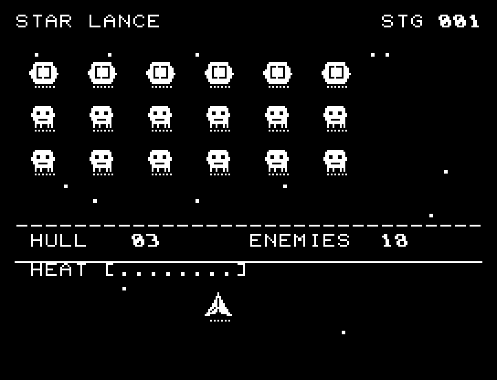
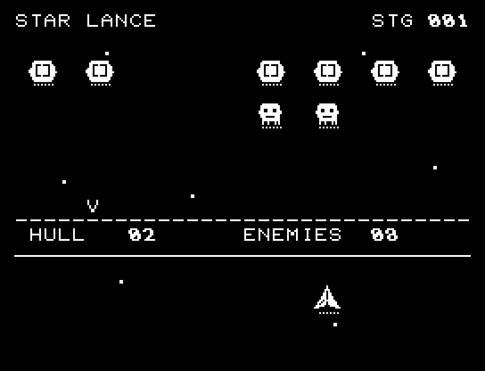
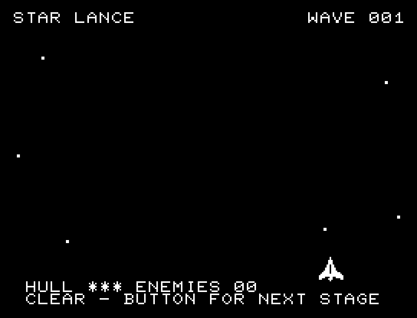

# STAR LANCE

[Wiki](https://github.com/zabaglione/jr100dev/wiki/STAR-LANCE) · [プレイ](https://zabaglione.github.io/pyjr100emu/?game=star-lance)

攻撃予告を見て、撃ち落として反撃を止めるか、弾を避けて冷やすかを選ぶ全6波のシューティング。1波18機、後半は三方向弾と装甲列が増えます。


## 紹介画像とプレイ動画







**[音付きプレイ動画を見る（約31秒）](https://zabaglione.github.io/pyjr100emu/gameplay.html?game=star-lance)**

1ステージのクリアまでを収録。

## タイトルのデザイン

縦長STARと大型戦闘機、下から迫る敵の編隊を配置し、ビームと厚みを持つ文字で速度を表します。

## 画面の奥行き

敵と自機の間を戦闘エリアとして空け、体力・残敵・熱と短い通知は最下部の2行へまとめました。装甲機、攻撃予告の発光、細い通常弾と太い重い弾、三段階の爆発をPCGで描き分けます。

## ゲーム専用フォント

PCG32文字を敵・自機・発光と破片・弾に使います。装甲の損傷と撃破は対象の文字だけを切り替えるため、同じ絵柄の別の敵には影響しません。数値と案内には通常フォントを使っています。

## 動きとクリア演出

編隊は1文字ずつ移動し、自弾・敵弾の飛翔中も戦闘が進みます。装甲への命中は点滅、撃破は発光・破片・散開・消失の順に表示します。攻撃予告、発射、命中、冷却成功、過熱を異なるSEで知らせます。自機の被弾時は短く止まり、その後しばらく点滅して連続被弾を防ぎます。被弾や結果を確認する間は、追加入力で表示を飛ばせません。

クリア時は完成した盤面・結果を残し、約1.6秒のジングルと余韻を挟みます。失敗時も原因を表示し、ジングルの後に短い間を置きます。その後、キーを押し直して次の操作に進みます。直前から押し続けたキーや、演出中に押したキーで結果を飛ばすことはありません。

## 操作と遊び方

A/Dまたはパッド左右の長押しで1文字ずつ連続移動します。RETURNまたはパッドのボタンで通常弾、Wまたはパッド上で重い弾。押し続けると連射でき、移動と射撃を同時に行えます。通常弾は1ダメージ・熱3、重い弾は2ダメージ・熱5で、発射間隔も長くなります。熱が12に達するとCOOLINGが表示され、一定時間撃てなくなります。移動は続けられます。撃つのを休み、冷えてから次の攻撃に備えます。

方向キーはキーボードまたはパッド、RETURNはパッドのボタンでも操作できます。SPACEでこの面のやり直し確認を開きます。やり直し確認はNOが初期選択です。A/Dで選び、RETURNで確定、SPACEで取り消します。確認中は進行を止めます。CTRL+CでBASICへ戻ります。

編隊は1文字ずつ移動し、自弾・敵弾の飛翔中も戦闘が進みます。装甲への命中は点滅、撃破は発光・破片・散開・消失の順に表示します。攻撃予告、発射、命中、冷却成功、過熱を異なるSEで知らせます。自機の被弾時は短く止まり、その後しばらく点滅して連続被弾を防ぎます。射撃・命中・撃破の演出中も移動と射撃を続けられます。

点滅する敵は攻撃の準備中です。発射前に倒すとその攻撃を止め、熱が4下がってCOOL +4を表示します。装甲機は通常弾2発、重い弾1発で撃破できます。敵弾は発射時に狙った方向へ進むので、発射を見て横へ避けましょう。画面下端のHULLは体力3、ENEMIESは残敵、HEATは発射熱です。体力0、または徐々に降下する編隊が突破すると失敗。3波目から三方向弾、4波目から2列目にも装甲が付き、攻撃間隔と予告時間も短くなります。


## ソースコード

ゲーム本体は [`rules.py`](rules.py) です。ビルド時にMB8861Hの機械語へ変換します。

描画・データ生成などの補助ソース: [`src/scene.asm`](src/scene.asm)、[`presentation.py`](presentation.py)。

ビルド設定は [`game.json`](game.json) と [`Makefile`](Makefile) です。共有コードと生成物の関係は[全ゲームのソース一覧](../SOURCES.md)を参照してください。

## ビルドと検証

バージョン 4.0.0。開始番地 `$0300`、ゲーム本体と定数は 9,732 bytes。画面・作業領域・復帰用の保存領域・512 bytesのスタックを含めて標準RAM 16KB内で動作します。PCGは32文字を場面ごとに切り替えます。

```sh
make -C games/star_lance
make -C games/star_lance test
```

出力はゲームの `build/` ディレクトリに作られます。JR-100上でPythonを実行する方式ではありません。

キー入力による全ステージのクリア、失敗を含む入力試験、画面範囲、RAM配置、スタック、PCM出力をエミュレーターで検査しています。掲載画像は所有するBASIC ROMからPRGを起動した実フレームです。SS1実機での作品別の確認範囲は[MiSTerガイド](https://zabaglione.github.io/pyjr100emu/guide/mister.html)に掲載しています。オリジナルのJR-100実機は未確認です。

```sh
.venv/bin/python games/native/replay.py star_lance --rom /path/to/owned-rom.prg --capture --keyboard
```

タイトルには長めの単音曲、プレイ中には効果音を付けています。ソース・画像・曲は[MIT License](https://github.com/zabaglione/jr100dev/blob/main/games/LICENSE)。`art/`にはPCG Workbench用の画面データもあります。
