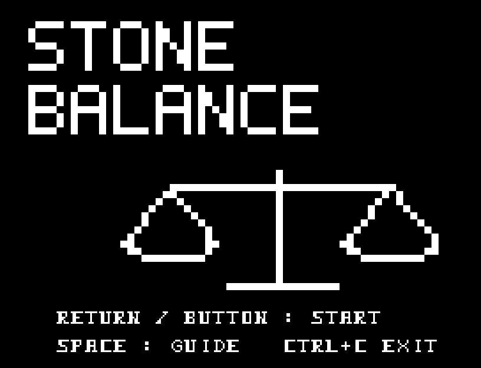
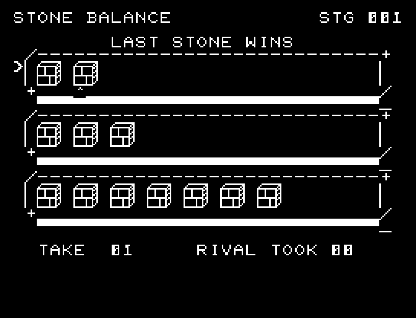
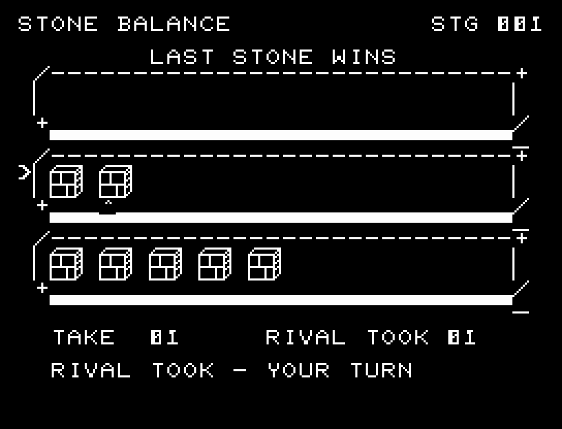
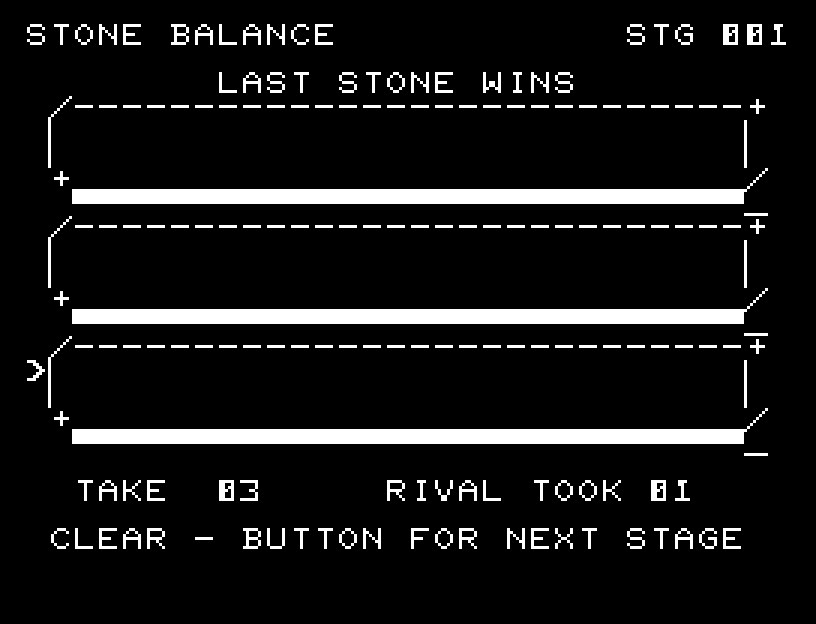
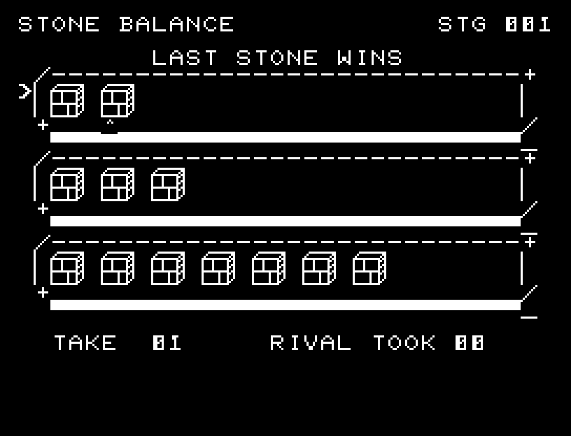
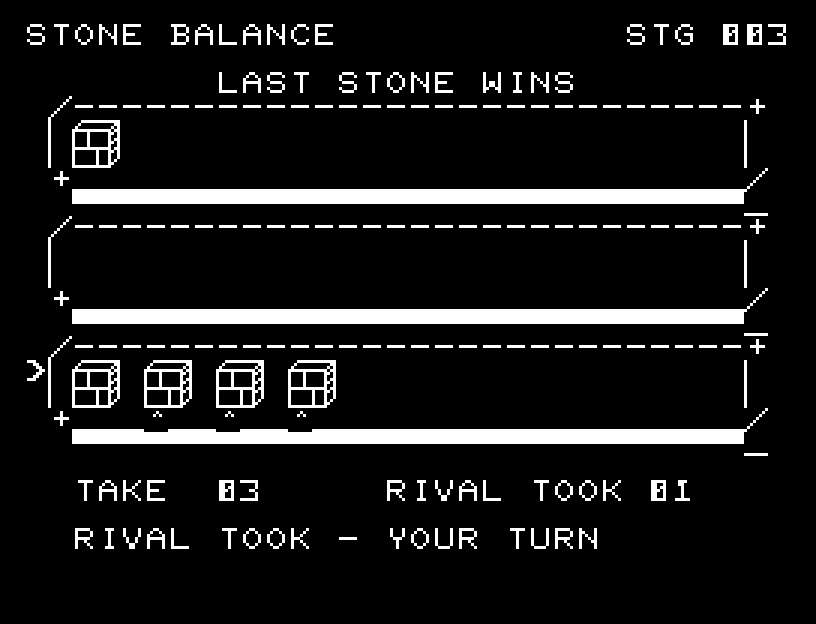

# STONE BALANCE

[Wiki](https://github.com/zabaglione/jr100dev/wiki/STONE-BALANCE) · [プレイ](https://zabaglione.github.io/pyjr100emu/?game=stone-balance)

3つの山から1〜3個ずつ取り合う全10局です。前半5局は最後の石を取った側が勝ち、後半5局は取った側が負けになります。



## 紹介画像とプレイ動画







**[音付きプレイ動画を見る（約32秒）](https://zabaglione.github.io/pyjr100emu/gameplay.html?game=stone-balance)**

1ステージのクリアまでを収録。

## タイトルのデザイン

大きさも数も違う石が釣り合う天秤を中央に置き、石の刻印風の文字で上下を囲みます。

## 画面の奥行き

厚みのある棚に石を並べ、選んだ石が1個ずつ盤外へ飛びます。自分と相手の手を別の間と音で示し、最後の石を確認してから結果を出します。

## ゲーム専用フォント

ゲーム中の**数字0〜9の10文字を石碑フォント**（上下の飾りを持つ刻印）で揃えています。部分的な英字の置き換えは行いません。タイトルの操作案内・説明・パスワード入力は通常フォントに統一しています。既存のロゴと絵柄を保ち、空きPCG枠だけを使用します。

## 動きとクリア演出

厚みのある棚に石を並べ、選んだ石が1個ずつ盤外へ飛びます。自分と相手の手を別の間と音で示し、最後の石を確認してから結果を出します。被弾や結果を確認する間は、追加入力で表示を飛ばせません。

クリア時は完成した盤面・結果を残し、約1.6秒のジングルと余韻を挟みます。失敗時も原因を表示し、ジングルの後に短い間を置きます。その後、キーを押し直して次の操作に進みます。直前から押し続けたキーや、演出中に押したキーで結果を飛ばすことはありません。

## 操作と遊び方

W/Sで山、A/Dで取る数を選び、RETURNで取ります。複数の山から同時には取れません。相手も勝てる手を選ぶので、残す山の形を考えます。

方向キーはキーボードまたはパッド、RETURNはパッドのボタンでも操作できます。SPACEでこの面のやり直し確認を開きます。やり直し確認はNOが初期選択です。A/Dで選び、RETURNで確定、SPACEで取り消します。確認中は進行を止めます。CTRL+CでBASICへ戻ります。

厚みのある棚に石を並べ、選んだ石が1個ずつ盤外へ飛びます。自分と相手の手を別の間と音で示し、最後の石を確認してから結果を出します。演出が終わってから次のキーを押してください。

LAST STONE WINS／LOSESが今回の勝敗条件、TAKEが取る数、RIVAL TOOKが相手の直前の個数。取る対象の石に矢印が付きます。





## ビルドと検証

バージョン 2.0.0。開始番地 `$0300`、ゲーム本体と定数は 7,668 bytes。画面・作業領域・復帰用の保存領域・512 bytesのスタックを含めて標準RAM 16KB内で動作します。PCGは32文字を場面ごとに切り替えます。

```sh
make -C games/stone_balance
make -C games/stone_balance test
```

出力はゲームの `build/` ディレクトリに作られます。`rules.py` はビルド時にMB8861Hの機械語へ変換されます。JR-100上でPythonを実行する方式ではありません。

キー入力による全ステージのクリア、失敗を含む入力試験、画面範囲、RAM配置、スタック、PCM出力をエミュレーターで検査しています。掲載画像は所有するBASIC ROMからPRGを起動した実フレームです。実機での動作・音声は未確認です。

```sh
.venv/bin/python games/native/replay.py stone_balance --rom /path/to/owned-rom.prg --capture --keyboard
```

タイトルには長めの単音曲、プレイ中には効果音を付けています。ソース・画像・曲は[MIT License](https://github.com/zabaglione/jr100dev/blob/main/games/LICENSE)。`art/`にはPCG Workbench用の画面データもあります。
