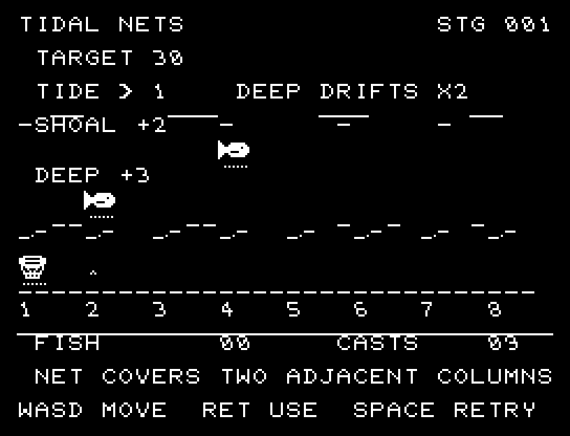
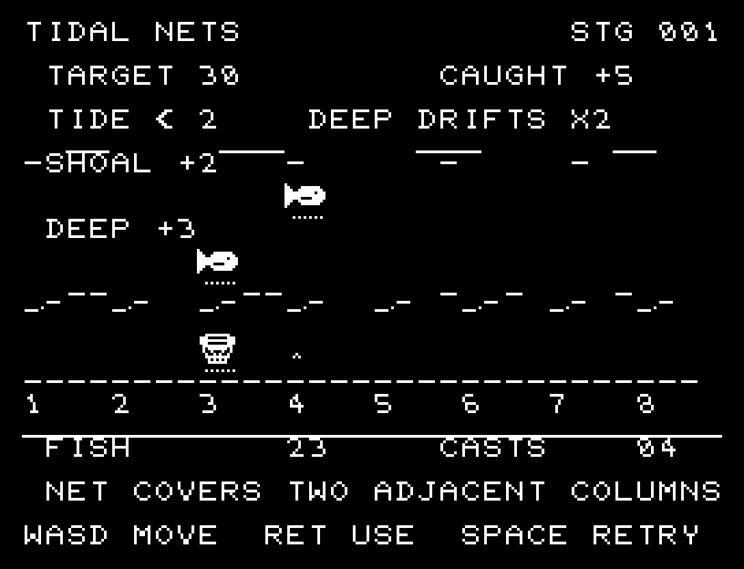
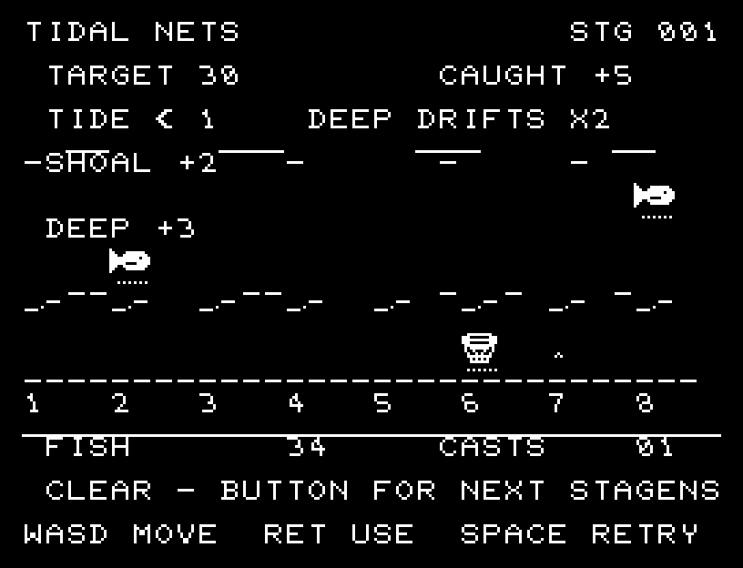

# TIDAL NETS

[Wiki](https://github.com/zabaglione/jr100dev/wiki/TIDAL-NETS) · [プレイ](https://zabaglione.github.io/pyjr100emu/?game=tidal-nets)

浅い魚群と深い魚群を、隣接2列を覆う網で狙います。浅い魚群は潮の矢印と数値の通り、深い魚群はその2倍流されます。浅い群は2匹、深い群は3匹、両方なら5匹。9回で30匹が目標です。


## 紹介画像とプレイ動画







**[音付きプレイ動画を見る（約48秒）](https://zabaglione.github.io/pyjr100emu/gameplay.html?game=tidal-nets)**

1ステージのクリアまでを収録。

## タイトルのデザイン

大きな船体と海中に広がる網を描き、横長TIDALと右のNETSが漁の場面を挟みます。

## 画面の奥行き

遠くと手前で水面の線の密度を変え、魚の丸みと網の口・底を描きました。8か所の投入位置と潮向きは正確な平面表示です。 浅い魚群と2倍流される深い魚群を、隣接2列を覆う網で狙います。9回で30匹が目標です。投入、魚の移動、網の引き揚げ、加点を順に描きます。

## ゲーム専用フォント

ゲーム中の**数字0〜9の10文字を結晶フォント**（細い角形と斜めの切り口）で揃えています。部分的な英字の置き換えは行いません。タイトルの操作案内・説明・パスワード入力は通常フォントに統一しています。既存のロゴと絵柄を保ち、空きPCG枠だけを使用します。

## 動きとクリア演出

浅い魚群と2倍流される深い魚群を、隣接2列を覆う網で狙います。9回で30匹が目標です。投入、魚の移動、網の引き揚げ、加点を順に描きます。被弾や結果を確認する間は、追加入力で表示を飛ばせません。

クリア時は完成した盤面・結果を残し、約1.6秒のジングルと余韻を挟みます。失敗時も原因を表示し、ジングルの後に短い間を置きます。その後、キーを押し直して次の操作に進みます。直前から押し続けたキーや、演出中に押したキーで結果を飛ばすことはありません。

## 操作と遊び方

A/Dで網の左端を選び、RETURNで投げます。8列目の隣は1列目です。両方の魚群がどこへ流れるかを予測してください。

方向キーはキーボードまたはパッド、RETURNはパッドのボタンでも操作できます。SPACEでこの面のやり直し確認を開きます。やり直し確認はNOが初期選択です。A/Dで選び、RETURNで確定、SPACEで取り消します。確認中は進行を止めます。CTRL+CでBASICへ戻ります。

浅い魚群と2倍流される深い魚群を、隣接2列を覆う網で狙います。9回で30匹が目標です。投入、魚の移動、網の引き揚げ、加点を順に描きます。


## ビルドと検証

バージョン 2.0.0。開始番地 `$0300`、ゲーム本体と定数は 7,223 bytes。画面・作業領域・復帰用の保存領域・512 bytesのスタックを含めて標準RAM 16KB内で動作します。PCGは32文字を場面ごとに切り替えます。

```sh
make -C games/tidal_nets
make -C games/tidal_nets test
```

出力はゲームの `build/` ディレクトリに作られます。`rules.py` はビルド時にMB8861Hの機械語へ変換されます。JR-100上でPythonを実行する方式ではありません。

キー入力による全ステージのクリア、失敗を含む入力試験、画面範囲、RAM配置、スタック、PCM出力をエミュレーターで検査しています。掲載画像は所有するBASIC ROMからPRGを起動した実フレームです。実機での動作・音声は未確認です。

```sh
.venv/bin/python games/native/replay.py tidal_nets --rom /path/to/owned-rom.prg --capture --keyboard
```

タイトルには長めの単音曲、プレイ中には効果音を付けています。ソース・画像・曲は[MIT License](https://github.com/zabaglione/jr100dev/blob/main/games/LICENSE)。`art/`にはPCG Workbench用の画面データもあります。
