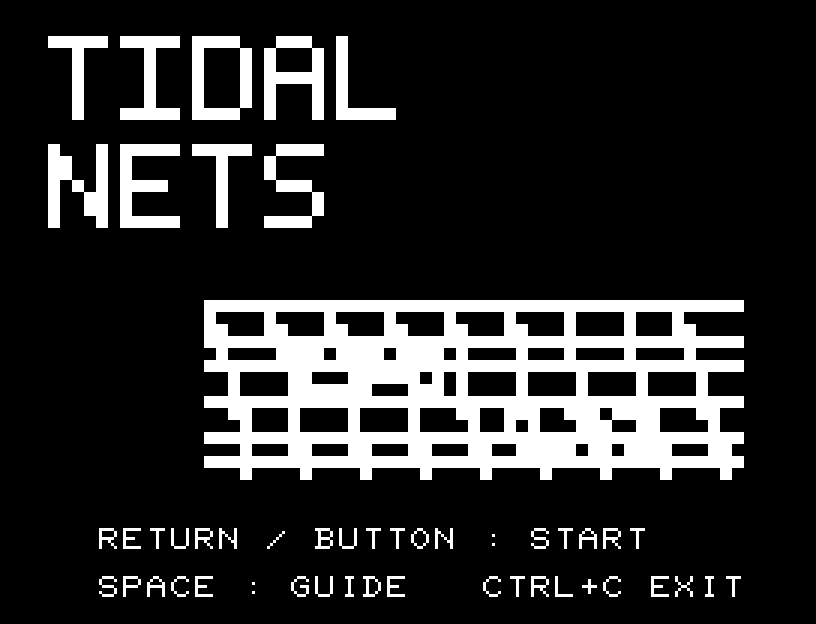
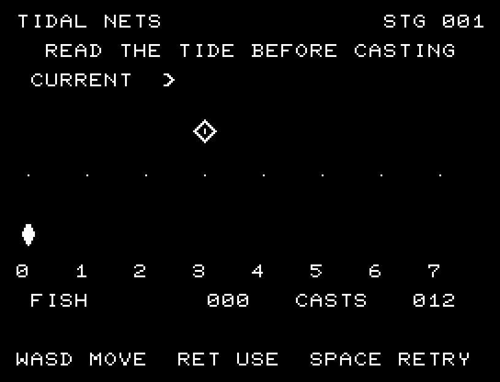
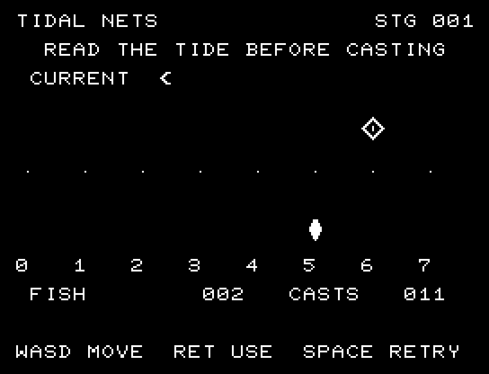

# TIDAL NETS

[Wiki](https://github.com/zabaglione/jr100dev/wiki/TIDAL-NETS) · [プレイ](https://zabaglione.github.io/pyjr100emu/?game=tidal-nets)

潮で1マス流される魚群を予測して網を投げます。12回の投網で魚16匹を目指し、1回の成功で2匹増えます。



## 操作と遊び方

A/Dで網を置く列を選び、RETURNで投網します。端から流された魚は反対側へ回ります。

方向キーはキーボードまたはパッド、RETURNはパッドのボタンでも操作できます。SPACEでこの面をやり直し、CTRL+CでBASICへ戻ります。

潮の矢印、魚群、網、漁獲数と投網残数を表示します。





## ビルドと検証

バージョン 1.0.0。開始番地 `$0300`、ゲーム本体と定数は 5,745 bytes。画面・作業領域・復帰用の保存領域・512 bytesのスタックを含めて標準RAM 16KB内で動作します。PCGは32文字を場面ごとに切り替えます。

```sh
make -C games/tidal_nets
make -C games/tidal_nets test
```

出力はゲームの `build/` ディレクトリに作られます。`rules.py` はビルド時にMB8861Hの機械語へ変換されます。JR-100上でPythonを実行する方式ではありません。

キー入力による全ステージのクリア、失敗を含む入力試験、画面範囲、RAM配置、スタック、PCM出力をエミュレーターで検査しています。掲載画像は所有するBASIC ROMからPRGを起動した実フレームです。実機での動作・音声は未確認です。

```sh
.venv/bin/python games/native/replay.py tidal_nets --rom /path/to/owned-rom.prg --capture --keyboard
```

タイトルには長めの単音曲、プレイ中には効果音を付けています。ソース・画像・曲は[MIT License](https://github.com/zabaglione/jr100dev/blob/main/games/LICENSE)。`art/`にはPCG Workbench用の画面データもあります。
