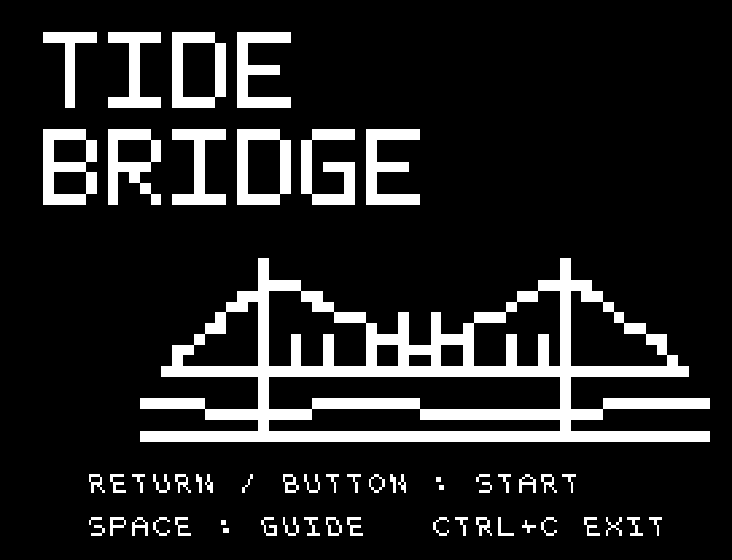
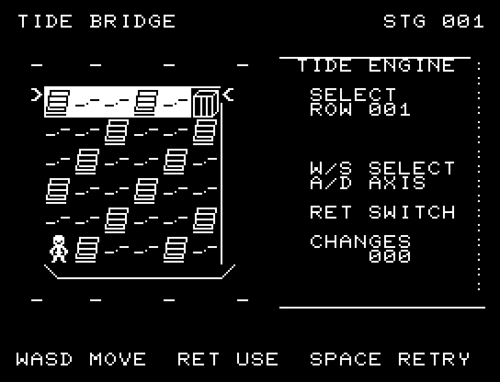
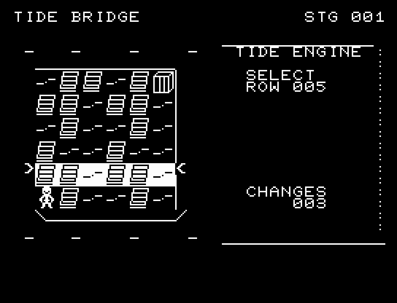
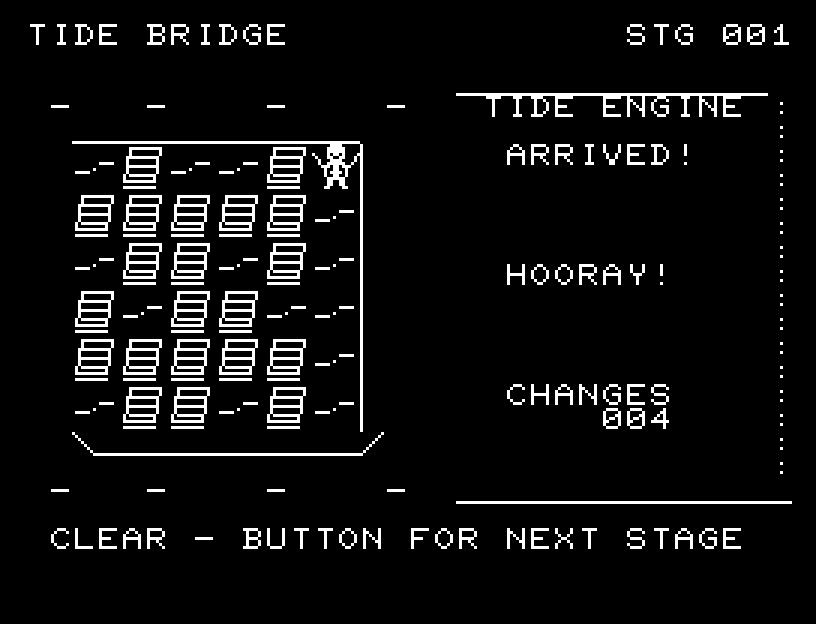
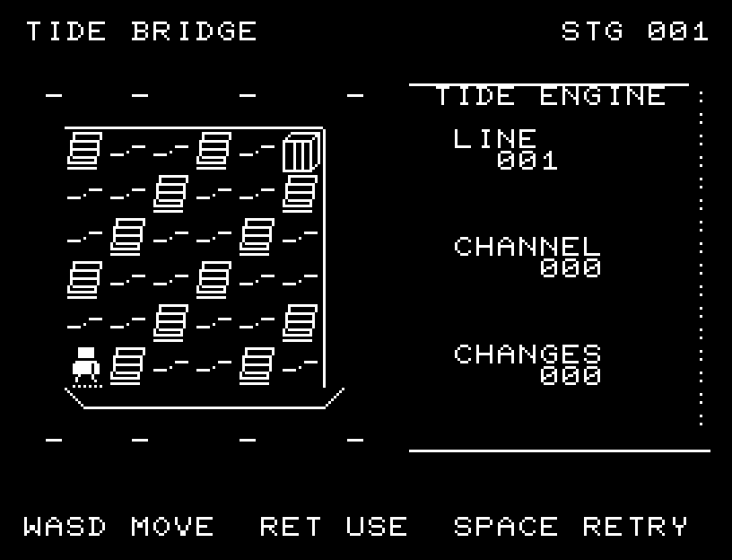
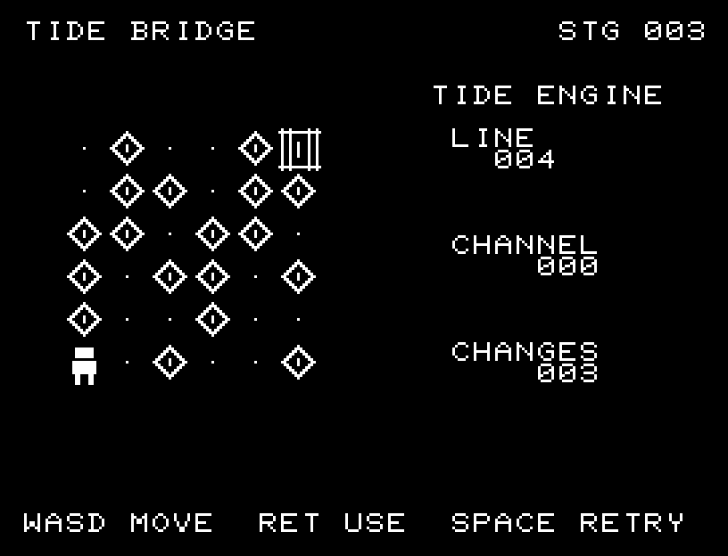

# TIDE BRIDGE

[Wiki](https://github.com/zabaglione/jr100dev/wiki/TIDE-BRIDGE) · [プレイ](https://zabaglione.github.io/pyjr100emu/?game=tide-bridge)

行または列の橋をまとめて上下させ、左下の岸と右上の門をつなぎます。3種類の橋の配置に挑戦します。



## 紹介画像とプレイ動画







**[音付きプレイ動画を見る（約31秒）](https://zabaglione.github.io/pyjr100emu/gameplay.html?game=tide-bridge)**

1ステージのクリアまでを収録。

## タイトルのデザイン

水面から持ち上がった橋と橋脚を大きく描き、横長のTIDEで川幅を表します。

## 画面の奥行き

橋を水面より高い板張りの足場、出口を門として描きました。選択中の行・列は全体を白黒反転し、両端の矢印とROW/COLの表示で範囲を示します。主人公は同じPCG4文字を書き換えて向きと喜びのポーズを変えます。

## ゲーム専用フォント

行・列の反転表示に8文字、主人公に4文字のPCGを使います。主人公の4文字は歩く向きと喜びのポーズに合わせて書き換えます。案内と数字には通常フォントを使っています。

## 動きとクリア演出

道がつながると、主人公が進行方向を向き、マスの中間を通って門まで歩きます。到着後は両手を上げて2回跳ね、喜びの効果音に続いてクリアのジングルが鳴ります。被弾や結果を確認する間は、追加入力で表示を飛ばせません。

クリア時は完成した盤面・結果を残し、約1.6秒のジングルと余韻を挟みます。失敗時も原因を表示し、ジングルの後に短い間を置きます。その後、キーを押し直して次の操作に進みます。直前から押し続けたキーや、演出中に押したキーで結果を飛ばすことはありません。

## 操作と遊び方

W/Sで対象の行・列を選び、A/Dで行と列を切り替え、RETURNで反転します。選択した行・列全体が白黒反転し、両端の矢印で範囲を示します。主人公と門はその上に表示されます。1面30回まで変更できます。

方向キーはキーボードまたはパッド、RETURNはパッドのボタンでも操作できます。SPACEでこの面のやり直し確認を開きます。やり直し確認はNOが初期選択です。A/Dで選び、RETURNで確定、SPACEで取り消します。確認中は進行を止めます。CTRL+CでBASICへ戻ります。

道がつながると、主人公が進行方向を向き、マスの中間を通って門まで歩きます。到着後は両手を上げて2回跳ね、喜びの効果音に続いてクリアのジングルが鳴ります。演出が終わってから次のキーを押してください。

SELECTの下にROW（行）またはCOL（列）と1〜6の番号を表示します。CHANGESは変更回数です。道がつながると主人公が門へ向かい、到着を喜んでからステージクリアになります。





## ソースコード

ゲーム本体は [`rules.py`](rules.py) です。ビルド時にMB8861Hの機械語へ変換します。

描画・データ生成などの補助ソース: [`presentation.py`](presentation.py)。

ビルド設定は [`game.json`](game.json) と [`Makefile`](Makefile) です。共有コードと生成物の関係は[全ゲームのソース一覧](../SOURCES.md)を参照してください。

## ビルドと検証

バージョン 1.6.1。開始番地 `$0300`、ゲーム本体と定数は 7,676 bytes。画面・作業領域・復帰用の保存領域・512 bytesのスタックを含めて標準RAM 16KB内で動作します。PCGは32文字を場面ごとに切り替えます。

```sh
make -C games/tide_bridge
make -C games/tide_bridge test
```

出力はゲームの `build/` ディレクトリに作られます。JR-100上でPythonを実行する方式ではありません。

キー入力による全ステージのクリア、失敗を含む入力試験、画面範囲、RAM配置、スタック、PCM出力をエミュレーターで検査しています。掲載画像は所有するBASIC ROMからPRGを起動した実フレームです。実機での動作・音声は未確認です。

```sh
.venv/bin/python games/native/replay.py tide_bridge --rom /path/to/owned-rom.prg --capture --keyboard
```

タイトルには長めの単音曲、プレイ中には効果音を付けています。ソース・画像・曲は[MIT License](https://github.com/zabaglione/jr100dev/blob/main/games/LICENSE)。`art/`にはPCG Workbench用の画面データもあります。
