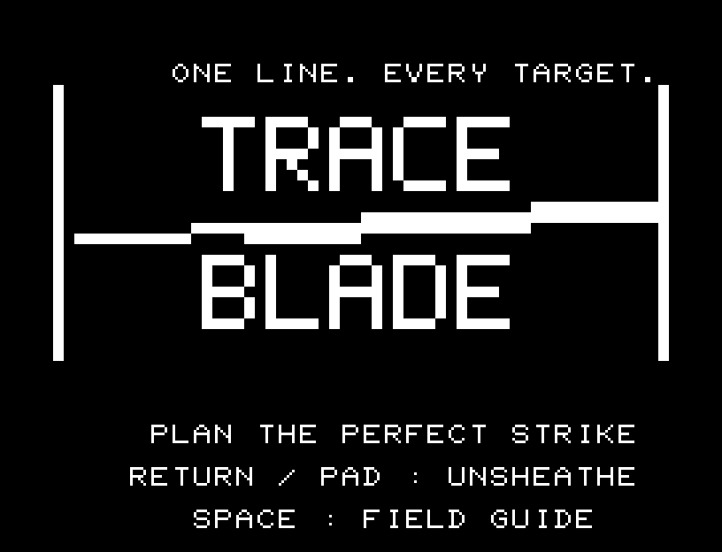
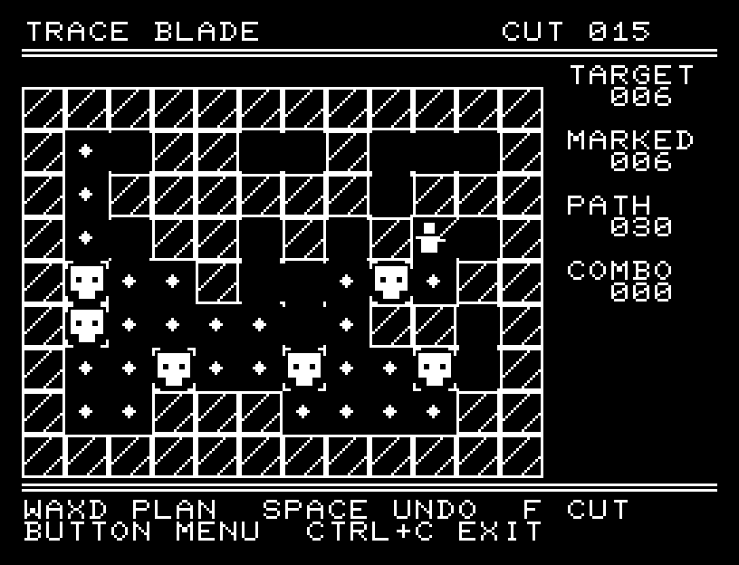
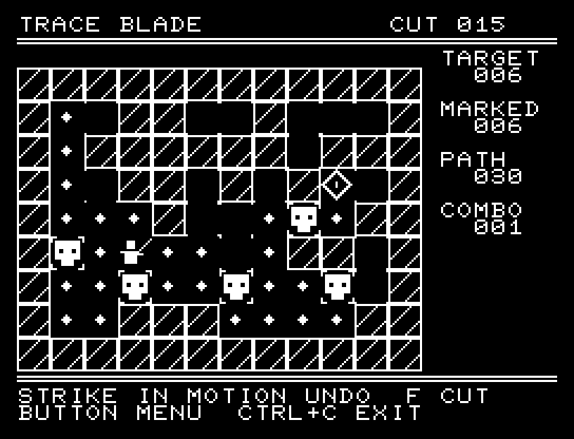
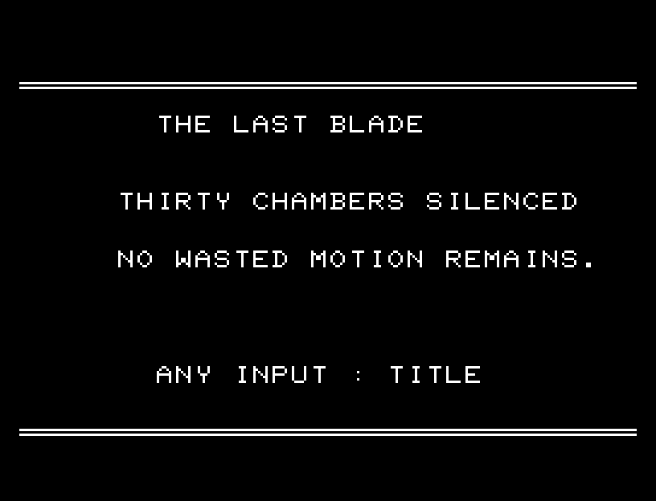

# TRACE BLADE

30の部屋を一筆の刀筋で突破する、JR-100・標準RAM 16KB向けパズルです。12×9マスの盤面で経路を計画し、全標的を通って菱形の出口へ到達したら実行します。刀が予定経路を走り、標的を連続で撃破します。



## 操作

| 操作 | キーボード | 1ボタンパッド |
| --- | --- | --- |
| 経路を1マス伸ばす | W/A/X/D | 上下左右 |
| 操作メニュー／決定 | RETURN | ボタン |
| メニュー選択 | W/X | 上下 |
| 1手戻す | SPACE | メニューのUNDO |
| 実行 | F | メニューのCUT |
| BASICへ戻る | CTRL+C | キーボードを使用 |

一度通ったセルと壁は通れません。経路は好きなだけ考え、始点まで1手ずつ戻せます。全標的を通り、出口で終わっている経路だけを実行できます。メニューのRESETはその面の経路を消し、TITLEはタイトルへ戻ります。BACKで計画を続けられます。

HUDのTARGETは標的数、MARKEDは経路に入った数、PATHは歩数、COMBOは実行中の撃破数。経路に入った標的には四隅の印が付きます。実行は入力を待たずに進み、面クリア後にボタンを押すと次の面です。





## ビルドと検証

開発環境を用意して `make -C games/trace_blade` を実行します。出力は `build/trace-blade.prg`、開始番地は `$0300`。本体・定数は8,338 bytesで、状態、画面、BASICへ戻すための保存領域、512 bytesのスタックを含めて標準16KB内です。PCGは32文字です。

`make -C games/trace_blade test` は経路の重複、壁、未完成経路の実行拒否、戻し、標的数、リセット、連続実行、次面への遷移を検証します。全30面を915歩の入力でクリアし、コード領域の破壊がないこととスタック範囲を確認しています。

```sh
.venv/bin/python games/trace_blade/replay.py --rom /path/to/owned-rom.prg --capture
```

掲載画像は所有する実BASIC ROMからPRGを起動したエミュレーターの実画面です。実機動作は未確認。効果音と32小節の独自タイトル曲を収録しています。ソース・画像・曲は[MIT License](../LICENSE)、ROMは含みません。`art/`の画面データをPCG Workbenchで編集できます。
