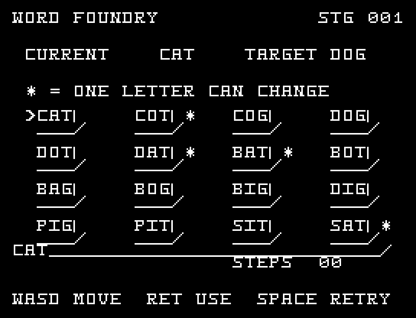
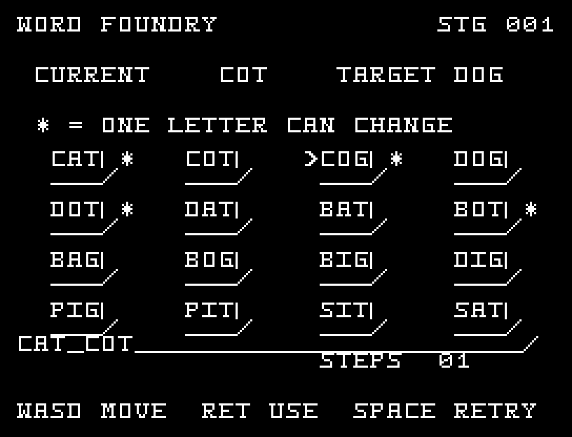
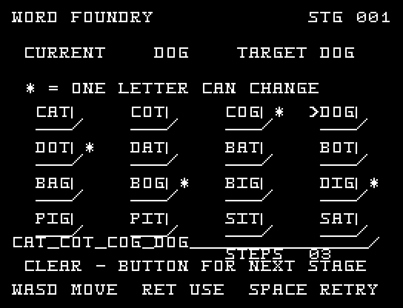

# WORD FOUNDRY

[Wiki](https://github.com/zabaglione/jr100dev/wiki/WORD-FOUNDRY) · [プレイ](https://zabaglione.github.io/pyjr100emu/?game=word-foundry)

一文字だけ違う単語へ置き換えながら、8手以内で目標の単語へ到達します。盤上の16語だけを使う5問のワードラダーです。


## 紹介画像とプレイ動画







**[音付きプレイ動画を見る（約36秒）](https://zabaglione.github.io/pyjr100emu/gameplay.html?game=word-foundry)**

1ステージのクリアまでを収録。

## タイトルのデザイン

コンベヤー上のA・B・Cの活字を白抜きと輪郭で並べ、横長WORDで文字を作る工場を表します。

## 画面の奥行き

各単語の下と右に縁を付け、活字のキーが並ぶ作業台にしました。単語の綴りは歪めず、1文字の違いを読みやすくしています。 一文字だけ置き換えられる候補すべてに印を付けます。変更する文字の移動と、ここまでの単語の経路を表示します。

## ゲーム専用フォント

ゲーム中の**英大文字A〜Zの26文字を活字フォント**（読みやすいセリフ体）で揃えています。部分的な英字の置き換えは行いません。タイトルの操作案内・説明・パスワード入力は通常フォントに統一しています。既存のロゴと絵柄を保ち、空きPCG枠だけを使用します。

## 動きとクリア演出

一文字だけ置き換えられる候補すべてに印を付けます。変更する文字の移動と、ここまでの単語の経路を表示します。被弾や結果を確認する間は、追加入力で表示を飛ばせません。

クリア時は完成した盤面・結果を残し、約1.6秒のジングルと余韻を挟みます。失敗時も原因を表示し、ジングルの後に短い間を置きます。その後、キーを押し直して次の操作に進みます。直前から押し続けたキーや、演出中に押したキーで結果を飛ばすことはありません。

## 操作と遊び方

WASDで単語を選び、RETURNで現在の単語と置き換えます。二文字以上違う単語は選べません。

方向キーはキーボードまたはパッド、RETURNはパッドのボタンでも操作できます。SPACEでこの面のやり直し確認を開きます。やり直し確認はNOが初期選択です。A/Dで選び、RETURNで確定、SPACEで取り消します。確認中は進行を止めます。CTRL+CでBASICへ戻ります。

一文字だけ置き換えられる候補すべてに印を付けます。変更する文字の移動と、ここまでの単語の経路を表示します。


## ビルドと検証

バージョン 1.6.0。開始番地 `$0300`、ゲーム本体と定数は 7,089 bytes。画面・作業領域・復帰用の保存領域・512 bytesのスタックを含めて標準RAM 16KB内で動作します。PCGは32文字を場面ごとに切り替えます。

```sh
make -C games/word_foundry
make -C games/word_foundry test
```

出力はゲームの `build/` ディレクトリに作られます。`rules.py` はビルド時にMB8861Hの機械語へ変換されます。JR-100上でPythonを実行する方式ではありません。

キー入力による全ステージのクリア、失敗を含む入力試験、画面範囲、RAM配置、スタック、PCM出力をエミュレーターで検査しています。掲載画像は所有するBASIC ROMからPRGを起動した実フレームです。実機での動作・音声は未確認です。

```sh
.venv/bin/python games/native/replay.py word_foundry --rom /path/to/owned-rom.prg --capture --keyboard
```

タイトルには長めの単音曲、プレイ中には効果音を付けています。ソース・画像・曲は[MIT License](https://github.com/zabaglione/jr100dev/blob/main/games/LICENSE)。`art/`にはPCG Workbench用の画面データもあります。
