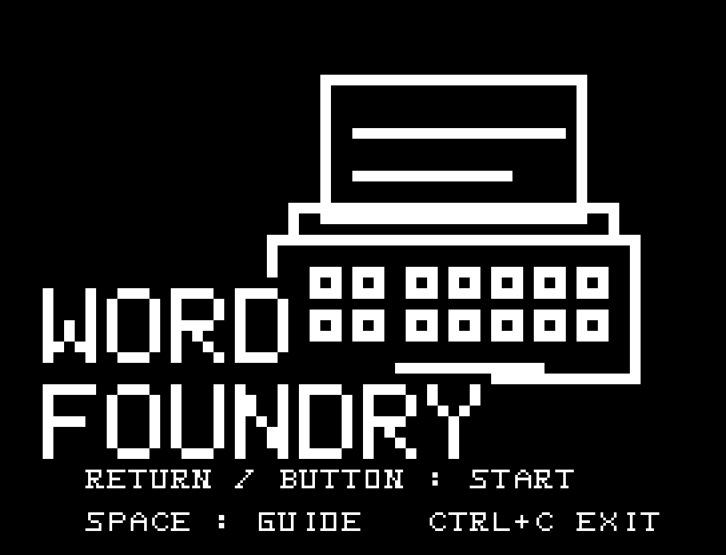
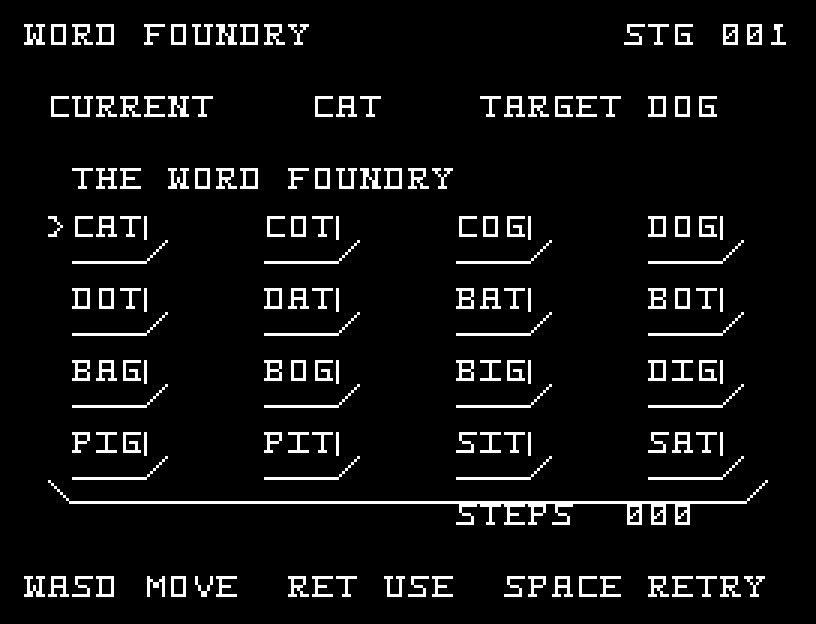
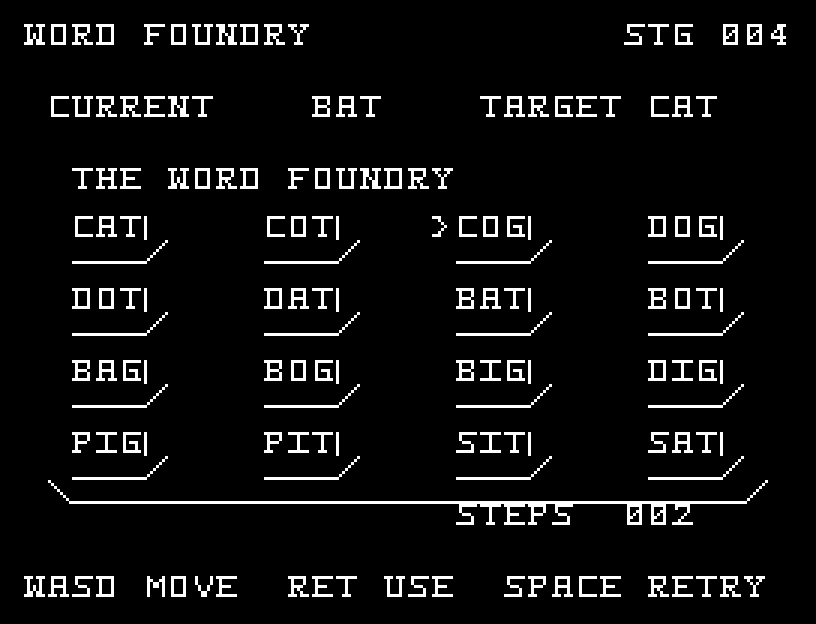

# WORD FOUNDRY

[Wiki](https://github.com/zabaglione/jr100dev/wiki/WORD-FOUNDRY) · [プレイ](https://zabaglione.github.io/pyjr100emu/?game=word-foundry)

一文字だけ違う単語へ置き換えながら、8手以内で目標の単語へ到達します。盤上の16語だけを使う5問のワードラダーです。



## 画面の奥行き

各単語の下と右に縁を付け、活字のキーが並ぶ作業台にしました。単語の綴りは歪めず、1文字の違いを読みやすくしています。

## ゲーム専用フォント

**活字フォント**（読みやすいセリフ体）を採用。タイトル／説明用に16文字、ゲーム用に32文字を割り当てています。ゲーム中の対象は `ABCDGIOPST>0123456789URENHWFY+/:` です。空きPCG枠だけを使い、残りの文字は通常フォントで表示します。数字を変更する作品では0〜9を一式で揃えています。

## 操作と遊び方

WASDで単語を選び、RETURNで現在の単語と置き換えます。二文字以上違う単語は選べません。

方向キーはキーボードまたはパッド、RETURNはパッドのボタンでも操作できます。SPACEでこの面をやり直し、CTRL+CでBASICへ戻ります。

使える単語、現在の単語、目標、手数を表示します。





## ビルドと検証

バージョン 1.2.0。開始番地 `$0300`、ゲーム本体と定数は 6,310 bytes。画面・作業領域・復帰用の保存領域・512 bytesのスタックを含めて標準RAM 16KB内で動作します。PCGは32文字を場面ごとに切り替えます。

```sh
make -C games/word_foundry
make -C games/word_foundry test
```

出力はゲームの `build/` ディレクトリに作られます。`rules.py` はビルド時にMB8861Hの機械語へ変換されます。JR-100上でPythonを実行する方式ではありません。

キー入力による全ステージのクリア、失敗を含む入力試験、画面範囲、RAM配置、スタック、PCM出力をエミュレーターで検査しています。掲載画像は所有するBASIC ROMからPRGを起動した実フレームです。実機での動作・音声は未確認です。

```sh
.venv/bin/python games/native/replay.py word_foundry --rom /path/to/owned-rom.prg --capture --keyboard
```

タイトルには長めの単音曲、プレイ中には効果音を付けています。ソース・画像・曲は[MIT License](https://github.com/zabaglione/jr100dev/blob/main/games/LICENSE)。`art/`にはPCG Workbench用の画面データもあります。
